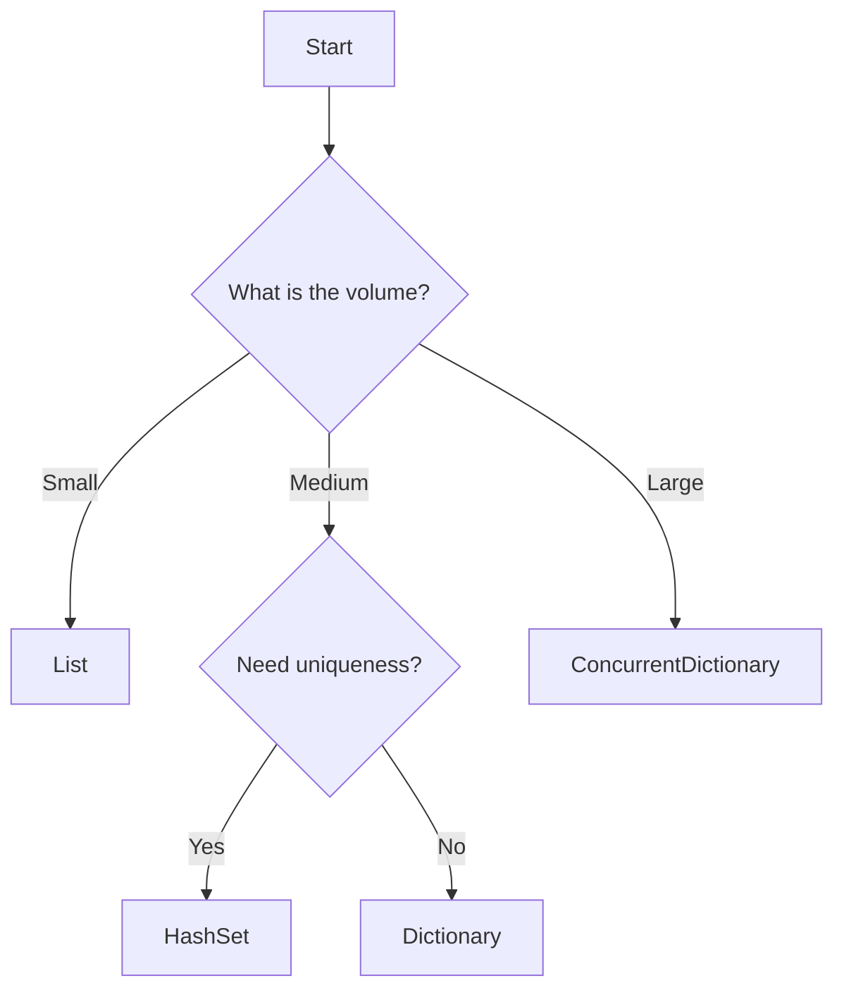

# .NET Collections Complexity and Volume-Driven Selection Guide

## Table of Contents
- [Quick Reference Table for Collection Selection by Volume](#quick-reference-table-for-collection-selection-by-volume)
- [Time Complexity Chart for Major .NET Collections](#time-complexity-chart-for-major-net-collections)
- [Volume-Based Selection Guidance](#volume-based-selection-guidance)
- [Common Mistakes with Code Examples](#common-mistakes-with-code-examples)
- [Memory Overhead Analysis](#memory-overhead-analysis)
- [Decision Tree for Collection Type Selection](#decision-tree-for-collection-type-selection)
- [Real-World Examples from Microsoft.Identity.Web](#real-world-examples-from-microsoftidentityweb)
- [Token Caching Scenarios](#token-caching-scenarios)
- [Best Practices Summary](#best-practices-summary)
- [Improvement Suggestions](#improvement-suggestions)

## Quick Reference Table for Collection Selection by Volume
| Collection Type | Volume | Best Use Case |
|------------------|--------|---------------|
| List<T> | Small | Ordered collection of items |
| HashSet<T> | Medium | Uniqueness required |
| Dictionary<TKey, TValue> | Large | Key-value pairs for fast lookup |

## Time Complexity Chart for Major .NET Collections
| Collection Type | Add | Remove | Access |
|------------------|-----|--------|--------|
| List<T> | O(1) | O(n) | O(1) |
| HashSet<T> | O(1) | O(n) | O(1) |
| Dictionary<TKey, TValue> | O(1) | O(n) | O(1) |

## Volume-Based Selection Guidance
- **Small Collections**: Use `List<T>` or `HashSet<T>` for efficiency.
- **Medium Collections**: Consider `Dictionary<TKey, TValue>` or `HashSet<T>` based on access patterns.
- **Large Collections**: Utilize `ConcurrentDictionary<TKey, TValue>` for thread-safe operations.

## Common Mistakes with Code Examples
- **Inefficient Patterns**: Avoid O(n²) complexity by minimizing nested loops.
  ```csharp
  // Common mistake
  var list = new List<int>();
  foreach (var item in list)
  {
      if (list.Contains(item)) // O(n)
      {
          // Logic
      }
  }
  ```
- **Duplicate Lookups**: Cache results where possible to enhance performance.

## Memory Overhead Analysis
- Analyze the memory footprint of different collections.
- Use profiling tools to assess the impact of collection choice on application memory usage.

## Decision Tree for Collection Type Selection


## Real-World Examples from Microsoft.Identity.Web
- **ConcurrentDictionary Usage**: Found in `TokenAcquisition.cs` and `MergedOptionsStore.cs`.
- **SemaphoreSlim Synchronization Patterns**: Effective for limiting concurrent access.
- **HashSet for Tenant Validation**: Efficient in scenarios where uniqueness is critical.
- **Race Condition Fix from Issue #1957**: Implemented using `lock` statements.

## Token Caching Scenarios Specific to Identity/Auth
- Discuss caching strategies for tokens to minimize network calls.

## Best Practices Summary
- Choose the right collection based on expected volume and access patterns.
- Avoid common pitfalls like excessive memory usage and inefficient lookups.

## Improvement Suggestions
- Review specific file references and line numbers for potential enhancements.

## References
- [Microsoft Learn Documentation](https://learn.microsoft.com)
- [Steven Staub's Performance Blog](https://stevenstaub.com)
