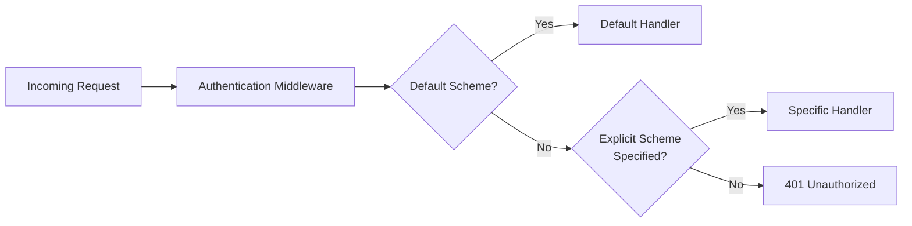

# Multiple Authentication Schemes in Microsoft.Identity.Web

This guide explains how to configure and use multiple authentication schemes in ASP.NET Core applications using Microsoft.Identity.Web. This is common when your application needs to handle different types of authentication simultaneously.

---

## 📋 Table of Contents

- [Overview](#overview)
- [Common Scenarios](#common-scenarios)
- [Configuration](#configuration)
- [Specifying Schemes in Controllers](#specifying-schemes-in-controllers)
- [Specifying Schemes When Calling APIs](#specifying-schemes-when-calling-apis)
- [Troubleshooting](#troubleshooting)
- [Best Practices](#best-practices)

---

## Overview

By default, ASP.NET Core uses a single default authentication scheme. However, many real-world applications need multiple schemes:

| Scenario | Schemes Involved |
|----------|-----------------|
| Web app that also exposes an API | OpenID Connect + JWT Bearer |
| API accepting tokens from multiple identity providers | Multiple JWT Bearer schemes |
| API with both user and service-to-service authentication | JWT Bearer + API Key/Certificate |
| Hybrid authentication for migration | Legacy scheme + Modern OAuth |

### How Authentication Schemes Work



---

## Common Scenarios

### Scenario 1: Web App + Web API in Same Project

Your application serves both web pages (using cookies/OpenID Connect) and API endpoints (using JWT Bearer tokens).

```csharp
using Microsoft.AspNetCore.Authentication.JwtBearer;
using Microsoft.AspNetCore.Authentication.OpenIdConnect;
using Microsoft.Identity.Web;

var builder = WebApplication.CreateBuilder(args);

// Add OpenID Connect for web app (browser sign-in)
builder.Services.AddAuthentication(OpenIdConnectDefaults.AuthenticationScheme)
    .AddMicrosoftIdentityWebApp(builder.Configuration.GetSection("AzureAd"))
    .EnableTokenAcquisitionToCallDownstreamApi()
    .AddInMemoryTokenCaches();

// Add JWT Bearer for API endpoints
builder.Services.AddAuthentication()
    .AddMicrosoftIdentityWebApi(builder.Configuration.GetSection("AzureAd"), 
        JwtBearerDefaults.AuthenticationScheme);

builder.Services.AddControllersWithViews();

var app = builder.Build();

app.UseAuthentication();
app.UseAuthorization();

app.MapControllers();
app.Run();
```

### Scenario 2: Multiple Identity Providers

Accept tokens from both Azure AD and Azure AD B2C:

```csharp
builder.Services.AddAuthentication(JwtBearerDefaults.AuthenticationScheme)
    // Primary scheme: Azure AD
    .AddMicrosoftIdentityWebApi(builder.Configuration.GetSection("AzureAd"), 
        JwtBearerDefaults.AuthenticationScheme)
    // Secondary scheme: Azure AD B2C
    .AddMicrosoftIdentityWebApi(builder.Configuration.GetSection("AzureAdB2C"), 
        "AzureAdB2C");
```

**appsettings.json:**

```json
{
  "AzureAd": {
    "Instance": "https://login.microsoftonline.com/",
    "TenantId": "your-tenant-id",
    "ClientId": "your-api-client-id"
  },
  "AzureAdB2C": {
    "Instance": "https://your-tenant.b2clogin.com/",
    "Domain": "your-tenant.onmicrosoft.com",
    "TenantId": "your-b2c-tenant-id",
    "ClientId": "your-b2c-api-client-id",
    "SignUpSignInPolicyId": "B2C_1_SignUpSignIn"
  }
}
```

---

## Configuration

### Registering Multiple Schemes

```csharp
using Microsoft.AspNetCore.Authentication;
using Microsoft.AspNetCore.Authentication.JwtBearer;
using Microsoft.AspNetCore.Authentication.OpenIdConnect;
using Microsoft.Identity.Web;

var builder = WebApplication.CreateBuilder(args);

// Set the default authentication scheme (can also do with AddAuthentication(scheme))
builder.Services.AddAuthentication(options =>
{
    options.DefaultScheme = JwtBearerDefaults.AuthenticationScheme;
    options.DefaultChallengeScheme = JwtBearerDefaults.AuthenticationScheme;
})
// Add JWT Bearer (primary)
.AddMicrosoftIdentityWebApi(builder.Configuration.GetSection("AzureAd"), 
    JwtBearerDefaults.AuthenticationScheme)
// Add OpenID Connect (secondary)
.AddMicrosoftIdentityWebApp(builder.Configuration.GetSection("AzureAd"), 
    OpenIdConnectDefaults.AuthenticationScheme);
```

### Named Schemes

Use named schemes for clarity:

```csharp
public static class AuthSchemes
{
    public const string AzureAd = "AzureAd";
    public const string AzureAdB2C = "AzureAdB2C";
}

builder.Services.AddAuthentication(AuthSchemes.AzureAd)
    .AddMicrosoftIdentityWebApi(builder.Configuration.GetSection("AzureAd"), AuthSchemes.AzureAd)
    .AddMicrosoftIdentityWebApi(builder.Configuration.GetSection("AzureAdB2C"), AuthSchemes.AzureAdB2C);
```

---

## Specifying Schemes in Controllers

### Using [Authorize] Attribute

Specify which authentication scheme(s) to use for a controller or action:

```csharp
using Microsoft.AspNetCore.Authentication.JwtBearer;
using Microsoft.AspNetCore.Authorization;
using Microsoft.AspNetCore.Mvc;

// Use default scheme
[Authorize]
[ApiController]
[Route("api/[controller]")]
public class DefaultController : ControllerBase
{
    [HttpGet]
    public IActionResult Get() => Ok("Using default scheme");
}

// Use specific scheme
[Authorize(AuthenticationSchemes = JwtBearerDefaults.AuthenticationScheme)]
[ApiController]
[Route("api/[controller]")]
public class ApiController : ControllerBase
{
    [HttpGet]
    public IActionResult Get() => Ok("Using JWT Bearer scheme");
}

// Accept multiple schemes (any one succeeds)
[Authorize(AuthenticationSchemes = "AzureAd,AzureAdB2C")]
[ApiController]
[Route("api/[controller]")]
public class MultiSchemeController : ControllerBase
{
    [HttpGet]
    public IActionResult Get() => Ok($"Authenticated via: {User.Identity?.AuthenticationType}");
}
```

### Per-Action Scheme Selection

```csharp
[ApiController]
[Route("api/[controller]")]
public class MixedController : ControllerBase
{
    // This action uses JWT Bearer
    [Authorize(AuthenticationSchemes = JwtBearerDefaults.AuthenticationScheme)]
    [HttpGet("api-data")]
    public IActionResult GetApiData() => Ok("API data");

    // This action uses OpenID Connect (for browser-based calls)
    [Authorize(AuthenticationSchemes = OpenIdConnectDefaults.AuthenticationScheme)]
    [HttpGet("web-data")]
    public IActionResult GetWebData() => Ok("Web data");

    // This action accepts either scheme
    [Authorize(AuthenticationSchemes = $"{JwtBearerDefaults.AuthenticationScheme},{OpenIdConnectDefaults.AuthenticationScheme}")]
    [HttpGet("any-data")]
    public IActionResult GetAnyData() => Ok("Data for any authenticated user");
}
```

---

## Specifying Schemes When Calling APIs

When your application uses multiple authentication schemes and calls downstream APIs, you need to specify which scheme to use for token acquisition.

### With Microsoft Graph

```csharp
using Microsoft.AspNetCore.Authentication.JwtBearer;
using Microsoft.Graph;

[Authorize]
public class GraphController : ControllerBase
{
    private readonly GraphServiceClient _graphClient;

    public GraphController(GraphServiceClient graphClient)
    {
        _graphClient = graphClient;
    }

    [HttpGet("profile")]
    public async Task<ActionResult> GetProfile()
    {
        // Specify which authentication scheme to use for token acquisition
        var user = await _graphClient.Me
            .GetAsync(r => r.Options
                .WithAuthenticationScheme(JwtBearerDefaults.AuthenticationScheme));

        return Ok(user);
    }

    [HttpGet("mail")]
    public async Task<ActionResult> GetMail()
    {
        // More detailed options including scopes and scheme
        var messages = await _graphClient.Me.Messages
            .GetAsync(r =>
            {
                r.Options.WithAuthenticationOptions(options =>
                {
                    // Specify authentication scheme
                    options.AcquireTokenOptions.AuthenticationOptionsName = 
                        JwtBearerDefaults.AuthenticationScheme;
                    
                    // Specify additional scopes if needed
                    options.Scopes = new[] { "Mail.Read" };
                });
            });

        return Ok(messages);
    }
}
```

### With IDownstreamApi

```csharp
using Microsoft.Identity.Abstractions;

[Authorize]
public class DownstreamController : ControllerBase
{
    private readonly IDownstreamApi _downstreamApi;

    public DownstreamController(IDownstreamApi downstreamApi)
    {
        _downstreamApi = downstreamApi;
    }

    [HttpGet("data")]
    public async Task<ActionResult> GetData()
    {
        var result = await _downstreamApi.CallApiForUserAsync<MyData>(
            "MyApi",
            options =>
            {
                options.AcquireTokenOptions.AuthenticationOptionsName = 
                    JwtBearerDefaults.AuthenticationScheme;
            });

        return Ok(result);
    }
}
```

---

## Troubleshooting

### Problem: Wrong Scheme Selected

**Symptoms:**
- 401 Unauthorized errors
- Token acquired with wrong permissions
- User claims missing or incorrect

**Solution:** Explicitly specify the authentication scheme:

```csharp
// In controller
[Authorize(AuthenticationSchemes = JwtBearerDefaults.AuthenticationScheme)]
public class MyApiController : ControllerBase { }

// When calling APIs
var user = await _graphClient.Me
    .GetAsync(r => r.Options.WithAuthenticationScheme(JwtBearerDefaults.AuthenticationScheme));
```

### Problem: Multiple Schemes Conflict

**Symptoms:**
- Authentication works for one scheme but not another
- Unexpected redirects or challenges

**Solution:** Set default schemes explicitly:

```csharp
builder.Services.AddAuthentication(options =>
{
    // Default for API calls
    options.DefaultScheme = JwtBearerDefaults.AuthenticationScheme;
    options.DefaultAuthenticateScheme = JwtBearerDefaults.AuthenticationScheme;
    
    // Default for unauthenticated challenges (redirects)
    options.DefaultChallengeScheme = JwtBearerDefaults.AuthenticationScheme;
});
```

### Problem: Token Cache Conflicts

**Symptoms:**
- Tokens cached for wrong scheme
- Incorrect user context

**Solution:** Use scheme-aware token acquisition:


### Problem: Authorization Policies Don't Work

**Symptoms:**
- Policy requirements not enforced
- Claims not found

**Solution:** Ensure policy uses correct scheme:

```csharp
builder.Services.AddAuthorization(options =>
{
    options.AddPolicy("ApiPolicy", policy =>
    {
        policy.AuthenticationSchemes.Add(JwtBearerDefaults.AuthenticationScheme);
        policy.RequireAuthenticatedUser();
        policy.RequireClaim("scope", "access_as_user");
    });
});
```

---

## Best Practices

### 1. Use Constants for Scheme Names

Usually SchemeDefaults.AuthenticationScheme, but a static class like this can work too:
```csharp
public static class AuthSchemes
{
    public const string Primary = JwtBearerDefaults.AuthenticationScheme;
    public const string B2C = "AzureAdB2C";
    public const string Internal = "InternalApi";
}

// Usage
[Authorize(AuthenticationSchemes = AuthSchemes.Primary)]
public class MyController : ControllerBase { }
```

### 2. Document Your Scheme Configuration

```csharp
/// <summary>
/// Configures authentication for the application.
/// 
/// Schemes configured:
/// - JwtBearer (default): For API clients using Azure AD tokens
/// - AzureAdB2C: For consumer-facing API clients using B2C tokens
/// - OpenIdConnect: For browser-based authentication (web app)
/// </summary>
public static IServiceCollection AddApplicationAuthentication(
    this IServiceCollection services, 
    IConfiguration configuration)
{
    // Implementation...
}
```

### 3. Test Each Scheme Independently

Create integration tests that verify each scheme works correctly:

```csharp
[Fact]
public async Task Api_WithJwtBearerToken_ReturnsSuccess()
{
    var token = await GetJwtBearerTokenAsync();
    _client.DefaultRequestHeaders.Authorization = 
        new AuthenticationHeaderValue("Bearer", token);
    
    var response = await _client.GetAsync("/api/data");
    
    Assert.Equal(HttpStatusCode.OK, response.StatusCode);
}

[Fact]
public async Task Api_WithB2CToken_ReturnsSuccess()
{
    var token = await GetB2CTokenAsync();
    _client.DefaultRequestHeaders.Authorization = 
        new AuthenticationHeaderValue("Bearer", token);
    
    var response = await _client.GetAsync("/api/data");
    
    Assert.Equal(HttpStatusCode.OK, response.StatusCode);
}
```

---

## Related Documentation

- [Authorization in Web APIs](../authentication/authorization.md) - Scope and role validation
- [Calling Microsoft Graph](../calling-downstream-apis/microsoft-graph.md) - Graph SDK integration
- [Calling Downstream APIs](../calling-downstream-apis/calling-downstream-apis-README.md) - API call patterns
- [Deploying Behind Gateways](./api-gateways.md) - Gateway authentication scenarios
- [Logging and Diagnostics](./logging.md) - Troubleshooting authentication issues
