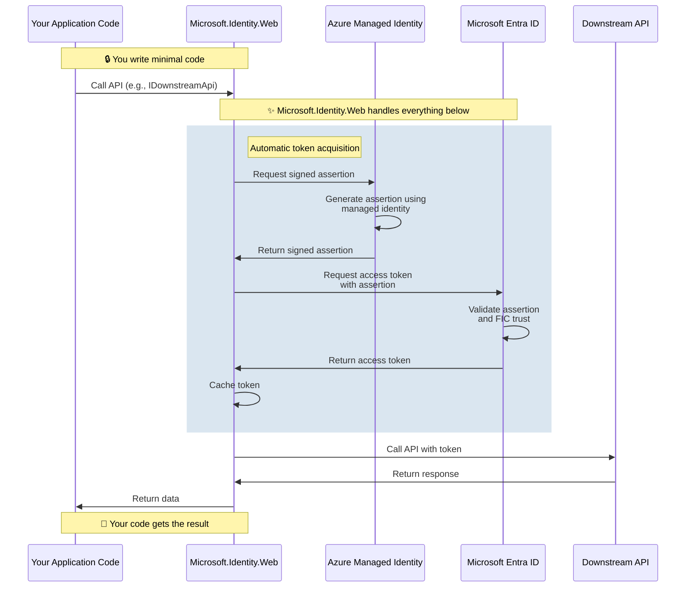

# Certificateless Authentication (FIC + Managed Identity)

Certificateless authentication eliminates the need to manage certificates by using Azure Managed Identity and Federated Identity Credentials (FIC). This is the **recommended approach for production applications** running on Azure.

## Overview

### What is Certificateless Authentication?

Certificateless authentication uses **Federated Identity Credential (FIC)** combined with **Azure Managed Identity** to authenticate your application without requiring certificates or client secrets. Instead of proving your application's identity with a certificate, Azure issues signed assertions on behalf of your application.

### Why Choose Certificateless?

**Zero credential management:**
- ✅ No certificates to create, store, or rotate
- ✅ No secrets to manage or secure
- ✅ No expiration dates to track
- ✅ No Key Vault costs for credential storage

**Automatic security:**
- ✅ Credentials never leave Azure
- ✅ Automatic rotation handled by Azure
- ✅ Reduced attack surface (no credentials to leak)
- ✅ Built-in Azure security best practices

**Operational benefits:**
- ✅ Simplified deployment
- ✅ Lower maintenance overhead
- ✅ Reduced security incidents
- ✅ Cost-effective (no certificate costs)

### How It Works



**Key components:**

1. **Managed Identity** - Azure resource that represents your application's identity
2. **Federated Identity Credential (FIC)** - Trust relationship configured in your app registration
3. **Signed Assertion** - Token issued by Managed Identity proving your app's identity
4. **Access Token** - Token from Microsoft Entra ID used to call APIs

---

## Prerequisites

### Azure Resources Required

1. **Azure Subscription** - Certificateless authentication requires Azure
2. **Managed Identity** - System-assigned or user-assigned
3. **App Registration** - In Microsoft Entra ID with FIC configured
4. **Azure Resource** - App Service, Container Apps, VM, AKS, etc.

### Supported Azure Services

Certificateless authentication works with any Azure service that supports Managed Identity:

- ✅ Azure App Service
- ✅ Azure Functions
- ✅ Azure Container Apps
- ✅ Azure Kubernetes Service (AKS)
- ✅ Azure Virtual Machines
- ✅ Azure Container Instances
- ✅ Azure Logic Apps
- ✅ Azure Service Fabric

---

## Configuration

### Step 1: Enable Managed Identity

#### System-Assigned Managed Identity (Recommended for Single App)

**Azure Portal:**
1. Navigate to your Azure resource (e.g., App Service)
2. Select **Identity** from the left menu
3. Under **System assigned** tab, set **Status** to **On**
4. Click **Save**
5. Note the **Object (principal) ID** - you'll need this for FIC setup

**Azure CLI:**
```bash
# Enable system-assigned managed identity
az webapp identity assign --name <app-name> --resource-group <resource-group>

# Get the principal ID
az webapp identity show --name <app-name> --resource-group <resource-group> --query principalId -o tsv
```

**Benefits of system-assigned:**
- ✅ Automatically created with the resource
- ✅ Lifecycle tied to the resource (deleted when resource is deleted)
- ✅ Simplest setup

#### User-Assigned Managed Identity (Recommended for Multiple Apps)

**Azure Portal:**
1. Search for **Managed Identities** in Azure Portal
2. Click **Create**
3. Enter name, subscription, resource group, location
4. Click **Review + Create**, then **Create**
5. After creation, note the **Client ID** and **Principal ID**
6. Assign the identity to your Azure resource(s)

**Azure CLI:**
```bash
# Create user-assigned managed identity
az identity create --name <identity-name> --resource-group <resource-group>

# Get the client ID and principal ID
az identity show --name <identity-name> --resource-group <resource-group>

# Assign to your app
az webapp identity assign --name <app-name> --resource-group <resource-group> --identities <identity-resource-id>
```

**Benefits of user-assigned:**
- ✅ Can be shared across multiple resources
- ✅ Independent lifecycle from resources
- ✅ Easier to manage permissions centrally

---

### Step 2: Configure Federated Identity Credential

The Federated Identity Credential (FIC) establishes trust between your app registration and the managed identity.

#### Azure Portal

1. Navigate to **Microsoft Entra ID** > **App registrations**
2. Select your application
3. Click **Certificates & secrets**
4. Select **Federated credentials** tab
5. Click **Add credential**
6. Select scenario: **Other issuer**
7. Configure the credential:
   - **Issuer:** (depends on Azure service - see table below)
   - **Subject identifier:** (depends on managed identity type - see below)
   - **Name:** Descriptive name (e.g., "MyApp-Production-FIC")
   - **Audience:** `api://AzureADTokenExchange` (default)
8. Click **Add**

#### Azure CLI

```bash
# Create federated identity credential
az ad app federated-credential create \
    --id <app-object-id> \
    --parameters '{
        "name": "MyApp-Production-FIC",
        "issuer": "<issuer-url>",
        "subject": "<subject-identifier>",
        "audiences": ["api://AzureADTokenExchange"],
        "description": "FIC for production environment"
    }'
```

#### Issuer URLs by Azure Service

| Azure Service | Issuer URL |
|---------------|------------|
| **App Service / Functions** | `https://login.microsoftonline.com/<tenant-id>/v2.0` |
| **Container Apps** | `https://login.microsoftonline.com/<tenant-id>/v2.0` |
| **AKS** | `https://oidc.prod-aks.azure.com/<tenant-id>` |
| **Virtual Machines** | `https://login.microsoftonline.com/<tenant-id>/v2.0` |

#### Subject Identifier by Managed Identity Type

**System-Assigned Managed Identity:**
```
microsoft:azure:<resource-type>:<subscription-id>:<resource-group>:<resource-name>
```

Example for App Service:
```
microsoft:azure:websites:12345678-1234-1234-1234-123456789012:my-resource-group:my-app-name
```

**User-Assigned Managed Identity:**
```
microsoft:azure:managed-identity:<subscription-id>:<resource-group>:<identity-name>
```

Example:
```
microsoft:azure:managed-identity:12345678-1234-1234-1234-123456789012:my-resource-group:my-identity
```

---

### Step 3: Configure Your Application

#### JSON Configuration (appsettings.json)

**Using System-Assigned Managed Identity:**

```json
{
  "AzureAd": {
    "Instance": "https://login.microsoftonline.com/",
    "TenantId": "your-tenant-id",
    "ClientId": "your-client-id",
    "ClientCredentials": [
      {
        "SourceType": "SignedAssertionFromManagedIdentity"
      }
    ]
  }
}
```

**Using User-Assigned Managed Identity:**

```json
{
  "AzureAd": {
    "Instance": "https://login.microsoftonline.com/",
    "TenantId": "your-tenant-id",
    "ClientId": "your-client-id",
    "ClientCredentials": [
      {
        "SourceType": "SignedAssertionFromManagedIdentity",
        "ManagedIdentityClientId": "user-assigned-identity-client-id"
      }
    ]
  }
}
```

#### Code Configuration

**ASP.NET Core Web App:**

```csharp
using Microsoft.AspNetCore.Authentication.OpenIdConnect;
using Microsoft.Identity.Web;
using Microsoft.Identity.Abstractions;

var builder = WebApplication.CreateBuilder(args);

// System-assigned managed identity
builder.Services.AddAuthentication(OpenIdConnectDefaults.AuthenticationScheme)
    .AddMicrosoftIdentityWebApp(options =>
    {
        options.Instance = "https://login.microsoftonline.com/";
        options.TenantId = "your-tenant-id";
        options.ClientId = "your-client-id";
        options.ClientCredentials = new[]
        {
            new CredentialDescription
            {
                SourceType = CredentialSource.SignedAssertionFromManagedIdentity
            }
        };
    });

// User-assigned managed identity
builder.Services.AddAuthentication(OpenIdConnectDefaults.AuthenticationScheme)
    .AddMicrosoftIdentityWebApp(options =>
    {
        options.Instance = "https://login.microsoftonline.com/";
        options.TenantId = "your-tenant-id";
        options.ClientId = "your-client-id";
        options.ClientCredentials = new[]
        {
            new CredentialDescription
            {
                SourceType = CredentialSource.SignedAssertionFromManagedIdentity,
                ManagedIdentityClientId = "user-assigned-identity-client-id"
            }
        };
    });
```

**ASP.NET Core Web API:**

```csharp
using Microsoft.AspNetCore.Authentication.JwtBearer;
using Microsoft.Identity.Web;
using Microsoft.Identity.Abstractions;

var builder = WebApplication.CreateBuilder(args);

builder.Services.AddAuthentication(JwtBearerDefaults.AuthenticationScheme)
    .AddMicrosoftIdentityWebApi(options =>
    {
        options.Instance = "https://login.microsoftonline.com/";
        options.TenantId = "your-tenant-id";
        options.ClientId = "your-client-id";
        options.ClientCredentials = new[]
        {
            new CredentialDescription
            {
                SourceType = CredentialSource.SignedAssertionFromManagedIdentity,
                ManagedIdentityClientId = "optional-user-assigned-client-id"
            }
        };
    })
    .EnableTokenAcquisitionToCallDownstreamApi()
    .AddInMemoryTokenCaches();
```

**Daemon Application (Console/Worker Service):**

```csharp
using Microsoft.Extensions.DependencyInjection;
using Microsoft.Identity.Abstractions;
using Microsoft.Identity.Web;

var tokenAcquirerFactory = TokenAcquirerFactory.GetDefaultInstance();

// System-assigned (no ManagedIdentityClientId needed)
// User-assigned (include ManagedIdentityClientId in appsettings.json)

var sp = tokenAcquirerFactory.Build();

// Downstream API calls will automatically use certificateless authentication
var api = sp.GetRequiredService<IDownstreamApi>();
var result = await api.GetForAppAsync<MyData>("MyApi");
```

---

## System-Assigned vs User-Assigned Managed Identity

### When to Use System-Assigned

**Use system-assigned when:**
- ✅ You have a single application per Azure resource
- ✅ You want the simplest setup
- ✅ Identity lifecycle should match resource lifecycle
- ✅ You don't need to share identity across resources

**Example scenario:**
A production web app deployed to a dedicated App Service that calls Microsoft Graph.

### When to Use User-Assigned

**Use user-assigned when:**
- ✅ Multiple applications need the same identity
- ✅ You want to manage identity separately from resources
- ✅ You need consistent identity across resource updates
- ✅ You want to pre-configure permissions before deployment

**Example scenario:**
A microservices architecture where multiple container instances need to call the same APIs with the same permissions.

### Comparison Table

| Feature | System-Assigned | User-Assigned |
|---------|----------------|---------------|
| **Lifecycle** | Tied to resource | Independent |
| **Sharing** | One resource only | Multiple resources |
| **Setup complexity** | Simpler | Slightly more complex |
| **Permission management** | Per resource | Centralized |
| **Use case** | Single-app scenarios | Multi-app scenarios |
| **Cost** | No additional cost | No additional cost |

---

## Advanced Configuration

### Multiple Managed Identities

If you have multiple user-assigned managed identities, specify which one to use:

```json
{
  "AzureAd": {
    "Instance": "https://login.microsoftonline.com/",
    "TenantId": "your-tenant-id",
    "ClientId": "your-client-id",
    "ClientCredentials": [
      {
        "SourceType": "SignedAssertionFromManagedIdentity",
        "ManagedIdentityClientId": "identity-1-client-id"
      }
    ]
  }
}
```

### Fallback Credentials

You can configure fallback credentials for local development or migration scenarios:

```json
{
  "AzureAd": {
    "Instance": "https://login.microsoftonline.com/",
    "TenantId": "your-tenant-id",
    "ClientId": "your-client-id",
    "ClientCredentials": [
      {
        "SourceType": "SignedAssertionFromManagedIdentity"
      },
      {
        "SourceType": "ClientSecret",
        "ClientSecret": "dev-only-secret"
      }
    ]
  }
}
```

Microsoft.Identity.Web tries credentials in order. In Azure, it uses managed identity. Locally (where managed identity isn't available), it falls back to client secret.

### Environment-Specific Configuration

Use different configurations per environment:

**appsettings.Production.json:**
```json
{
  "AzureAd": {
    "ClientCredentials": [
      {
        "SourceType": "SignedAssertionFromManagedIdentity"
      }
    ]
  }
}
```

**appsettings.Development.json:**
```json
{
  "AzureAd": {
    "ClientCredentials": [
      {
        "SourceType": "ClientSecret",
        "ClientSecret": "dev-secret"
      }
    ]
  }
}
```

---

## Migration from Certificates

### Migration Strategy

**Step 1: Add FIC alongside existing certificate**

Configure both credentials:

```json
{
  "AzureAd": {
    "Instance": "https://login.microsoftonline.com/",
    "TenantId": "your-tenant-id",
    "ClientId": "your-client-id",
    "ClientCredentials": [
      {
        "SourceType": "SignedAssertionFromManagedIdentity"
      },
      {
        "SourceType": "KeyVault",
        "KeyVaultUrl": "https://your-keyvault.vault.azure.net",
        "KeyVaultCertificateName": "YourCertificate"
      }
    ]
  }
}
```

**Step 2: Test certificateless in non-production**

Deploy to staging/test environment and verify:
- ✅ Authentication works
- ✅ API calls succeed
- ✅ No certificate-related errors

**Step 3: Deploy to production**

Once validated, deploy to production with certificateless as primary.

**Step 4: Remove certificate**

After confirming stability:
1. Remove certificate from configuration
2. Delete FIC from app registration (if not needed)
3. Remove certificate from Key Vault (if not used elsewhere)

### Migration Checklist

- [ ] Enable managed identity on Azure resource
- [ ] Configure FIC in app registration
- [ ] Test with both credentials in staging
- [ ] Monitor authentication metrics
- [ ] Deploy to production
- [ ] Verify production authentication
- [ ] Remove certificate configuration
- [ ] Clean up unused certificates

---

## Troubleshooting

### Common Issues

#### Problem: "Failed to get managed identity token"

**Possible causes:**
- Managed identity not enabled on the resource
- Application not running on Azure
- Network connectivity issues to managed identity endpoint

**Solutions:**
1. Verify managed identity is enabled:
   ```bash
   az webapp identity show --name <app-name> --resource-group <resource-group>
   ```
2. Check that you're running on Azure (not locally without fallback)
3. Verify network connectivity:
   ```bash
   # From within the Azure resource
   curl "http://169.254.169.254/metadata/identity/oauth2/token?api-version=2018-02-01&resource=https://management.azure.com/" -H "Metadata: true"
   ```

#### Problem: "The provided client credential is invalid"

**Possible causes:**
- FIC not configured in app registration
- Subject identifier mismatch
- Issuer URL incorrect

**Solutions:**
1. Verify FIC exists in app registration:
   - Go to app registration > Certificates & secrets > Federated credentials
   - Confirm credential is present
2. Double-check subject identifier format matches your resource type
3. Verify issuer URL matches your Azure service
4. Ensure audience is `api://AzureADTokenExchange`

#### Problem: "User-assigned identity not found"

**Possible causes:**
- Managed identity client ID incorrect
- Identity not assigned to the resource
- Typo in configuration

**Solutions:**
1. Verify user-assigned identity is attached to resource:
   ```bash
   az webapp identity show --name <app-name> --resource-group <resource-group>
   ```
2. Check the client ID matches exactly:
   ```bash
   az identity show --name <identity-name> --resource-group <resource-group> --query clientId
   ```
3. Verify `ManagedIdentityClientId` in configuration matches

#### Problem: Works locally but fails in Azure

**Possible causes:**
- Fallback credential (client secret) used locally
- FIC not configured for Azure environment
- Environment-specific configuration missing

**Solutions:**
1. Check if fallback credentials are configured
2. Verify FIC is configured for Azure environment
3. Review environment-specific configuration files
4. Check Azure App Service configuration settings

---

## Security Best Practices

### Principle of Least Privilege

Grant managed identity only the permissions it needs:

```bash
# Example: Grant managed identity read access to Key Vault
az keyvault set-policy \
    --name <keyvault-name> \
    --object-id <managed-identity-principal-id> \
    --secret-permissions get \
    --certificate-permissions get
```

### Monitor Access

- ✅ Enable diagnostic logging for the app registration
- ✅ Monitor sign-in logs for the managed identity
- ✅ Set up alerts for authentication failures
- ✅ Review permissions regularly

### Rotate FIC Credentials

While FIC doesn't require manual rotation, you should:

- ✅ Review FIC configurations annually
- ✅ Remove unused FICs
- ✅ Update FICs when resources change
- ✅ Document FIC purpose and owner

### Network Security

- ✅ Use private endpoints where possible
- ✅ Restrict network access to Azure resources
- ✅ Use Azure Private Link for Key Vault access
- ✅ Enable Azure DDoS Protection

---

## Performance Considerations

### Token Caching

Certificateless authentication benefits from token caching:

```csharp
builder.Services.AddAuthentication(JwtBearerDefaults.AuthenticationScheme)
    .AddMicrosoftIdentityWebApi(options => { /* ... */ })
    .EnableTokenAcquisitionToCallDownstreamApi()
    .AddDistributedTokenCaches(); // Use distributed cache for scale
```

### Managed Identity Performance

- ✅ **System-assigned:** Slightly faster (no client ID lookup)
- ✅ **User-assigned:** Minimal overhead with proper configuration
- ✅ **Assertion caching:** Managed automatically by Azure
- ✅ **Token caching:** Configure appropriately for your scenario

---

## Cost Considerations

### Cost Benefits of Certificateless

**Eliminated costs:**
- ❌ Certificate purchase/renewal
- ❌ Key Vault storage for certificates (if only used for this)
- ❌ Certificate management tools/services
- ❌ Engineering time for certificate rotation

**Remaining costs:**
- ✅ Azure resource costs (you'd have these anyway)
- ✅ Managed identity (no additional cost)
- ✅ Token requests (included in Azure service costs)

**Typical savings:** 80-90% reduction in authentication-related costs

---

## Additional Resources

- **[Azure Managed Identities Overview](https://learn.microsoft.com/azure/active-directory/managed-identities-azure-resources/overview)** - Complete managed identity documentation
- **[Federated Identity Credentials](https://learn.microsoft.com/entra/workload-id/workload-identity-federation)** - FIC deep dive
- **[Workload Identity Federation](https://learn.microsoft.com/azure/active-directory/develop/workload-identity-federation)** - Conceptual overview
- **[Microsoft.Identity.Web Samples](https://github.com/Azure-Samples/active-directory-aspnetcore-webapp-openidconnect-v2)** - Working examples

---

## Next Steps

- **[Back to Credentials Overview](./credentials-README.md)** - Compare all credential types
- **[Certificates Guide](./certificates.md)** - Alternative authentication methods
- **[Calling Downstream APIs](../../calling-downstream-apis/calling-downstream-apis-README.md)** - Use certificateless auth to call APIs

---

**Need help?** [Open an issue](https://github.com/AzureAD/microsoft-identity-web/issues) or check [troubleshooting guides](../../calling-downstream-apis/from-web-apps.md#troubleshooting).