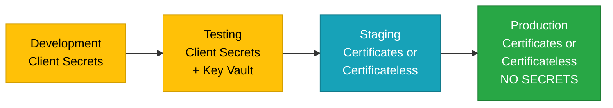

# Client Secrets

Client secrets are simple string-based credentials used to authenticate your application to Microsoft Entra ID (formerly Azure AD). While easy to configure, they provide lower security than certificates or certificateless methods and are **recommended only for development and testing**.

## Overview

### What Are Client Secrets?

A client secret is a password-like string that your application sends to Microsoft Entra ID to prove its identity. Think of it as an API key or shared secret between your application and the identity provider.

### Why Use Client Secrets?

**Development convenience:**
- ✅ Simple to create and configure
- ✅ No certificate management required
- ✅ Quick setup for testing
- ✅ Easy to rotate for development

**When appropriate:**
- ✅ Local development environments
- ✅ Proof-of-concept projects
- ✅ Testing and staging (with caution)
- ✅ Short-lived demo applications

### Why NOT Use Client Secrets in Production

**Security concerns:**
- ❌ Symmetric key (both sides know the secret)
- ❌ Lower security than asymmetric cryptography
- ❌ Risk of exposure in configuration files
- ❌ No cryptographic proof of identity
- ❌ Many organizations prohibit client secrets entirely

**Operational limitations:**
- ❌ Manual rotation required
- ❌ No automatic renewal
- ❌ Difficult to manage at scale
- ❌ Limited audit capabilities

**Compliance issues:**
- ❌ May not meet regulatory requirements (FIPS, PCI-DSS, etc.)
- ❌ Not accepted by some security teams
- ❌ Fails many security assessments

---

## Client Secrets vs Alternatives

| Feature | Client Secrets | Certificates | Certificateless (FIC+MSI) |
|---------|---------------|--------------|---------------------------|
| **Security** | Low | High | Very High |
| **Setup complexity** | Very simple | Moderate | Moderate |
| **Production ready** | No | Yes | Yes |
| **Rotation** | Manual | Manual or automated | Automatic |
| **Compliance** | Often fails | Usually passes | Usually passes |
| **Cost** | Free | Certificate costs | Free |
| **Azure dependency** | No | No | Yes (Azure only) |
| **Recommended for** | Dev/test only | Production | Production on Azure |

**Production alternatives:**
- **Running on Azure?** → [Certificateless Authentication](./certificateless.md) (recommended)
- **Certificate required?** → [Certificate-Based Authentication](./certificates.md)
- **Need strong security?** → Avoid client secrets

---

## Configuration

### JSON Configuration (appsettings.json)

```json
{
  "AzureAd": {
    "Instance": "https://login.microsoftonline.com/",
    "TenantId": "your-tenant-id",
    "ClientId": "your-client-id",
    "ClientCredentials": [
      {
        "SourceType": "ClientSecret",
        "ClientSecret": "your-client-secret"
      }
    ]
  }
}
```

### C# Code Configuration

```csharp
using Microsoft.Identity.Abstractions;

var credentialDescription = new CredentialDescription
{
    SourceType = CredentialSource.ClientSecret,
    ClientSecret = "your-client-secret"
};
```

### ASP.NET Core Web App

```csharp
using Microsoft.AspNetCore.Authentication.OpenIdConnect;
using Microsoft.Identity.Web;
using Microsoft.Identity.Abstractions;

var builder = WebApplication.CreateBuilder(args);

builder.Services.AddAuthentication(OpenIdConnectDefaults.AuthenticationScheme)
    .AddMicrosoftIdentityWebApp(options =>
    {
        options.Instance = "https://login.microsoftonline.com/";
        options.TenantId = "your-tenant-id";
        options.ClientId = "your-client-id";
        options.ClientCredentials = new[]
        {
            new CredentialDescription
            {
                SourceType = CredentialSource.ClientSecret,
                ClientSecret = builder.Configuration["AzureAd:ClientSecret"]
            }
        };
    });
```

### ASP.NET Core Web API

```csharp
using Microsoft.AspNetCore.Authentication.JwtBearer;
using Microsoft.Identity.Web;
using Microsoft.Identity.Abstractions;

var builder = WebApplication.CreateBuilder(args);

builder.Services.AddAuthentication(JwtBearerDefaults.AuthenticationScheme)
    .AddMicrosoftIdentityWebApi(options =>
    {
        options.Instance = "https://login.microsoftonline.com/";
        options.TenantId = "your-tenant-id";
        options.ClientId = "your-client-id";
        options.ClientCredentials = new[]
        {
            new CredentialDescription
            {
                SourceType = CredentialSource.ClientSecret,
                ClientSecret = builder.Configuration["AzureAd:ClientSecret"]
            }
        };
    })
    .EnableTokenAcquisitionToCallDownstreamApi()
    .AddInMemoryTokenCaches();
```

### Daemon Application (Console/Worker Service)

```csharp
using Microsoft.Extensions.DependencyInjection;
using Microsoft.Identity.Abstractions;
using Microsoft.Identity.Web;

// Client secret loaded from appsettings.json automatically
var tokenAcquirerFactory = TokenAcquirerFactory.GetDefaultInstance();
var sp = tokenAcquirerFactory.Build();

var api = sp.GetRequiredService<IDownstreamApi>();
var result = await api.GetForAppAsync<MyData>("MyApi");
```

---

## Setup Guide

### Step 1: Create Client Secret in Azure Portal

1. Navigate to **Microsoft Entra ID** > **App registrations**
2. Select your application
3. Click **Certificates & secrets**
4. Under **Client secrets** tab, click **New client secret**
5. Configure the secret:
   - **Description:** Descriptive name (e.g., "Development Secret" or "Testing Secret")
   - **Expires:** Select expiration period
     - 6 months (recommended for development)
     - 12 months
     - 24 months
     - Custom
6. Click **Add**
7. **IMPORTANT:** Copy the secret value **immediately** - you won't be able to see it again

### Step 2: Store the Secret Securely

**⚠️ CRITICAL: Never commit secrets to source control**

**Option A: User Secrets (Local Development - Recommended)**

```bash
# .NET User Secrets (local development only)
cd YourProject
dotnet user-secrets init
dotnet user-secrets set "AzureAd:ClientSecret" "your-client-secret"
```

User secrets are stored outside your project directory and never committed to source control.

**Option B: Environment Variables**

```bash
# Linux/macOS
export AzureAd__ClientSecret="your-client-secret"

# Windows PowerShell
$env:AzureAd__ClientSecret="your-client-secret"
```

**Option C: Azure Key Vault (Best for Shared Environments)**

```bash
# Store secret in Key Vault
az keyvault secret set \
    --vault-name <keyvault-name> \
    --name "AzureAd--ClientSecret" \
    --value "your-client-secret"
```

Configure your application to read from Key Vault:

```csharp
var builder = WebApplication.CreateBuilder(args);

// Add Key Vault configuration
var keyVaultUrl = builder.Configuration["KeyVaultUrl"];
builder.Configuration.AddAzureKeyVault(
    new Uri(keyVaultUrl),
    new DefaultAzureCredential());
```

**Option D: Azure App Service Configuration**

```bash
# Set app setting in Azure App Service
az webapp config appsettings set \
    --name <app-name> \
    --resource-group <resource-group> \
    --settings AzureAd__ClientSecret="your-client-secret"
```

### Step 3: Configure Your Application

Add to `appsettings.json` (without the secret value):

```json
{
  "AzureAd": {
    "Instance": "https://login.microsoftonline.com/",
    "TenantId": "your-tenant-id",
    "ClientId": "your-client-id",
    "ClientCredentials": [
      {
        "SourceType": "ClientSecret"
      }
    ]
  }
}
```

The actual secret value comes from user secrets, environment variable, or Key Vault.

---

## Securing Client Secrets

### Development Best Practices

**DO:**
- ✅ Use .NET User Secrets for local development
- ✅ Store secrets in Key Vault for shared dev/test environments
- ✅ Use separate secrets for each environment (dev, test, staging)
- ✅ Rotate secrets regularly (every 3-6 months)
- ✅ Use short expiration periods (6-12 months)
- ✅ Document where secrets are stored
- ✅ Remove secrets from configuration files before committing

**DON'T:**
- ❌ Commit secrets to source control
- ❌ Share secrets via email, Slack, or Teams
- ❌ Store secrets in plaintext files
- ❌ Use production secrets in development
- ❌ Leave expired secrets in app registration
- ❌ Use the same secret across multiple environments

### .gitignore Configuration

Ensure your `.gitignore` includes:

```gitignore
# User secrets
secrets.json

# Environment files
.env
.env.local
.env.*.local

# Configuration files with secrets
appsettings.Development.json
appsettings.Local.json
**/appsettings.*.json

# VS user-specific files
*.user
*.suo
```

### Configuration Hierarchy

Microsoft.Identity.Web resolves client secrets in this order:

1. **Code configuration** (least recommended)
2. **Environment variables** (good for containers)
3. **User secrets** (best for local development)
4. **Azure Key Vault** (best for shared environments)
5. **appsettings.json** (never store secrets here)

---

## Secret Rotation

### Rotation Strategy

**Step 1: Create new secret**

1. Create a new client secret in Azure Portal
2. Note the new secret value
3. Keep old secret active

**Step 2: Update configuration with new secret**

```bash
# Update user secrets
dotnet user-secrets set "AzureAd:ClientSecret" "new-secret-value"

# Or update Key Vault
az keyvault secret set \
    --vault-name <keyvault-name> \
    --name "AzureAd--ClientSecret" \
    --value "new-secret-value"
```

**Step 3: Deploy and verify**

- Deploy updated configuration
- Verify authentication works with new secret
- Monitor for errors

**Step 4: Remove old secret**

- After grace period (e.g., 24-48 hours)
- Delete old client secret from app registration
- Verify no applications are using old secret

### Automated Rotation Reminders

**Azure Portal:**
- Set calendar reminders 30 days before expiration

**Automation:**
```bash
# Script to check secret expiration
az ad app credential list \
    --id <app-id> \
    --query "[?type=='Password'].{Description:customKeyIdentifier, Expires:endDateTime}" \
    -o table
```

---

## Migration to Production Credentials

### From Client Secrets to Certificates

**Step 1: Create and configure certificate**

See [Certificate-Based Authentication](./certificates.md) for detailed instructions.

**Step 2: Add certificate alongside secret**

```json
{
  "AzureAd": {
    "ClientCredentials": [
      {
        "SourceType": "KeyVault",
        "KeyVaultUrl": "https://keyvault.vault.azure.net",
        "KeyVaultCertificateName": "ProductionCert"
      },
      {
        "SourceType": "ClientSecret",
        "ClientSecret": "fallback-secret"
      }
    ]
  }
}
```

**Step 3: Test with certificate in non-production**

**Step 4: Deploy to production with certificate only**

**Step 5: Remove client secret**

### From Client Secrets to Certificateless (FIC+MSI)

**Step 1: Enable managed identity and configure FIC**

See [Certificateless Authentication](./certificateless.md) for detailed instructions.

**Step 2: Add certificateless alongside secret**

```json
{
  "AzureAd": {
    "ClientCredentials": [
      {
        "SourceType": "SignedAssertionFromManagedIdentity"
      },
      {
        "SourceType": "ClientSecret",
        "ClientSecret": "fallback-secret"
      }
    ]
  }
}
```

**Step 3: Test in Azure**

Managed identity only works in Azure, so test in an Azure environment.

**Step 4: Deploy to production**

**Step 5: Remove client secret**

---

## Troubleshooting

### Problem: "Invalid client secret provided"

**Possible causes:**
- Secret expired
- Wrong secret value
- Secret not configured in app registration
- Whitespace or encoding issues

**Solutions:**
1. Verify secret exists and is not expired:
   ```bash
   az ad app credential list --id <app-id>
   ```
2. Create new secret if expired
3. Check for leading/trailing whitespace in configuration
4. Verify secret matches app registration

### Problem: Secret not loading from configuration

**Possible causes:**
- Configuration key name mismatch
- Environment variable not set
- User secrets not initialized
- Key Vault access denied

**Solutions:**
```csharp
// Debug: Log where secret is coming from
var secret = builder.Configuration["AzureAd:ClientSecret"];
Console.WriteLine($"Secret loaded: {secret != null}");
Console.WriteLine($"Secret length: {secret?.Length ?? 0}");
```

### Problem: Works locally but fails in Azure

**Possible causes:**
- Different configuration sources (user secrets vs app settings)
- Secret not deployed to Azure App Service
- Key Vault permissions not configured

**Solutions:**
1. Check Azure App Service configuration settings
2. Verify Key Vault access from App Service
3. Use same secret storage mechanism across environments

---

## Security Warnings

### ⚠️ Common Pitfalls

**Exposed secrets:**
- ❌ Secrets committed to Git repositories
- ❌ Secrets in public Docker images
- ❌ Secrets logged in application logs
- ❌ Secrets in error messages or exceptions

**Detection and remediation:**
```bash
# Scan Git history for secrets (using git-secrets or similar)
git secrets --scan-history

# If secret exposed in Git history:
# 1. Immediately revoke the secret in Azure Portal
# 2. Create new secret
# 3. Update all configurations
# 4. Consider rewriting Git history (complex)
```

### 🔒 Defense in Depth

Even when using client secrets for development:

1. **Separate secrets per environment** - Never reuse production secrets
2. **Short expiration** - 6 months or less for development
3. **Regular rotation** - Rotate every 3-6 months
4. **Access auditing** - Monitor secret usage
5. **Least privilege** - Grant minimum required permissions

---

## When Client Secrets Are Acceptable

### Acceptable Use Cases

**Development:**
- ✅ Local developer workstations (with user secrets)
- ✅ Personal development Azure subscriptions
- ✅ Proof-of-concept projects

**Testing:**
- ✅ Automated testing (CI/CD with secure secret storage)
- ✅ Integration test environments (isolated, non-production)
- ✅ Staging environments (with enhanced monitoring)

**Special scenarios:**
- ✅ Short-lived demo applications
- ✅ Internal tools with limited scope
- ✅ Temporary solutions during migration

### Unacceptable Use Cases

**Never use client secrets for:**
- ❌ Production applications
- ❌ Customer-facing services
- ❌ Applications handling sensitive data
- ❌ Long-running services
- ❌ Publicly accessible applications
- ❌ Compliance-regulated workloads

---

## Migration Path to Production



**Recommended progression:**
1. **Development:** Client secrets with user secrets
2. **Testing:** Client secrets in Key Vault (short-lived)
3. **Staging:** Certificates or certificateless (production-like)
4. **Production:** Certificates or certificateless (no client secrets)

---

## Additional Resources

- **[Azure Key Vault for Secrets](https://learn.microsoft.com/azure/key-vault/secrets/about-secrets)** - Secure secret storage
- **[.NET User Secrets](https://learn.microsoft.com/aspnet/core/security/app-secrets)** - Local development secrets
- **[Client Credentials Flow](https://learn.microsoft.com/azure/active-directory/develop/v2-oauth2-client-creds-grant-flow)** - OAuth 2.0 client credentials
- **[Secret Scanning Tools](https://github.com/awslabs/git-secrets)** - Detect exposed secrets

---

## Next Steps

### Migrate to Production Credentials

- **[Certificateless Authentication](./certificateless.md)** - Best for Azure (recommended)
- **[Certificate-Based Authentication](./certificates.md)** - Universal production solution

### Learn More

- **[Back to Credentials Overview](./README.md)** - Compare all credential types
- **[Calling Downstream APIs](../../calling-downstream-apis/README.md)** - Use credentials to call APIs
- **[Security Best Practices](../../advanced/security-best-practices.md)** - Comprehensive security guidance

---

**⚠️ Remember:** Client secrets are for development only. Always use certificates or certificateless authentication in production.

**Need help?** [Open an issue](https://github.com/AzureAD/microsoft-identity-web/issues) or check [troubleshooting guides](../../scenarios/web-apps/troubleshooting.md).