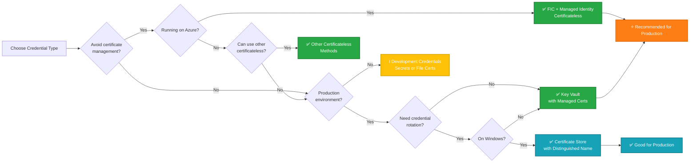

# Application Credentials in Microsoft.Identity.Web

Client credentials are used to prove the identity of your application when acquiring tokens from Microsoft Entra ID (formerly Azure AD). Microsoft.Identity.Web supports multiple credential types to meet different security requirements, deployment environments, and operational needs.

## Overview

### What Are Client Credentials?

Client credentials authenticate your application to the identity provider. They serve two primary purposes:

1. **Client Credentials** - Prove the identity of your application when acquiring tokens
2. **Token Decryption Credentials** - Decrypt encrypted tokens sent to your application

### Why Authentication Matters

Proper credential management is critical for:

- **Security** - Protecting your application and user data
- **Compliance** - Meeting regulatory and organizational requirements
- **Operations** - Minimizing management overhead and security incidents
- **Reliability** - Ensuring your application can authenticate consistently

### Microsoft.Identity.Web's Approach

Microsoft.Identity.Web provides a unified `ClientCredentials` configuration model that supports both traditional certificate-based authentication and modern certificateless approaches. This flexibility allows you to choose the right credential type for your scenario while maintaining a consistent configuration pattern.

---

## When to Use Which Credential Type

### Decision Flow



### Comparison Table

| Credential Type | What Is It | When to Use | Advantages | Considerations |
|----------------|------------|-------------|------------|----------------|
| **Federated Identity Credential with Managed Identity (FIC+MSI)** <br> (`SignedAssertionFromManagedIdentity`) | Azure Managed Identity generates signed assertions | • Production on Azure<br>• Zero certificate management<br>• Cloud-native apps | • No secrets to manage<br>• Automatic rotation<br>• No certificate lifecycle<br>• Highly secure<br>• Cost-effective | • Azure-only<br>• Requires managed identity setup |
| **Key Vault** <br> (`SourceType = KeyVault`) | Certificate stored in Azure Key Vault | • Production environments<br>• Centralized management<br>• Automatic rotation<br>• Shared credentials | • Centralized control<br>• Audit logging<br>• Access policies<br>• Automatic renewal<br>• Cross-platform | • Requires Azure subscription<br>• Additional cost<br>• Network dependency |
| **Certificate Store** <br> (`StoreWithThumbprint` or `StoreWithDistinguishedName`) | Certificate in Windows Certificate Store | • Production on Windows<br>• Using Windows cert management<br>• On-premises environments | • Integrated with Windows<br>• IT-managed certificates<br>• Hardware security modules (HSM)<br>• Distinguished Name enables rotation | • Windows-only<br>• Manual renewal (with thumbprint)<br>• Requires certificate management |
| **File Path** <br> (`SourceType = Path`) | PFX/P12 file on disk | • Development/testing<br>• Simple deployment<br>• Container environments | • Simple setup<br>• Easy deployment<br>• No external dependencies | **Not for production**<br>• File system security risk<br>• Manual rotation<br>• Secret exposure risk |
| **Base64 Encoded** <br> (`SourceType = Base64Encoded`) | Certificate as base64 string | • Development/testing<br>• Configuration-embedded certificates<br>• Environment variables | • Simple configuration<br>• No file system dependency<br>• Works in containers | **Not for production**<br>• Configuration exposure<br>• Manual rotation<br>• Difficult to secure |
| **Client Secret** <br> (`SourceType = ClientSecret`) | Simple shared secret string | • Development/testing<br>• Proof of concept<br>• Basic scenarios | • Simple to use<br>• Easy to configure<br>• Quick setup | **Not for production**<br>• Lower security<br>• Manual rotation<br>• Exposure risk |
| **Auto Decrypt Keys** <br> (`SourceType = AutoDecryptKeys`) | Automatic key retrieval for token decryption | • Encrypted token scenarios<br>• Automatic token decryption | • Automatic key management<br>• Key rotation support<br>• Transparent decryption | • Specific use case<br>• Requires client credentials<br>• Additional configuration |

---

## Quick Configuration Examples

All credential types are configured in the `ClientCredentials` array in your application configuration. Both JSON and code-based configuration are supported.

### Certificateless Authentication (FIC + Managed Identity) ⭐ Recommended

**Best for:** Production applications running on Azure

#### JSON Configuration

```json
{
  "AzureAd": {
    "Instance": "https://login.microsoftonline.com/",
    "TenantId": "your-tenant-id",
    "ClientId": "your-client-id",
    "ClientCredentials": [
      {
        "SourceType": "SignedAssertionFromManagedIdentity",
        "ManagedIdentityClientId": "optional-for-user-assigned-msi"
      }
    ]
  }
}
```

#### C# Code Configuration

```csharp
using Microsoft.Identity.Abstractions;

var credentialDescription = new CredentialDescription
{
    SourceType = CredentialSource.SignedAssertionFromManagedIdentity,
    ManagedIdentityClientId = "optional-for-user-assigned-msi"
};
```

**Benefits:**
- ✅ Zero certificate management overhead
- ✅ Automatic credential rotation
- ✅ No secrets in configuration
- ✅ Reduced security risk

**[Learn more about certificateless authentication →](./certificateless.md)**

---

### Certificates from Key Vault

**Best for:** Production applications requiring certificate-based authentication with centralized management

#### JSON Configuration

```json
{
  "AzureAd": {
    "Instance": "https://login.microsoftonline.com/",
    "TenantId": "your-tenant-id",
    "ClientId": "your-client-id",
    "ClientCredentials": [
      {
        "SourceType": "KeyVault",
        "KeyVaultUrl": "https://your-keyvault.vault.azure.net",
        "KeyVaultCertificateName": "YourCertificateName"
      }
    ]
  }
}
```

#### C# Code Configuration

```csharp
using Microsoft.Identity.Abstractions;

// Using property initialization
var credentialDescription = new CredentialDescription
{
    SourceType = CredentialSource.KeyVault,
    KeyVaultUrl = "https://your-keyvault.vault.azure.net",
    KeyVaultCertificateName = "YourCertificateName"
};

// Using helper method
var credentialDescription = CredentialDescription.FromKeyVault(
    "https://your-keyvault.vault.azure.net",
    "YourCertificateName");
```

**Benefits:**
- ✅ Centralized certificate management
- ✅ Automatic renewal support
- ✅ Audit logging and access control
- ✅ Works across platforms

**[Learn more about Key Vault certificates →](./certificates.md#key-vault)**

---

### Certificates from Certificate Store

**Best for:** Production Windows applications using enterprise certificate management

#### Using Thumbprint

**JSON Configuration:**

```json
{
  "AzureAd": {
    "Instance": "https://login.microsoftonline.com/",
    "TenantId": "your-tenant-id",
    "ClientId": "your-client-id",
    "ClientCredentials": [
      {
        "SourceType": "StoreWithThumbprint",
        "CertificateStorePath": "CurrentUser/My",
        "CertificateThumbprint": "A1B2C3D4E5F6..."
      }
    ]
  }
}
```

**C# Code Configuration:**

```csharp
using Microsoft.Identity.Abstractions;

var credentialDescription = CredentialDescription.FromCertificateStore(
    "CurrentUser/My",
    thumbprint: "A1B2C3D4E5F6...");
```

#### Using Distinguished Name (Recommended for Rotation)

**JSON Configuration:**

```json
{
  "AzureAd": {
    "Instance": "https://login.microsoftonline.com/",
    "TenantId": "your-tenant-id",
    "ClientId": "your-client-id",
    "ClientCredentials": [
      {
        "SourceType": "StoreWithDistinguishedName",
        "CertificateStorePath": "CurrentUser/My",
        "CertificateDistinguishedName": "CN=YourAppCertificate"
      }
    ]
  }
}
```

**C# Code Configuration:**

```csharp
using Microsoft.Identity.Abstractions;

var credentialDescription = CredentialDescription.FromCertificateStore(
    "CurrentUser/My",
    distinguishedName: "CN=YourAppCertificate");
```

**Certificate Store Paths:**
- `CurrentUser/My` - User's personal certificate store
- `LocalMachine/My` - Computer's certificate store

**Benefits:**
- ✅ Integrated with Windows certificate management
- ✅ Hardware security module (HSM) support
- ✅ IT-managed certificate lifecycle
- ✅ Distinguished Name enables automatic rotation

**[Learn more about certificate store →](./certificates.md#certificate-store)**

---

### Certificates from File Path

**Best for:** Development, testing, and simple deployments

#### JSON Configuration

```json
{
  "AzureAd": {
    "Instance": "https://login.microsoftonline.com/",
    "TenantId": "your-tenant-id",
    "ClientId": "your-client-id",
    "ClientCredentials": [
      {
        "SourceType": "Path",
        "CertificateDiskPath": "/app/certificates/mycert.pfx",
        "CertificatePassword": "certificate-password"
      }
    ]
  }
}
```

#### C# Code Configuration

```csharp
using Microsoft.Identity.Abstractions;

var credentialDescription = CredentialDescription.FromCertificatePath(
    "/app/certificates/mycert.pfx",
    "certificate-password");
```

**⚠️ Security Warning:** Not recommended for production. Use Key Vault or Certificate Store instead.

**[Learn more about file-based certificates →](./certificates.md#file-path)**

---

### Base64 Encoded Certificates

**Best for:** Development and testing with configuration-embedded certificates

#### JSON Configuration

```json
{
  "AzureAd": {
    "Instance": "https://login.microsoftonline.com/",
    "TenantId": "your-tenant-id",
    "ClientId": "your-client-id",
    "ClientCredentials": [
      {
        "SourceType": "Base64Encoded",
        "Base64EncodedValue": "MIID... (base64 encoded certificate)"
      }
    ]
  }
}
```

#### C# Code Configuration

```csharp
using Microsoft.Identity.Abstractions;

var credentialDescription = CredentialDescription.FromBase64String(
    "MIID... (base64 encoded certificate)");
```

**⚠️ Security Warning:** Not recommended for production. Secrets exposed in configuration files.

**[Learn more about base64 certificates →](./certificates.md#base64-encoded)**

---

### Client Secrets (Development/Testing Only)

**Best for:** Development, testing, and proof-of-concept scenarios

#### JSON Configuration

```json
{
  "AzureAd": {
    "Instance": "https://login.microsoftonline.com/",
    "TenantId": "your-tenant-id",
    "ClientId": "your-client-id",
    "ClientCredentials": [
      {
        "SourceType": "ClientSecret",
        "ClientSecret": "your-client-secret"
      }
    ]
  }
}
```

#### C# Code Configuration

```csharp
using Microsoft.Identity.Abstractions;

var credentialDescription = new CredentialDescription
{
    SourceType = CredentialSource.ClientSecret,
    ClientSecret = "your-client-secret"
};
```

**⚠️ Security Warning:**
- **Not for production use**
- Lower security than certificates or certificateless methods
- Some organizations prohibit client secrets entirely
- Manual rotation required

**[Learn more about client secrets →](./client-secrets.md)**

---

### Token Decryption Credentials

**Best for:** Applications that receive encrypted tokens

#### JSON Configuration

```json
{
  "AzureAd": {
    "Instance": "https://login.microsoftonline.com/",
    "TenantId": "your-tenant-id",
    "ClientId": "your-client-id",
    "TokenDecryptionCredentials": [
      {
        "SourceType": "AutoDecryptKeys",
        "DecryptKeysAuthenticationOptions": {
          "ProtocolScheme": "Bearer",
          "AcquireTokenOptions": {
            "Tenant": "your-tenant.onmicrosoft.com"
          }
        }
      }
    ]
  }
}
```

#### C# Code Configuration

```csharp
using Microsoft.Identity.Abstractions;

var credentialDescription = new CredentialDescription
{
    SourceType = CredentialSource.AutoDecryptKeys,
    DecryptKeysAuthenticationOptions = new AuthorizationHeaderProviderOptions
    {
        ProtocolScheme = "Bearer",
        AcquireTokenOptions = new AcquireTokenOptions
        {
            Tenant = "your-tenant.onmicrosoft.com"
        }
    }
};
```

**Note:** Token decryption credentials require client credentials to acquire decryption keys.

**[Learn more about token decryption →](./token-decryption.md)**

---

## Security Best Practices

### For Production Environments

**Recommended (Priority Order):**

1. **Certificateless Authentication (if possible)**
   - ✅ Federated Identity Credential with Managed Identity (FIC+MSI)
   - ✅ Other certificateless methods
   - **Why:** Zero credential management, automatic rotation, lowest risk

2. **Certificate-Based Authentication (if required)**
   - ✅ Azure Key Vault with managed certificates
   - ✅ Certificate Store with Distinguished Name (Windows)
   - **Why:** Strong cryptographic proof, suitable for compliance requirements

**Never in Production:**
- ❌ Client Secrets
- ❌ File-based certificates (except in secure container environments)
- ❌ Base64 encoded certificates

### For Development and Testing

**Acceptable shortcuts:**
- ✅ Client secrets (for quick setup)
- ✅ File-based certificates (for local development)
- ✅ Base64 encoded certificates (for isolated testing)

**Important:** Keep development credentials separate from production and rotate them regularly.

### Common Security Pitfalls

1. **Hardcoding Secrets** - Never commit credentials to source control
2. **Using Development Credentials in Production** - Always use production-grade credentials for production
3. **Ignoring Rotation** - Implement credential rotation strategies
4. **Overprivileged Service Principals** - Grant only necessary permissions
5. **Inadequate Monitoring** - Log and monitor credential usage

---

## Configuration Approaches

### Configuration by File (appsettings.json)

All scenarios support configuration through `appsettings.json`:

```json
{
  "AzureAd": {
    "Instance": "https://login.microsoftonline.com/",
    "TenantId": "your-tenant-id",
    "ClientId": "your-client-id",
    "ClientCredentials": [
      {
        "SourceType": "SignedAssertionFromManagedIdentity"
      }
    ]
  }
}
```

**For daemon apps and console applications:**
Ensure `appsettings.json` is copied to the output directory. Add this to your `.csproj`:

```xml
<ItemGroup>
  <None Update="appsettings.json">
    <CopyToOutputDirectory>PreserveNewest</CopyToOutputDirectory>
  </None>
</ItemGroup>
```

### Configuration by Code

You can configure credentials programmatically:

#### ASP.NET Core Web App

```csharp
using Microsoft.AspNetCore.Authentication.OpenIdConnect;
using Microsoft.Identity.Web;
using Microsoft.Identity.Abstractions;

var builder = WebApplication.CreateBuilder(args);

builder.Services.AddAuthentication(OpenIdConnectDefaults.AuthenticationScheme)
    .AddMicrosoftIdentityWebApp(options =>
    {
        options.Instance = "https://login.microsoftonline.com/";
        options.TenantId = "your-tenant-id";
        options.ClientId = "your-client-id";
        options.ClientCredentials = new[]
        {
            new CredentialDescription
            {
                SourceType = CredentialSource.SignedAssertionFromManagedIdentity
            }
        };
    });
```

#### ASP.NET Core Web API

```csharp
using Microsoft.AspNetCore.Authentication.JwtBearer;
using Microsoft.Identity.Web;
using Microsoft.Identity.Abstractions;

var builder = WebApplication.CreateBuilder(args);

builder.Services.AddAuthentication(JwtBearerDefaults.AuthenticationScheme)
    .AddMicrosoftIdentityWebApi(options =>
    {
        options.Instance = "https://login.microsoftonline.com/";
        options.TenantId = "your-tenant-id";
        options.ClientId = "your-client-id";
        options.ClientCredentials = new[]
        {
            new CredentialDescription
            {
                SourceType = CredentialSource.KeyVault,
                KeyVaultUrl = "https://your-keyvault.vault.azure.net",
                KeyVaultCertificateName = "YourCertificateName"
            }
        };
    });
```

#### Daemon Application

```csharp
using Microsoft.Extensions.DependencyInjection;
using Microsoft.Identity.Abstractions;
using Microsoft.Identity.Web;

var tokenAcquirerFactory = TokenAcquirerFactory.GetDefaultInstance();

// Credentials are loaded from appsettings.json automatically
// Or configure programmatically:
tokenAcquirerFactory.Services.Configure<MicrosoftIdentityApplicationOptions>(options =>
{
    options.Instance = "https://login.microsoftonline.com/";
    options.TenantId = "your-tenant-id";
    options.ClientId = "your-client-id";
    options.ClientCredentials = new[]
    {
        new CredentialDescription
        {
            SourceType = CredentialSource.SignedAssertionFromManagedIdentity
        }
    };
});
```

### Hybrid Approach

You can mix file and code configuration:

```csharp
// Load base configuration from appsettings.json
var builder = WebApplication.CreateBuilder(args);

builder.Services.AddAuthentication(OpenIdConnectDefaults.AuthenticationScheme)
    .AddMicrosoftIdentityWebApp(builder.Configuration.GetSection("AzureAd"));

// Override or supplement with code-based configuration
builder.Services.Configure<MicrosoftIdentityOptions>(options =>
{
    // Add additional credential sources
    options.ClientCredentials = options.ClientCredentials.Concat(new[]
    {
        new CredentialDescription
        {
            SourceType = CredentialSource.KeyVault,
            KeyVaultUrl = Environment.GetEnvironmentVariable("KEY_VAULT_URL"),
            KeyVaultCertificateName = Environment.GetEnvironmentVariable("CERT_NAME")
        }
    }).ToArray();
});
```

---

## Important Notes

### Credential Types and Usage

1. **Certificate** - Can be used for both client credentials and token decryption
2. **Client Secret** - Only for client credentials (not for token decryption)
3. **Signed Assertion** - Only for client credentials (not for token decryption)
4. **Decrypt Keys** - Only for token decryption (not for client credentials)

### Multiple Credentials

You can configure multiple credential sources in the `ClientCredentials` array. Microsoft.Identity.Web will attempt to use them in order:

```json
{
  "ClientCredentials": [
    {
      "SourceType": "SignedAssertionFromManagedIdentity"
    },
    {
      "SourceType": "KeyVault",
      "KeyVaultUrl": "https://your-keyvault.vault.azure.net",
      "KeyVaultCertificateName": "FallbackCertificate"
    }
  ]
}
```

This provides fallback options and supports migration scenarios.

### Custom Credential Providers

For advanced scenarios, you can implement custom signed assertion providers:

```json
{
  "ClientCredentials": [
    {
      "SourceType": "CustomSignedAssertion",
      "CustomSignedAssertionProviderName": "MyCustomProvider",
      "CustomSignedAssertionProviderData": {
        "Key1": "Value1",
        "Key2": "Value2"
      }
    }
  ]
}
```

See [Custom Signed Assertion Providers](../../advanced/custom-credential-providers.md) for details.

---

## Next Steps

### Choose Your Credential Type

Based on the decision flow and comparison table above, select the credential type that best fits your scenario:

- **[Certificateless Authentication →](./certificateless.md)** - FIC+MSI and modern approaches (recommended)
- **[Certificates →](./certificates.md)** - Key Vault, Certificate Store, File, Base64
- **[Client Secrets →](./client-secrets.md)** - Development and testing
- **[Token Decryption →](./token-decryption.md)** - Encrypted token scenarios

### Explore Scenarios

Learn how credentials are used in different application scenarios:

- **[Web Applications](../../getting-started/quickstart-webapp.md)** - Sign-in users with web apps
- **[Web APIs](../../getting-started/quickstart-webapi.md)** - Protect and call APIs
- **[Daemon Applications](../../getting-started/daemon-app.md)** - Background services and console apps
- **[Agent Identities](../../scenarios/agent-identities/README.md)** - Call APIs on behalf of agents

### Related Topics

- **[Calling Downstream APIs](../../calling-downstream-apis/calling-downstream-apis-README.md)** - Use credentials to call protected APIs
- **[Token Cache](../token-cache/token-cache-README.md)** - Configure token caching strategies
- **[Migration Guides](../../migration/README.md)** - Upgrade from previous versions

---

## Troubleshooting

### Common Issues

**Problem:** "The provided client credential is not valid"

**Solutions:**
- Verify the credential type matches your app registration
- Check that certificates are not expired
- Ensure managed identity is properly configured
- Validate Key Vault access permissions

**Problem:** "Cannot find certificate with thumbprint"

**Solutions:**
- Verify the certificate is installed in the correct store
- Check the thumbprint matches exactly (no spaces or extra characters)
- Consider using Distinguished Name for rotation support
- Ensure the application has permission to access the certificate store

**Problem:** "Access to Key Vault was denied"

**Solutions:**
- Verify managed identity has "Get" permission for secrets and certificates
- Check Key Vault access policies or RBAC assignments
- Ensure network connectivity to Key Vault
- Validate the Key Vault URL and certificate name are correct

**More troubleshooting:** See scenario-specific troubleshooting guides in [Web Apps](../../scenarios/web-apps/troubleshooting.md), [Web APIs](../../scenarios/web-apis/troubleshooting.md), and [Daemon Apps](../../getting-started/daemon-app.md).

---

## Additional Resources

- **[Microsoft.Identity.Abstractions CredentialDescription](https://github.com/AzureAD/microsoft-identity-abstractions-for-dotnet/blob/main/docs/credentialdescription.md)** - Underlying credential model
- **[Azure Managed Identities](https://learn.microsoft.com/azure/active-directory/managed-identities-azure-resources/overview)** - Learn about managed identities
- **[Azure Key Vault](https://learn.microsoft.com/azure/key-vault/general/overview)** - Key Vault documentation
- **[Certificate Management](https://learn.microsoft.com/azure/active-directory/develop/howto-create-service-principal-portal)** - Managing app credentials

---

**Need help?** Visit our [troubleshooting guide](../../scenarios/web-apps/troubleshooting.md) or [open an issue](https://github.com/AzureAD/microsoft-identity-web/issues).
