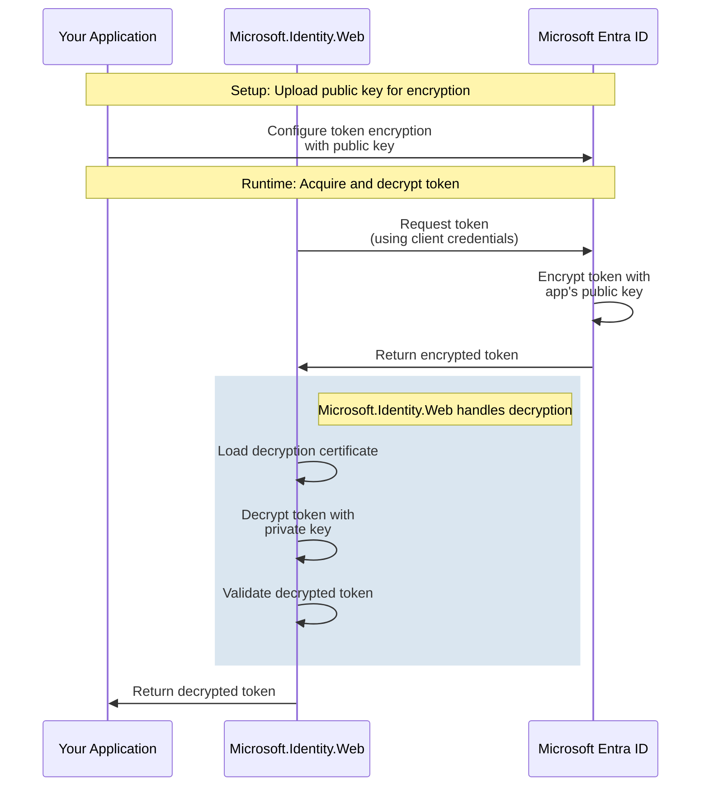

# Token Decryption Credentials

Token decryption credentials are used when your application receives encrypted tokens from Microsoft Entra ID (formerly Azure AD). This is a specialized scenario where Microsoft Entra ID encrypts tokens using your application's public key, and your application needs credentials to decrypt them.

## Overview

### What is Token Decryption?

Token decryption (also called token encryption) is a security feature where:

1. **Microsoft Entra ID encrypts** the token using your application's public key
2. **Your application decrypts** the token using its private key (decryption credential)
3. **Token contents** are protected in transit and at rest

This provides an additional layer of security beyond HTTPS, protecting token contents from unauthorized access even if network traffic is intercepted.

### When is Token Decryption Used?

**Common scenarios:**
- ✅ High-security applications requiring defense in depth
- ✅ Compliance requirements mandating token encryption
- ✅ Applications handling extremely sensitive data
- ✅ Zero-trust architecture implementations
- ✅ Applications subject to regulatory requirements (HIPAA, PCI-DSS, etc.)

**Not needed for most applications:**
- ⚠️ Most applications use HTTPS, which already encrypts tokens in transit
- ⚠️ Token encryption adds complexity
- ⚠️ Only implement if you have specific security or compliance requirements

### Token Decryption vs Client Credentials

**Different purposes:**

| Feature | Client Credentials | Token Decryption Credentials |
|---------|-------------------|------------------------------|
| **Purpose** | Prove app identity | Decrypt encrypted tokens |
| **Used when** | Acquiring tokens | Receiving encrypted tokens |
| **Direction** | Outbound (to Entra ID) | Inbound (from Entra ID) |
| **Required** | Always | Only if token encryption enabled |
| **Can use secrets** | Yes (not recommended) | No (certificates only) |

**Important:** Token decryption credentials are in addition to client credentials, not instead of.

---

## How Token Decryption Works



---

## Configuration

Token decryption uses certificates to decrypt encrypted tokens. You can use any of the certificate types supported by Microsoft.Identity.Web.

### Using Certificates for Token Decryption

#### JSON Configuration

```json
{
  "AzureAd": {
    "Instance": "https://login.microsoftonline.com/",
    "TenantId": "your-tenant-id",
    "ClientId": "your-client-id",
    "ClientCredentials": [
      {
        "SourceType": "SignedAssertionFromManagedIdentity"
      }
    ],
    "TokenDecryptionCredentials": [
      {
        "SourceType": "KeyVault",
        "KeyVaultUrl": "https://your-keyvault.vault.azure.net",
        "KeyVaultCertificateName": "TokenDecryptionCert"
      }
    ]
  }
}
```

#### C# Code Configuration

```csharp
using Microsoft.Identity.Abstractions;

var decryptionCredential = new CredentialDescription
{
    SourceType = CredentialSource.KeyVault,
    KeyVaultUrl = "https://your-keyvault.vault.azure.net",
    KeyVaultCertificateName = "TokenDecryptionCert"
};
```

#### ASP.NET Core Integration

```csharp
using Microsoft.AspNetCore.Authentication.JwtBearer;
using Microsoft.Identity.Web;
using Microsoft.Identity.Abstractions;

var builder = WebApplication.CreateBuilder(args);

builder.Services.AddAuthentication(JwtBearerDefaults.AuthenticationScheme)
    .AddMicrosoftIdentityWebApi(options =>
    {
        // Client credentials for acquiring tokens
        options.ClientCredentials = new[]
        {
            new CredentialDescription
            {
                SourceType = CredentialSource.SignedAssertionFromManagedIdentity
            }
        };
        
        // Token decryption credentials
        options.TokenDecryptionCredentials = new[]
        {
            new CredentialDescription
            {
                SourceType = CredentialSource.KeyVault,
                KeyVaultUrl = "https://your-keyvault.vault.azure.net",
                KeyVaultCertificateName = "TokenDecryptionCert"
            }
        };
    })
    .EnableTokenAcquisitionToCallDownstreamApi()
    .AddInMemoryTokenCaches();
```

### Certificate Types for Token Decryption

You can use any certificate type supported by Microsoft.Identity.Web:

**Azure Key Vault (Recommended):**
```json
{
  "TokenDecryptionCredentials": [
    {
      "SourceType": "KeyVault",
      "KeyVaultUrl": "https://your-keyvault.vault.azure.net",
      "KeyVaultCertificateName": "DecryptionCert"
    }
  ]
}
```

**Certificate Store (Windows):**
```json
{
  "TokenDecryptionCredentials": [
    {
      "SourceType": "StoreWithDistinguishedName",
      "CertificateStorePath": "CurrentUser/My",
      "CertificateDistinguishedName": "CN=TokenDecryptionCert"
    }
  ]
}
```

**File Path (Development):**
```json
{
  "TokenDecryptionCredentials": [
    {
      "SourceType": "Path",
      "CertificateDiskPath": "/app/certificates/decryption-cert.pfx",
      "CertificatePassword": "cert-password"
    }
  ]
}
```

**Base64 Encoded:**
```json
{
  "TokenDecryptionCredentials": [
    {
      "SourceType": "Base64Encoded",
      "Base64EncodedValue": "MIID... (base64 encoded certificate)"
    }
  ]
}
```

See [Certificates Guide](./certificates.md) for detailed information on each certificate type.

### Using Same Certificate for Both Purposes

You can use the same certificate for both client credentials and token decryption:

```json
{
  "AzureAd": {
    "ClientCredentials": [
      {
        "SourceType": "KeyVault",
        "KeyVaultUrl": "https://your-keyvault.vault.azure.net",
        "KeyVaultCertificateName": "SharedCert"
      }
    ],
    "TokenDecryptionCredentials": [
      {
        "SourceType": "KeyVault",
        "KeyVaultUrl": "https://your-keyvault.vault.azure.net",
        "KeyVaultCertificateName": "SharedCert"
      }
    ]
  }
}
```

---

## Setup Guide

### Step 1: Generate or Obtain Certificate

**Option A: Generate in Azure Key Vault**

```bash
# Generate certificate for token decryption
az keyvault certificate create \
    --vault-name <keyvault-name> \
    --name token-decryption-cert \
    --policy "$(az keyvault certificate get-default-policy)" \
    --validity 24
```

**Option B: Generate with PowerShell**

```powershell
# Generate self-signed certificate
$cert = New-SelfSignedCertificate `
    -Subject "CN=TokenDecryptionCert" `
    -CertStoreLocation "Cert:\CurrentUser\My" `
    -KeyExportPolicy Exportable `
    -KeySpec KeyExchange `
    -KeyLength 2048 `
    -KeyAlgorithm RSA `
    -HashAlgorithm SHA256 `
    -NotAfter (Get-Date).AddYears(2)

# Export public key
Export-Certificate -Cert $cert -FilePath "decryption-cert.cer"
```

**Important:** For token decryption, the certificate must have:
- ✅ Key usage: Key Encipherment
- ✅ Key spec: KeyExchange (not Signature)

### Step 2: Configure Token Encryption in App Registration

1. Navigate to **Microsoft Entra ID** > **App registrations**
2. Select your application
3. Click **Token encryption** (in the left menu under "Manage")
4. Click **Upload certificate**
5. Upload the public key certificate (.cer file)
6. Select the uploaded certificate as the **encryption certificate**
7. Click **Save**

**Azure CLI:**

```bash
# Upload certificate for token encryption
az ad app credential reset \
    --id <app-object-id> \
    --cert @decryption-cert.cer \
    --append

# Note: Setting as encryption certificate requires Graph API call
az rest \
    --method PATCH \
    --uri "https://graph.microsoft.com/v1.0/applications/<app-object-id>" \
    --body '{
        "keyCredentials": [
            {
                "type": "AsymmetricX509Cert",
                "usage": "Encrypt",
                "key": "<base64-encoded-cert>"
            }
        ]
    }'
```

### Step 3: Configure Decryption Credentials in Your Application

Use the configuration examples above to set up `TokenDecryptionCredentials` in your application.

### Step 4: Test Token Decryption

```csharp
// Token decryption happens automatically
// When your app receives an encrypted token, Microsoft.Identity.Web decrypts it

// You can verify decryption is working by inspecting token claims
var claims = User.Claims;
foreach (var claim in claims)
{
    Console.WriteLine($"{claim.Type}: {claim.Value}");
}
```

---

## Multiple Decryption Credentials

You can configure multiple token decryption credentials for rotation scenarios:

```json
{
  "AzureAd": {
    "TokenDecryptionCredentials": [
      {
        "SourceType": "KeyVault",
        "KeyVaultUrl": "https://keyvault.vault.azure.net",
        "KeyVaultCertificateName": "NewDecryptionCert"
      },
      {
        "SourceType": "KeyVault",
        "KeyVaultUrl": "https://keyvault.vault.azure.net",
        "KeyVaultCertificateName": "OldDecryptionCert"
      }
    ]
  }
}
```

Microsoft.Identity.Web tries each credential until one successfully decrypts the token.

---

## Token Decryption Key Rotation

### Rotation Strategy

**Step 1: Generate new certificate**

Create a new certificate for token decryption (see Step 1 in Setup Guide).

**Step 2: Upload new certificate to app registration**

Upload the new public key and configure it as an additional encryption certificate (don't remove the old one yet).

**Step 3: Deploy configuration with both certificates**

```json
{
  "TokenDecryptionCredentials": [
    { "SourceType": "KeyVault", "KeyVaultCertificateName": "NewDecryptionCert" },
    { "SourceType": "KeyVault", "KeyVaultCertificateName": "OldDecryptionCert" }
  ]
}
```

**Step 4: Wait for token refresh**

Tokens are encrypted with the certificate configured in app registration. After updating app registration, newly issued tokens use the new certificate. Wait for all existing tokens to expire (typically 1 hour).

**Step 5: Remove old certificate**

Once all tokens are using the new certificate:
- Remove old certificate from configuration
- Remove old certificate from app registration
- Delete old certificate from Key Vault/store

---

## Troubleshooting

### Problem: "Unable to decrypt token"

**Possible causes:**
- Decryption certificate not configured
- Certificate doesn't match app registration
- Private key not accessible
- Wrong certificate used (signature cert instead of encryption cert)

**Solutions:**

1. Verify token encryption is enabled:
   - Check app registration > Token encryption
   - Ensure certificate is uploaded and selected

2. Verify decryption credentials are configured:
   ```csharp
   // Add logging to verify credentials are loaded
   var decryptCreds = options.TokenDecryptionCredentials;
   Console.WriteLine($"Decryption credentials: {decryptCreds?.Length ?? 0}");
   ```

3. Check certificate key usage:
   ```bash
   # Verify certificate has KeyEncipherment usage
   openssl x509 -in cert.cer -noout -text | grep "Key Usage"
   ```

### Problem: "The provided client credential is not valid"

**Possible causes:**
- Private key not accessible
- Certificate expired
- Wrong certificate used (thumbprint mismatch)

**Solutions:**

1. Verify certificate is valid:
   ```bash
   # Check expiration
   openssl pkcs12 -in mycert.pfx -nokeys -passin pass:password | openssl x509 -noout -dates
   ```

2. Verify certificate is accessible from your application
3. Check private key permissions
4. Ensure certificate matches the one uploaded to app registration

### Problem: Token decryption works locally but fails in production

**Possible causes:**
- Different certificates in different environments
- Production certificate not accessible
- Key Vault permissions not configured

**Solutions:**

1. Use environment-specific configuration:
   ```json
   // appsettings.Production.json
   {
     "AzureAd": {
       "TokenDecryptionCredentials": [
         {
           "SourceType": "KeyVault",
           "KeyVaultUrl": "https://prod-keyvault.vault.azure.net",
           "KeyVaultCertificateName": "ProdDecryptionCert"
         }
       ]
     }
   }
   ```

2. Verify managed identity has Key Vault access in production

3. Check app registration has correct certificate for production

---

## Security Best Practices

### Certificate Management

- ✅ Use separate certificates for client credentials and token decryption
- ✅ Store decryption certificates in Azure Key Vault
- ✅ Rotate certificates regularly (annually or per policy)
- ✅ Use certificates with appropriate key usage (KeyEncipherment)
- ✅ Monitor certificate expiration

### Key Protection

- ✅ Never expose private keys
- ✅ Use Hardware Security Modules (HSM) for high-security scenarios
- ✅ Limit private key access to necessary identities
- ✅ Enable audit logging for key access

### Token Handling

- ✅ Decrypt tokens immediately upon receipt
- ✅ Don't log decrypted token contents
- ✅ Validate tokens after decryption
- ✅ Use short token lifetimes

---

## Performance Considerations

### Token Decryption Overhead

Token decryption adds computational overhead:

- ⏱️ **Decryption time:** ~1-5ms per token
- ⏱️ **Certificate retrieval:** ~10-50ms (cached)
- ⏱️ **Overall impact:** Minimal for most applications

### Optimization Strategies

**Caching:**
- ✅ Microsoft.Identity.Web caches certificates automatically
- ✅ Tokens are decrypted once per request
- ✅ Use distributed cache for scale-out scenarios

**Certificate location:**
- ✅ Key Vault: Network call to retrieve certificate (cached)
- ✅ Certificate Store: Local access (faster)
- ✅ File: Local disk access (fastest, but less secure)

---

## When to Use Token Decryption

### Use Token Decryption When:

- ✅ **Compliance requires it** - Regulatory mandates for token encryption
- ✅ **High-security applications** - Defense in depth strategy
- ✅ **Zero-trust architecture** - Never trust, always verify
- ✅ **Sensitive data handling** - Extra protection for critical data
- ✅ **Untrusted networks** - Additional layer beyond HTTPS

### Don't Use Token Decryption When:

- ⚠️ **HTTPS is sufficient** - Most applications are fine with HTTPS alone
- ⚠️ **Added complexity not justified** - Overhead not worth the benefit
- ⚠️ **No compliance requirement** - Not mandated by regulations
- ⚠️ **Performance critical** - Milliseconds matter

**Default recommendation:** Most applications don't need token decryption. Use it only when you have specific security or compliance requirements.

---

## Additional Resources

- **[Token Encryption in Microsoft Entra ID](https://learn.microsoft.com/azure/active-directory/develop/active-directory-certificate-credentials#token-encryption)** - Official documentation
- **[Certificate-Based Authentication](./certificates.md)** - Detailed certificate guidance
- **[Security Best Practices](../../advanced/security-best-practices.md)** - Comprehensive security guidance

---

## Next Steps

- **[Back to Credentials Overview](./README.md)** - Compare all credential types
- **[Certificates Guide](./certificates.md)** - Certificate management
- **[Calling Downstream APIs](../../calling-downstream-apis/README.md)** - Use credentials to call APIs

---

**Need help?** [Open an issue](https://github.com/AzureAD/microsoft-identity-web/issues) or check [troubleshooting guides](../../scenarios/web-apps/troubleshooting.md).