# Token Cache in Microsoft.Identity.Web

Token caching is fundamental to application performance, reliability, and user experience. Microsoft.Identity.Web provides flexible token caching strategies that balance performance, persistence, and operational reliability.

---

## 📋 Table of Contents

- [Overview](#overview)
- [Quick Start](#quick-start)
- [Choosing a Cache Strategy](#choosing-a-cache-strategy)
- [Cache Implementations](#cache-implementations)
- [Advanced Configuration](#advanced-configuration)
- [Next Steps](#next-steps)

---

## Overview

### What Are Tokens Cached?

Microsoft.Identity.Web caches several types of tokens:

| Token Type | Size | Scope | Eviction |
|------------|------|-------|----------|
| **Access Tokens** | ~2 KB | Per (user/app, tenant, resource) | Automatic (lifetime-based) |
| **Refresh Tokens** | Variable | Per user account | Manual or policy-based |
| **ID Tokens** | ~2-7 KB | Per user | Automatic |

**Where token caching applies:**
- **[Web apps calling APIs](../../calling-downstream-apis/from-web-apps.md)** - User tokens for delegated access
- **[Web APIs calling downstream APIs](../../calling-downstream-apis/from-web-apis.md)** - OBO tokens (requires careful eviction policies)
- **Daemon applications** - App-only tokens for service-to-service calls

### Why Cache Tokens?

**Performance Benefits:**
- Reduces round trips to Microsoft Entra ID
- Faster API calls (L1: <10ms vs L2: ~30ms vs network: >100ms)
- Lower latency for end users

**Reliability Benefits:**
- Continues working during temporary Entra ID outages
- Resilient to network transients
- Graceful degradation when distributed cache fails

**Cost Benefits:**
- Reduces authentication requests (throttling avoidance)
- Lower Azure costs for authentication operations

---

## Quick Start

### Development - In-Memory Cache

For development and samples, use the in-memory cache:

```csharp
using Microsoft.Identity.Web;

builder.Services.AddMicrosoftIdentityWebAppAuthentication(builder.Configuration, "AzureAd")
    .EnableTokenAcquisitionToCallDownstreamApi()
    .AddInMemoryTokenCaches();
```

**✅ Pros:**
- Simple setup
- Fast performance
- No external dependencies

**❌ Cons:**
- Cache lost on app restart. In a web app, you'll be signed-in (with the cookie) but a re-sign-in will be needed to get an access token, and populate the token cache
- Not suitable for production multi-server deployments
- Not shared across application instances

---

### Production - Distributed Cache

For production applications, especially multi-server deployments:

```csharp
using Microsoft.Identity.Web;

builder.Services.AddMicrosoftIdentityWebAppAuthentication(builder.Configuration, "AzureAd")
    .EnableTokenAcquisitionToCallDownstreamApi()
    .AddDistributedTokenCaches();

// Choose your cache implementation
builder.Services.AddStackExchangeRedisCache(options =>
{
    options.Configuration = builder.Configuration.GetConnectionString("Redis");
    options.InstanceName = "MyApp_";
});
```

**✅ Pros:**
- Survives app restarts
- Shared across all application instances
- Automatic L1+L2 caching

**❌ Cons:**
- Requires external cache infrastructure
- Additional configuration complexity
- Network latency for cache operations

---

## Choosing a Cache Strategy

```mermaid
flowchart TD
    Start([Token Caching<br/>Decision]) --> Q1{Production<br/>Environment?}

    Q1 -->|No - Dev/Test| DevChoice[In-Memory Cache<br/>AddInMemoryTokenCaches]
    Q1 -->|Yes| Q2{Multiple Server<br/>Instances?}

    Q2 -->|No - Single Server| Q3{App Restarts<br/>Acceptable?}
    Q3 -->|Yes| DevChoice
    Q3 -->|No| DistChoice

    Q2 -->|Yes| DistChoice[Distributed Cache<br/>AddDistributedTokenCaches]

    DistChoice --> Q4{Cache<br/>Implementation?}

    Q4 -->|High Performance| Redis[Redis Cache<br/>StackExchange.Redis<br/>⭐ Recommended]
    Q4 -->|Azure Native| Azure[Azure Cache for Redis<br/>or Azure Cosmos DB]
    Q4 -->|On-Premises| SQL[SQL Server Cache<br/>AddDistributedSqlServerCache]
    Q4 -->|Testing| DistMem[Distributed Memory<br/>❌ Not for production]

    Redis --> L1L2[Automatic L1+L2<br/>Caching]
    Azure --> L1L2
    SQL --> L1L2
    DistMem --> L1L2

    L1L2 --> Config[Configure Options<br/>MsalDistributedTokenCacheAdapterOptions]
    DevChoice --> MemConfig[Configure Memory Options<br/>MsalMemoryTokenCacheOptions]

    style Start fill:#e1f5ff
    style DevChoice fill:#d4edda
    style DistChoice fill:#fff3cd
    style Redis fill:#d1ecf1
    style L1L2 fill:#f8d7da
```



### Decision Matrix

| Scenario | Recommended Cache | Rationale |
|----------|------------------|-----------|
| **Local development** | In-Memory | Simplicity, no infrastructure needed |
| **Samples/demos** | In-Memory | Easy setup for demonstrations |
| **Single-server production (restarts OK)** | In-Memory | Acceptable if sessions can be re-established |
| **Multi-server production** | Redis | Shared cache, high performance, reliable |
| **Azure-hosted applications** | Azure Cache for Redis | Native Azure integration, managed service |
| **On-premises enterprise** | SQL Server | Leverages existing infrastructure |
| **High-security environments** | SQL Server + Encryption | Data residency, encryption at rest |
| **Testing distributed scenarios** | Distributed Memory | Tests L2 cache behavior without infrastructure |

---

## Cache Implementations

### 1. In-Memory Cache

**When to use:**
- Development and testing
- Single-server deployments with acceptable restart behavior
- Samples and prototypes

**Configuration:**

```csharp
builder.Services.AddMicrosoftIdentityWebAppAuthentication(builder.Configuration, "AzureAd")
    .EnableTokenAcquisitionToCallDownstreamApi()
    .AddInMemoryTokenCaches();
```

**With custom options:**

```csharp
builder.Services.AddMicrosoftIdentityWebAppAuthentication(builder.Configuration, "AzureAd")
    .EnableTokenAcquisitionToCallDownstreamApi()
    .AddInMemoryTokenCaches(options =>
    {
        // Token cache entry will expire after this duration
        options.AbsoluteExpirationRelativeToNow = TimeSpan.FromHours(1);

        // Limit cache size (default is unlimited)
        options.SizeLimit = 500 * 1024 * 1024; // 500 MB
    });
```

[→ Learn more about in-memory cache configuration](in-memory.md)

---

### 2. Distributed Cache (L2) with Automatic L1 Support

**When to use:**
- Production multi-server deployments
- Applications requiring cache persistence across restarts
- High-availability scenarios

**Key Feature:** Since Microsoft.Identity.Web v1.8.0, distributed cache automatically includes an in-memory L1 cache for performance and reliability.

#### Redis Cache (Recommended)

**appsettings.json:**
```json
{
  "ConnectionStrings": {
    "Redis": "localhost:6379"
  }
}
```

**Program.cs:**
```csharp
using Microsoft.Identity.Web;
using Microsoft.Identity.Web.TokenCacheProviders.Distributed;

builder.Services.AddMicrosoftIdentityWebAppAuthentication(builder.Configuration, "AzureAd")
    .EnableTokenAcquisitionToCallDownstreamApi()
    .AddDistributedTokenCaches();

// Redis cache implementation
builder.Services.AddStackExchangeRedisCache(options =>
{
    options.Configuration = builder.Configuration.GetConnectionString("Redis");
    options.InstanceName = "MyApp_"; // Unique prefix per application
});

// Optional: Configure distributed cache behavior
builder.Services.Configure<MsalDistributedTokenCacheAdapterOptions>(options =>
{
    // Control L1 cache size
    options.L1CacheOptions.SizeLimit = 500 * 1024 * 1024; // 500 MB

    // Handle L2 cache failures gracefully
    options.OnL2CacheFailure = (exception) =>
    {
        if (exception is StackExchange.Redis.RedisConnectionException)
        {
            // Log the failure
            // Optionally attempt reconnection
            return true; // Retry the operation
        }
        return false; // Don't retry
    };
});
```

#### Azure Cache for Redis

```csharp
builder.Services.AddStackExchangeRedisCache(options =>
{
    options.Configuration = builder.Configuration.GetConnectionString("AzureRedis");
    options.InstanceName = "MyApp_";
});
```

**Connection string format:**
```
<cache-name>.redis.cache.windows.net:6380,password=<access-key>,ssl=True,abortConnect=False
```

#### SQL Server Cache

```csharp
builder.Services.AddDistributedSqlServerCache(options =>
{
    options.ConnectionString = builder.Configuration.GetConnectionString("TokenCacheDb");
    options.SchemaName = "dbo";
    options.TableName = "TokenCache";

    // Set expiration longer than access token lifetime (default 1 hour)
    // This prevents cache entries from expiring before tokens
    options.DefaultSlidingExpiration = TimeSpan.FromMinutes(90);
});
```

#### Azure Cosmos DB Cache

```csharp
builder.Services.AddCosmosCache((CosmosCacheOptions options) =>
{
    options.ContainerName = builder.Configuration["CosmosCache:ContainerName"];
    options.DatabaseName = builder.Configuration["CosmosCache:DatabaseName"];
    options.ClientBuilder = new CosmosClientBuilder(
        builder.Configuration["CosmosCache:ConnectionString"]);
    options.CreateIfNotExists = true;
});
```

[→ Learn more about distributed cache configuration](distributed.md)

---

### 3. Session Cache (Not Recommended)

**⚠️ Use with caution** - Session-based caching has significant limitations:

```csharp
using Microsoft.Identity.Web.TokenCacheProviders.Session;

// In Program.cs
builder.Services.AddSession();

builder.Services.AddMicrosoftIdentityWebAppAuthentication(builder.Configuration, "AzureAd")
    .EnableTokenAcquisitionToCallDownstreamApi()
    .AddSessionTokenCaches();

// In middleware pipeline
app.UseSession(); // Must be before UseAuthentication()
app.UseAuthentication();
app.UseAuthorization();
```

**❌ Limitations:**
- **Cookie size issues** - Large ID tokens with many claims cause problems
- **Scope conflicts** - Cannot use with singleton `TokenAcquisition` (e.g., Microsoft Graph SDK)
- **Session affinity required** - Doesn't work well in load-balanced scenarios
- **Not recommended** - Use distributed cache instead

---

## Advanced Configuration

### L1 Cache Control

The L1 (in-memory) cache improves performance when using distributed caches:

```csharp
builder.Services.Configure<MsalDistributedTokenCacheAdapterOptions>(options =>
{
    // Control L1 cache size (default: 500 MB)
    options.L1CacheOptions.SizeLimit = 100 * 1024 * 1024; // 100 MB

    // Disable L1 cache if session affinity is not available
    // (forces all requests to use L2 cache for consistency)
    options.DisableL1Cache = false;
});
```

**When to disable L1:**
- No session affinity in load balancer
- Users frequently prompted for MFA due to cache inconsistency
- Trade-off: L2 access is slower (~30ms vs ~10ms)

[→ Learn more about L1/L2 cache architecture](l1-l2-cache.md)

---

### Cache Eviction Policies

Control when cached tokens are removed:

```csharp
builder.Services.Configure<MsalDistributedTokenCacheAdapterOptions>(options =>
{
    // Absolute expiration (removed after this time, regardless of use)
    options.AbsoluteExpirationRelativeToNow = TimeSpan.FromHours(72);

    // Sliding expiration (renewed on each access)
    options.SlidingExpiration = TimeSpan.FromHours(2);
});
```

**Or configure via appsettings.json:**

```json
{
  "TokenCacheOptions": {
    "AbsoluteExpirationRelativeToNow": "72:00:00",
    "SlidingExpiration": "02:00:00"
  }
}
```

```csharp
builder.Services.Configure<MsalDistributedTokenCacheAdapterOptions>(
    builder.Configuration.GetSection("TokenCacheOptions"));
```

**Recommendations:**
- Set expiration **longer than token lifetime** (tokens typically expire in 1 hour)
- Default: 90 minutes sliding expiration
- Balance between memory usage and user experience
- Consider: 72 hours absolute + 2 hours sliding for good UX

[→ Learn more about cache eviction strategies](eviction.md)

---

### Encryption at Rest

Protect sensitive token data in distributed caches:

#### Single Machine

```csharp
builder.Services.Configure<MsalDistributedTokenCacheAdapterOptions>(options =>
{
    options.Encrypt = true; // Uses ASP.NET Core Data Protection
});
```

#### Distributed Systems (Multiple Servers)

**⚠️ Critical:** Distributed systems **do not** share encryption keys by default. You must configure key sharing:

**Azure Key Vault (Recommended):**

```csharp
using Microsoft.AspNetCore.DataProtection;

builder.Services.AddDataProtection()
    .PersistKeysToAzureBlobStorage(new Uri(builder.Configuration["DataProtection:BlobUri"]))
    .ProtectKeysWithAzureKeyVault(
        new Uri(builder.Configuration["DataProtection:KeyIdentifier"]),
        new DefaultAzureCredential());
```

**Certificate-Based:**

```csharp
builder.Services.AddDataProtection()
    .PersistKeysToFileSystem(new DirectoryInfo(@"\\server\share\keys"))
    .ProtectKeysWithCertificate(
        new X509Certificate2("current.pfx", builder.Configuration["CertPassword"]))
    .UnprotectKeysWithAnyCertificate(
        new X509Certificate2("current.pfx", builder.Configuration["CertPassword"]),
        new X509Certificate2("previous.pfx", builder.Configuration["PrevCertPassword"]));
```

[→ Learn more about encryption and data protection](encryption.md)

---

## Cache Performance Considerations

### Token Size Estimates

| Token Type | Typical Size | Per | Notes |
|------------|--------------|-----|-------|
| App tokens | ~2 KB | Tenant × Resource | Auto-evicted |
| User tokens | ~7 KB | User × Tenant × Resource | Manual eviction needed |
| Refresh tokens | Variable | User | Long-lived |

### Memory Planning

For **500 concurrent users** calling **3 APIs**:
- User tokens: 500 × 3 × 7 KB = **10.5 MB**
- With overhead: **~15-20 MB**

For **10,000 concurrent users**:
- User tokens: 10,000 × 3 × 7 KB = **210 MB**
- With overhead: **~300-350 MB**

**Recommendation:** Set L1 cache size limit based on expected concurrent users.

---

## Next Steps

### Documentation

- **[Distributed Cache Deep Dive](distributed.md)** - L1/L2 architecture, configuration
- **[Cache Eviction Strategies](eviction.md)** - Managing OBO tokens, sliding expiration
- **[Troubleshooting Guide](troubleshooting.md)** - Common issues and solutions
- **[Encryption Guide](encryption.md)** - Data protection in distributed systems

### Using Token Caching in Your Application

- **[Calling Downstream APIs from Web Apps](../../calling-downstream-apis/from-web-apps.md)** - User token acquisition and caching
- **[Calling Downstream APIs from Web APIs](../../calling-downstream-apis/from-web-apis.md)** - OBO token caching considerations
- **[Web App Quickstart](../../getting-started/quickstart-webapp.md)** - Getting started with authentication

### Common Scenarios

- [Configuring Redis for Production](distributed.md#redis-production-setup)
- [Handling L2 Cache Failures](troubleshooting.md#l2-cache-failures)
- [Optimizing Cache Performance](distributed.md#performance-optimization)
- [Multi-Region Cache Deployment](distributed.md#multi-region)

---

## Best Practices

✅ **Use distributed cache in production** - Essential for multi-server deployments

✅ **Set appropriate cache size limits** - Prevent unbounded memory growth

✅ **Configure eviction policies** - Balance UX and memory usage

✅ **Enable encryption for sensitive data** - Protect tokens at rest

✅ **Monitor cache health** - Track hit rates, failures, and performance

✅ **Handle L2 cache failures gracefully** - L1 cache ensures resilience

✅ **Test cache behavior** - Verify restart scenarios and failover

❌ **Don't use distributed memory cache in production** - Not persistent or distributed

❌ **Don't use session cache** - Has significant limitations

❌ **Don't set expiration shorter than token lifetime** - Forces unnecessary re-authentication

❌ **Don't forget encryption key sharing** - Distributed systems need shared keys

---

## Reference

- [Token cache serialization (ASP.NET Core)](https://aka.ms/ms-id-web/token-cache-serialization)
- [ASP.NET Core Distributed Caching](https://learn.microsoft.com/aspnet/core/performance/caching/distributed)
- [Data Protection in ASP.NET Core](https://learn.microsoft.com/aspnet/core/security/data-protection/introduction)
- [Azure Cache for Redis](https://learn.microsoft.com/azure/azure-cache-for-redis/)

---

**Last Updated:** October 27, 2025
**Microsoft.Identity.Web Version:** 3.14.1+
