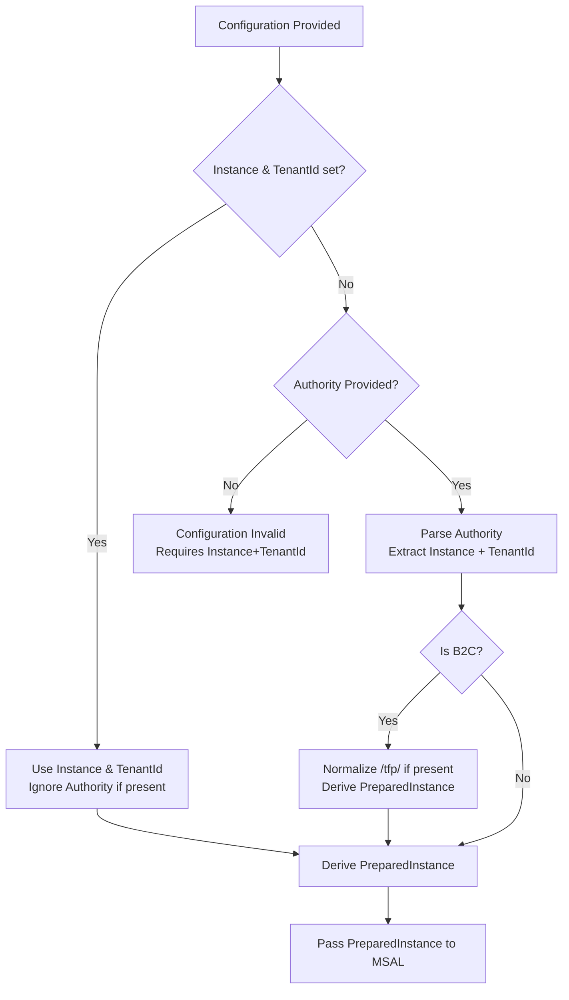

# Authority Configuration & Precedence in Microsoft.Identity.Web

## Overview

Microsoft.Identity.Web provides flexible options for configuring authentication authority URLs. Understanding how these configuration options interact is crucial for proper application setup, especially when working with Azure Active Directory (AAD), Azure AD B2C, and Customer Identity and Access Management (CIAM).

This guide explains:
- How authority-related configuration properties work together
- The precedence rules when multiple properties are set
- Best practices for different authentication scenarios
- How to interpret and resolve configuration warnings

## Terminology

### Core Configuration Properties

- **Authority**: A complete URL to the authentication endpoint, including the instance and tenant identifier. Examples:
  - `https://login.microsoftonline.com/common`
  - `https://login.microsoftonline.com/contoso.onmicrosoft.com`
  - `https://contoso.b2clogin.com/contoso.onmicrosoft.com/B2C_1_susi`

- **Instance**: The base URL of the authentication service without tenant information. Examples:
  - `https://login.microsoftonline.com/` (Azure Commercial)
  - `https://login.microsoftonline.us/` (Azure Government)
  - `https://login.chinacloudapi.cn/` (Azure China)
  - `https://contoso.b2clogin.com/` (B2C)
  
  See [Azure AD authentication endpoints](https://learn.microsoft.com/azure/active-directory/develop/authentication-national-cloud) for sovereign cloud instances.

- **TenantId**: The tenant identifier, which can be:
  - A GUID (e.g., `12345678-1234-1234-1234-123456789012`)
  - A tenant domain (e.g., `contoso.onmicrosoft.com`)
  - Special values (`common`, `organizations`, `consumers`)

- **Domain**: The primary domain of your tenant (e.g., `contoso.onmicrosoft.com`). Used primarily with B2C configurations.

- **Policy IDs**: B2C-specific identifiers for user flows:
  - `SignUpSignInPolicyId` (e.g., `B2C_1_susi`)
  - `ResetPasswordPolicyId` (e.g., `B2C_1_reset`)
  - `EditProfilePolicyId` (e.g., `B2C_1_edit_profile`)

## Authority Resolution Decision Tree

The following flowchart illustrates how Microsoft.Identity.Web resolves the authority configuration:



## Precedence Rules

The following table summarizes how different configuration combinations are resolved:

| Authority Set | Instance Set | TenantId Set | Result | Warning |
|---------------|--------------|--------------|--------|---------|
| ✅ | ❌ | ❌ | Authority is parsed → Instance + TenantId | No |
| ✅ | ✅ | ❌ | Instance used, Authority **ignored** | ⚠️ Yes (EventId 408) |
| ✅ | ❌ | ✅ | TenantId used, Authority **ignored** | ⚠️ Yes (EventId 408) |
| ✅ | ✅ | ✅ | Instance + TenantId used, Authority **ignored** | ⚠️ Yes (EventId 408) |
| ❌ | ✅ | ✅ | Instance + TenantId used | No |
| ❌ | ✅ | ❌ | Instance used, tenant resolved at runtime | No* |
| ❌ | ❌ | ✅ | Invalid configuration | Error |

\* For single-tenant apps, always specify TenantId when using Instance.

## Recommended Configuration Patterns

### AAD Single-Tenant Application

**Recommended**: Use `Instance` and `TenantId` separately for clarity and flexibility.

```json
{
  "AzureAd": {
    "Instance": "https://login.microsoftonline.com/",
    "TenantId": "12345678-1234-1234-1234-123456789012",
    "ClientId": "11111111-1111-1111-1111-111111111111"
  }
}
```

**Alternative**: Use `Authority` (will be parsed automatically).

```json
{
  "AzureAd": {
    "Authority": "https://login.microsoftonline.com/12345678-1234-1234-1234-123456789012",
    "ClientId": "11111111-1111-1111-1111-111111111111"
  }
}
```

### AAD Multi-Tenant Application

**Option 1**: Use `Instance` with special tenant value.

```json
{
  "AzureAd": {
    "Instance": "https://login.microsoftonline.com/",
    "TenantId": "organizations",
    "ClientId": "11111111-1111-1111-1111-111111111111"
  }
}
```

**Option 2**: Use complete `Authority`.

```json
{
  "AzureAd": {
    "Authority": "https://login.microsoftonline.com/organizations",
    "ClientId": "11111111-1111-1111-1111-111111111111"
  }
}
```

### Azure AD B2C

**Recommended**: Use `Authority` including the policy path. Do NOT mix with `Instance`/`TenantId`.

```json
{
  "AzureAdB2C": {
    "Authority": "https://contoso.b2clogin.com/contoso.onmicrosoft.com/B2C_1_susi",
    "ClientId": "11111111-1111-1111-1111-111111111111",
    "Domain": "contoso.onmicrosoft.com"
  }
}
```

**Note**: The legacy `/tfp/` path segment is automatically normalized by Microsoft.Identity.Web:
- `https://contoso.b2clogin.com/tfp/contoso.onmicrosoft.com/B2C_1_susi` 
- Becomes: `https://contoso.b2clogin.com/contoso.onmicrosoft.com/B2C_1_susi`

See [B2C Authority Examples](b2c-authority-examples.md) for more details.

### CIAM (Customer Identity and Access Management)

**Recommended**: Use `Authority` for CIAM configurations. The library automatically handles CIAM authorities correctly.

```json
{
  "AzureAd": {
    "Authority": "https://contoso.ciamlogin.com/contoso.onmicrosoft.com",
    "ClientId": "11111111-1111-1111-1111-111111111111"
  }
}
```

See [CIAM Authority Examples](ciam-authority-examples.md) for more details.

## Understanding the Warning Log Message

When both `Authority` and (`Instance` and/or `TenantId`) are configured, you'll see a warning like:

```
[Warning] [MsIdWeb] Authority 'https://login.microsoftonline.com/common' is being ignored 
because Instance 'https://login.microsoftonline.com/' and/or TenantId 'contoso.onmicrosoft.com' 
are already configured. To use Authority, remove Instance and TenantId from the configuration.
```

**What it means**: Microsoft.Identity.Web detected conflicting configuration. The `Instance` and `TenantId` properties take precedence, and the `Authority` value is completely ignored.

**How to fix**:
1. **Option 1 (Recommended)**: Remove `Authority` from your configuration, keep `Instance` and `TenantId`.
2. **Option 2**: Remove both `Instance` and `TenantId`, keep only `Authority`.

**Event ID**: 408 (AuthorityConflict)

## Edge Cases and Special Scenarios

### Scheme-less Authority

If you provide an authority without the `https://` scheme, you may encounter parsing errors. Always include the full URL:

❌ Wrong: `"Authority": "login.microsoftonline.com/common"`  
✅ Correct: `"Authority": "https://login.microsoftonline.com/common"`

### Trailing Slashes

Trailing slashes are automatically normalized. Both forms work identically:
- `https://login.microsoftonline.com/`
- `https://login.microsoftonline.com`

### Query Parameters in Authority

Query parameters in the Authority URL are preserved during parsing but generally not recommended. Use `ExtraQueryParameters` configuration option instead.

### Missing v2.0 Endpoint Suffix

Microsoft.Identity.Web and MSAL.NET use the v2.0 endpoint by default. You do NOT need to append `/v2.0` to your authority:

❌ Avoid: `https://login.microsoftonline.com/common/v2.0`  
✅ Correct: `https://login.microsoftonline.com/common`

### Custom Domains with CIAM

When using custom domains with CIAM, use the full Authority URL. The library handles custom CIAM domains automatically:

```json
{
  "AzureAd": {
    "Authority": "https://login.contoso.com/contoso.onmicrosoft.com",
    "ClientId": "11111111-1111-1111-1111-111111111111"
  }
}
```

**Note**: Ensure your custom domain is properly configured in your CIAM tenant before using it.

## Migration Guidance

If you're upgrading from older configurations or mixing authority properties, see the [Migration Guide](migration-authority-vs-instance.md) for detailed upgrade paths.

## Frequently Asked Questions

For answers to common configuration questions and troubleshooting tips, see the [Authority Precedence FAQ](faq-authority-precedence.md).

## Additional Resources

- [Azure AD B2C Authority Examples](b2c-authority-examples.md)
- [CIAM Authority Examples](ciam-authority-examples.md)
- [Migration Guide: Authority vs Instance/TenantId](migration-authority-vs-instance.md)
- [Microsoft identity platform documentation](https://learn.microsoft.com/azure/active-directory/develop/)
- [Azure AD B2C documentation](https://learn.microsoft.com/azure/active-directory-b2c/)
