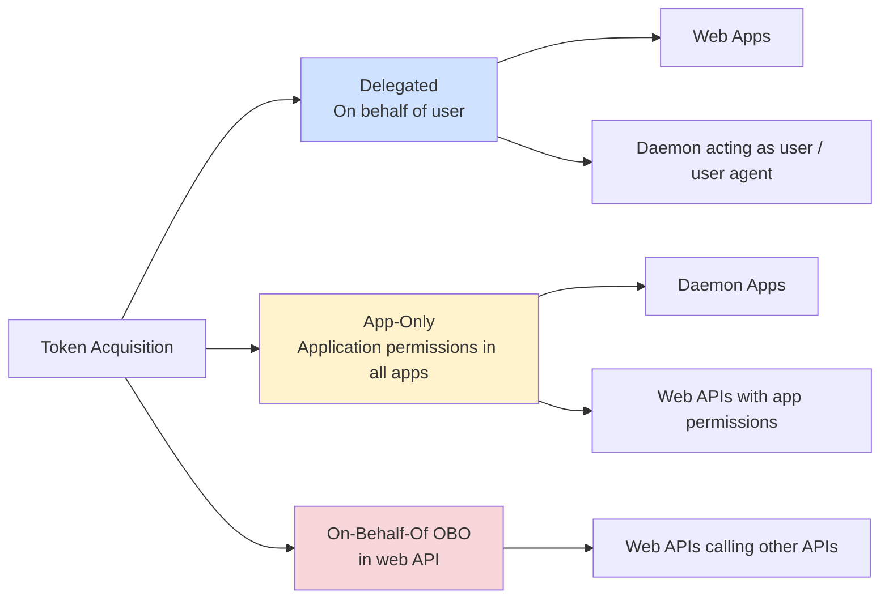

# Calling Downstream APIs with Microsoft.Identity.Web

This guide helps you choose and implement the right approach for calling downstream APIs (Microsoft Graph, Azure services, or custom APIs) from your ASP.NET Core, OWIN or .NET applications using Microsoft.Identity.Web.

## 🎯 Choosing the Right Approach

Use this decision tree to select the best method for your scenario:

| API Type / Scenario                  | Decision / Criteria                   | Recommended Client/Class                                |
|--------------------------------------|---------------------------------------|---------------------------------------------------------|
| Microsoft Graph                      | You need to call Microsoft Graph APIS | GraphServiceClient                                      |
| Azure SDK (Storage, KeyVault, etc.)  | You need to call Azure APIs (Azure SDK) | MicrosoftIdentityTokenCredential with Azure SDK clients  |
| Custom API                           | simple, configurable                  | IDownstreamApi                                          |
| Custom API                           | using HttpClient + delegating handler | MicrosoftIdentityMessageHandler                         |
| Custom API                           | using your HttpClient                 | IAuthorizationHeaderProvider                            |

## 📊 Comparison Table

| Approach | Best For | Complexity | Configuration | Flexibility |
|----------|----------|------------|---------------|-------------|
| **GraphServiceClient** | Microsoft Graph APIs | Low | Simple | Medium |
| **MicrosoftIdentityTokenCredential** | Azure SDK clients | Low | Simple | Low |
| **IDownstreamApi** | REST APIs with standard patterns | Low | JSON + Code | Medium |
| **MicrosoftIdentityMessageHandler** | HttpClient with auth pipeline | Medium | Code | High |
| **IAuthorizationHeaderProvider** | Custom auth logic | High | Code | Very High |

## 🔐 Token Acquisition Patterns

Microsoft.Identity.Web supports three main token acquisition patterns:



### Delegated Permissions (User Tokens)
- **Scenario**: Web app calls API on behalf of signed-in user, and autonomous agent user identity.
- **Token type**: Access token with delegated permissions
- **Methods**: `CreateAuthorizationHeaderForUserAsync()`, `GetForUserAsync()`

### Application Permissions (App-Only Tokens)
- **Scenario**: Daemon app or background service calls API. Autonmous agent identity
- **Token type**: Access token with application permissions
- **Methods**: `CreateAuthorizationHeaderForAppAsync()`, `GetForAppAsync()`

### On-Behalf-Of (OBO)
- **Scenario**: Web API receives user token, calls another API on behalf of that user and interactive agents.
- **Token type**: New access token via OBO flow
- **Methods**: `CreateAuthorizationHeaderForUserAsync()` from web API context

## 🚀 Quick Start Examples

### Microsoft Graph (Recommended for Graph APIs)

```csharp
// Installation
// dotnet add package Microsoft.Identity.Web.GraphServiceClient

// Startup configuration
using Microsoft.Identity.Web;

builder.Services.AddMicrosoftGraph();

// Usage in controller
public class HomeController : Controller
{
    private readonly GraphServiceClient _graphClient;
    
    public HomeController(GraphServiceClient graphClient)
    {
        _graphClient = graphClient;
    }
    
    public async Task<IActionResult> Profile()
    {
        // Delegated - calls on behalf of signed-in user
        var user = await _graphClient.Me.GetAsync();
        
        // App-only - requires app permissions
        var users = await _graphClient.Users
            .GetAsync(r => r.Options.WithAppOnly());
            
        return View(user);
    }
}
```

[📖 Learn more about Microsoft Graph integration](microsoft-graph.md)

### Azure SDKs (Recommended for Azure Services)

```csharp
// Installation
// dotnet add package Microsoft.Identity.Web.Azure
// dotnet add package Azure.Storage.Blobs

// Startup configuration
using Microsoft.Identity.Web;

builder.Services.AddMicrosoftIdentityAzureTokenCredential();

// Usage
public class StorageService
{
    private readonly MicrosoftIdentityTokenCredential _credential;
    
    public StorageService(MicrosoftIdentityTokenCredential credential)
    {
        _credential = credential;
    }
    
    public async Task<List<string>> ListBlobsAsync()
    {
        var blobClient = new BlobServiceClient(
            new Uri("https://myaccount.blob.core.windows.net"),
            _credential);
            
        var container = blobClient.GetBlobContainerClient("mycontainer");
        var blobs = new List<string>();
        
        await foreach (var blob in container.GetBlobsAsync())
        {
            blobs.Add(blob.Name);
        }
        
        return blobs;
    }
}
```

[📖 Learn more about Azure SDK integration](azure-sdks.md)

### IDownstreamApi (Recommended for Custom REST APIs)

```csharp
// Installation
// dotnet add package Microsoft.Identity.Web.DownstreamApi

// appsettings.json
{
  "DownstreamApis": {
    "MyApi": {
      "BaseUrl": "https://myapi.example.com",
      "Scopes": ["api://myapi/read", "api://myapi/write"]
    }
  }
}

// Startup configuration
using Microsoft.Identity.Web;

builder.Services.AddDownstreamApis(
    builder.Configuration.GetSection("DownstreamApis"));

// Usage
public class ApiService
{
    private readonly IDownstreamApi _api;
    
    public ApiService(IDownstreamApi api)
    {
        _api = api;
    }
    
    public async Task<Product> GetProductAsync(int id)
    {
        // Delegated - on behalf of user
        return await _api.GetForUserAsync<Product>(
            "MyApi", 
            $"api/products/{id}"
        );
    }
    
    public async Task<List<Product>> GetAllProductsAsync()
    {
        // App-only - using app permissions
        return await _api.GetForAppAsync<List<Product>>(
            "MyApi",
            "api/products");
    }
}
```

[📖 Learn more about IDownstreamApi](custom-apis.md)

### MicrosoftIdentityMessageHandler (For HttpClient Integration)

```csharp
// Startup configuration
using Microsoft.Identity.Web;

builder.Services.AddHttpClient("MyApiClient", client =>
{
    client.BaseAddress = new Uri("https://myapi.example.com");
})
.AddHttpMessageHandler(sp => new MicrosoftIdentityMessageHandler(
    sp.GetRequiredService<IAuthorizationHeaderProvider>(),
    new MicrosoftIdentityMessageHandlerOptions 
    { 
        Scopes = new[] { "api://myapi/.default" }
    }));

// Usage
public class ApiService
{
    private readonly HttpClient _httpClient;
    
    public ApiService(IHttpClientFactory httpClientFactory)
    {
        _httpClient = httpClientFactory.CreateClient("MyApiClient");
    }
    
    public async Task<Product> GetProductAsync(int id)
    {
        var request = new HttpRequestMessage(HttpMethod.Get, $"api/products/{id}")
            .WithAuthenticationOptions(options => 
            {
                options.RequestAppToken = false; // Use delegated token
                options.scopes = [ "myApi.scopes" ];
            });
            
        var response = await _httpClient.SendAsync(request);
        response.EnsureSuccessStatusCode();
        
        return await response.Content.ReadFromJsonAsync<Product>();
    }
}
```

[📖 Learn more about MicrosoftIdentityMessageHandler](custom-apis.md#microsoftidentitymessagehandler)

### IAuthorizationHeaderProvider (Maximum Flexibility)

```csharp
// Direct usage for custom scenarios
public class CustomAuthService
{
    private readonly IAuthorizationHeaderProvider _headerProvider;
    
    public CustomAuthService(IAuthorizationHeaderProvider headerProvider)
    {
        _headerProvider = headerProvider;
    }
    
    public async Task<string> CallApiAsync()
    {
        // Get auth header (includes "Bearer " + token)
        string authHeader = await _headerProvider
            .CreateAuthorizationHeaderForUserAsync(
                scopes: new[] { "api://myapi/.default" });
        
        using var client = new HttpClient();
        client.DefaultRequestHeaders.Add("Authorization", authHeader);
        client.DefaultRequestHeaders.Add("X-Custom-Header", "MyValue");
        
        var response = await client.GetStringAsync("https://myapi.example.com/data");
        return response;
    }
}
```

[📖 Learn more about IAuthorizationHeaderProvider](custom-apis.md#iauthorizationheaderprovider)

## 📋 Configuration Patterns

Microsoft.Identity.Web supports both JSON configuration and code-based configuration.

### appsettings.json Configuration

```json
{
  "AzureAd": {
    "Instance": "https://login.microsoftonline.com/",
    "TenantId": "your-tenant-id",
    "ClientId": "your-client-id",
    "ClientCredentials": [
      {
        "SourceType": "SignedAssertionFromManagedIdentity"
      }
    ]
  },
  "DownstreamApis": {
    "MicrosoftGraph": {
      "BaseUrl": "https://graph.microsoft.com/v1.0",
      "Scopes": ["User.Read", "Mail.Read"]
    },
    "MyApi": {
      "BaseUrl": "https://myapi.example.com",
      "Scopes": ["api://myapi/read"]
    }
  }
}
```

**Note**: For daemon/console apps, set `appsettings.json` properties: **"Copy to Output Directory" = "Copy if newer"**

[📖 Learn more about credentials configuration](../authentication/credentials/README.md)

### Code-Based Configuration

```csharp
// Explicit configuration in code
builder.Services.Configure<MicrosoftIdentityApplicationOptions>(options =>
{
    options.Instance = "https://login.microsoftonline.com/";
    options.TenantId = "your-tenant-id";
    options.ClientId = "your-client-id";
    options.ClientCredentials = new[]
    {
        CertificateDescription.FromKeyVault(
            "https://myvault.vault.azure.net",
            "MyCertificate")
    };
});

builder.Services.AddDownstreamApi("MyApi", options =>
{
    options.BaseUrl = "https://myapi.example.com";
    options.Scopes = new[] { "api://myapi/read" };
});
```

## 🎭 Scenario-Specific Guides

The best approach depends on where you're calling the API from:

### From Web Apps
- **Primary pattern**: Delegated permissions (on behalf of user)
- **Token acquisition**: Happens automatically during sign-in
- **Special considerations**: Incremental consent, handling consent failures

[📖 Read the Web Apps guide](from-web-apps.md)

### From Web APIs  
- **Primary pattern**: On-Behalf-Of (OBO) flow
- **Token acquisition**: Exchange incoming token for downstream token
- **Special considerations**: Long-running processes, token caching, agent identities.

[📖 Read the Web APIs guide](from-web-apis.md)

### From Daemon Apps scenarios (also happen in web apps and APIs)
- **Primary pattern**: Application permissions (app-only)
- **Token acquisition**: Client credentials flow
- **Special considerations**: No user context, requires admin consent

[📖 Read the main documentation](../README.md#daemon-applications)

## ⚠️ Error Handling

All token acquisition methods can throw exceptions that you should handle.
In web apps the `[AuthorizeForScope(scopes)]` attribute handles user incremental
consent or re-signing.

```csharp
using Microsoft.Identity.Abstractions;

try
{
    var result = await _api.GetForUserAsync<Data>("MyApi", "api/data");
}
catch (MicrosoftIdentityWebChallengeUserException ex)
{
    // User needs to sign in or consent to additional scopes
    // In web apps, this triggers a redirect to Azure AD
    throw;
}
catch (HttpRequestException ex)
{
    // Downstream API returned error
    _logger.LogError(ex, "API call failed");
}
```

### Common Error Scenarios

| Exception | Meaning | Solution |
|-----------|---------|----------|
| `MicrosoftIdentityWebChallengeUserException` | User consent required | Redirect to Azure AD for consent. Use AuthorizeForScopes attribute or ConsentHandler class |
| `MsalUiRequiredException` | Interactive auth needed | Handle in web apps with challenge |
| `MsalServiceException` | Azure AD service error | Check configuration, retry |
| `HttpRequestException` | Downstream API error | Handle API-specific errors |

## 🔗 Related Documentation

- **[Credentials Configuration](../authentication/credentials/README.md)** - How to configure authentication credentials
- **[Web App Scenarios](../scenarios/web-apps/README.md)** - Building web applications
- **[Web API Scenarios](../scenarios/web-apis/README.md)** - Building and protecting APIs  
- **[Agent Identities](../scenarios/agent-identities/README.md)** - Calling downstream APIs from agent identities.

## 📦 NuGet Packages

| Package | Purpose | When to Use |
|---------|---------|-------------|
| **Microsoft.Identity.Web.TokenAcquisition** | Token acquisition services | core package |
| **Microsoft.Identity.Web.DownstreamApi** | IDownstreamApi abstraction | Calling REST APIs |
| **Microsoft.Identity.Web.GraphServiceClient** | Microsoft Graph integration | Calling Microsoft Graph |
| **Microsoft.Identity.Web.Azure** | Azure SDK integration | Calling Azure services |
| **Microsoft.Identity.Web** | ASP.NET Core web apps and web APIs | ASP.NET Core |
| **Microsoft.Identity.Web.OWIN** | ASP.NET OWIN web apps and web APIs | OWIN |

## 🎓 Next Steps

1. **Choose your approach** using the decision tree above
2. **Read the scenario-specific guide** for your application type
3. **Configure credentials** following the [credentials guide](../authentication/credentials/README.md)
4. **Implement and test** using the code examples provided
5. **Handle errors** gracefully using the patterns shown

---

**Version Support**: This documentation covers Microsoft.Identity.Web 3.14.1+ with .NET 8 and .NET 9 examples.
