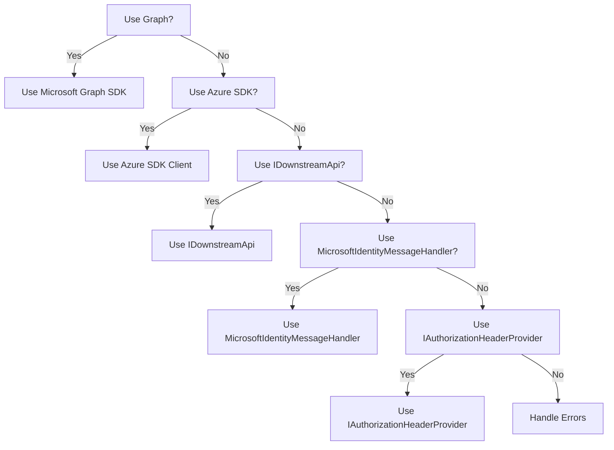

# Calling Downstream APIs

## Decision Tree

```mermaid
graph TD;
    A[Use Graph?] -->|Yes| B[Use Microsoft Graph SDK];
    A -->|No| C[Use Azure SDK?];
    C -->|Yes| D[Use Azure SDK Client];
    C -->|No| E[Use IDownstreamApi?];
    E -->|Yes| F[Use IDownstreamApi];
    E -->|No| G[Use MicrosoftIdentityMessageHandler?];
    G -->|Yes| H[Use MicrosoftIdentityMessageHandler];
    G -->|No| I[Use IAuthorizationHeaderProvider];
    I -->|Yes| J[Use IAuthorizationHeaderProvider];
    I -->|No| K[Handle Errors];

```

## Token Acquisition Patterns
- Overview of token acquisition patterns
- Error handling strategies
- Cross-references to related documents