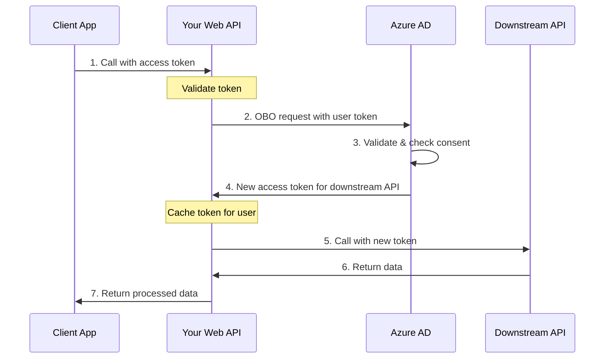
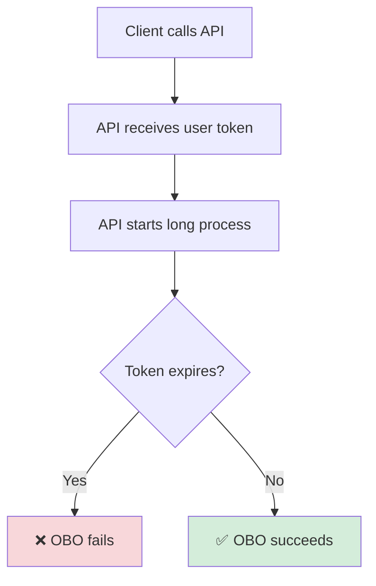

# Calling Downstream APIs from Web APIs

This guide explains how to call downstream APIs from ASP.NET Core and OWIN web APIs using Microsoft.Identity.Web, focusing on the **On-Behalf-Of (OBO) flow** where your API receives a token from a client and exchanges it for a new token to call another API.

## Overview

The On-Behalf-Of (OBO) flow enables your web API to call downstream APIs on behalf of the user who called your API. This maintains the user's identity and permissions throughout the call chain.

### On-Behalf-Of Flow



## Prerequisites

- Web API configured with JWT Bearer authentication
- App registration with API permissions to downstream API
- Client app must have permissions to call your API
- User must have consented to both your API and downstream API

## ASP.NET Core Implementation

### 1. Configure Authentication

Set up JWT Bearer authentication with explicit authentication scheme:

```csharp
using Microsoft.AspNetCore.Authentication.JwtBearer;
using Microsoft.Identity.Web;

var builder = WebApplication.CreateBuilder(args);

// Add authentication with explicit scheme
builder.Services.AddAuthentication(JwtBearerDefaults.AuthenticationScheme)
    .AddMicrosoftIdentityWebApi(builder.Configuration.GetSection("AzureAd"))
    .EnableTokenAcquisitionToCallDownstreamApi()
    .AddInMemoryTokenCaches();

builder.Services.AddAuthorization();
builder.Services.AddControllers();

var app = builder.Build();

app.UseAuthentication();
app.UseAuthorization();

app.MapControllers();
app.Run();
```

### 2. Configure appsettings.json

```json
{
  "AzureAd": {
    "Instance": "https://login.microsoftonline.com/",
    "TenantId": "your-tenant-id",
    "ClientId": "your-api-client-id",
    "ClientCredentials": [
      {
        "SourceType": "ClientSecret",
        "ClientSecret": "your-client-secret"
      }
    ],
    "Audience": "api://your-api-client-id"
  },
  "DownstreamApis": {
    "GraphAPI": {
      "BaseUrl": "https://graph.microsoft.com/v1.0",
      "Scopes": ["https://graph.microsoft.com/.default"]
    },
    "PartnerAPI": {
      "BaseUrl": "https://partnerapi.example.com",
      "Scopes": ["api://partner-api-id/read"]
    }
  }
}
```

### 3. Add Downstream API Support

```csharp
using Microsoft.Identity.Web;

builder.Services.AddDownstreamApis(
    builder.Configuration.GetSection("DownstreamApis"));
```

### 4. Call Downstream API from Your API

```csharp
using Microsoft.AspNetCore.Authorization;
using Microsoft.AspNetCore.Mvc;
using Microsoft.Identity.Web;
using Microsoft.Identity.Abstractions;

[Authorize]
[ApiController]
[Route("api/[controller]")]
public class DataController : ControllerBase
{
    private readonly IDownstreamApi _downstreamApi;
    private readonly ILogger<DataController> _logger;

    public DataController(
        IDownstreamApi downstreamApi,
        ILogger<DataController> logger)
    {
        _downstreamApi = downstreamApi;
        _logger = logger;
    }

    [HttpGet("userdata")]
    public async Task<ActionResult<UserData>> GetUserData()
    {
        try
        {
            // Call downstream API using OBO flow
            // Token from incoming request is automatically used
            var userData = await _downstreamApi.GetForUserAsync<UserData>(
                "PartnerAPI",
                "api/users/me");

            return Ok(userData);
        }
        catch (MicrosoftIdentityWebChallengeUserException ex)
        {
            // User needs to consent to downstream API permissions
            _logger.LogWarning(ex, "User consent required for downstream API");
            return Unauthorized(new { error = "consent_required", scopes = ex.Scopes });
        }
        catch (HttpRequestException ex)
        {
            _logger.LogError(ex, "Downstream API call failed");
            return StatusCode(500, "Failed to retrieve data from downstream service");
        }
    }

    [HttpPost("process")]
    public async Task<ActionResult<ProcessResult>> ProcessData([FromBody] DataRequest request)
    {
        // Call downstream API with POST
        var result = await _downstreamApi.PostForUserAsync<DataRequest, ProcessResult>(
            "PartnerAPI",
            "api/process",
            request);

        return Ok(result);
    }
}
```

## Token cache

### In-Memory Cache (Development)

```csharp
builder.Services.AddMicrosoftIdentityWebApi(builder.Configuration.GetSection("AzureAd"))
    .EnableTokenAcquisitionToCallDownstreamApi()
    .AddInMemoryTokenCaches();
```

⚠️ **Warning**: Use distributed cache for production.

### Distributed Cache (Production)

For production APIs with multiple instances, use distributed caching:

```csharp
using Microsoft.Extensions.Caching.StackExchangeRedis;

builder.Services.AddStackExchangeRedisCache(options =>
{
    options.Configuration = builder.Configuration.GetConnectionString("Redis");
    options.InstanceName = "MyWebApi";
});

builder.Services.AddMicrosoftIdentityWebApi(builder.Configuration.GetSection("AzureAd"))
    .EnableTokenAcquisitionToCallDownstreamApi()
    .AddDistributedTokenCaches();
```

### Other Distributed Cache Options

```csharp
// SQL Server
builder.Services.AddDistributedSqlServerCache(options =>
{
    options.ConnectionString = builder.Configuration.GetConnectionString("TokenCacheDb");
    options.SchemaName = "dbo";
    options.TableName = "TokenCache";
});

// Cosmos DB
builder.Services.AddCosmosDbTokenCaches(options =>
{
    options.DatabaseId = "TokenCache";
    options.ContainerId = "Tokens";
});
```

## Long-Running Processes with OBO

For long-running background processes, you need special handling because the user's token may expire.

### The Challenge



### Session Keys

Long-running OBO processes use a **session key** to associate a cached OBO token with a particular background workflow. There are two options:

| Approach | When to use |
|---|---|
| **Explicit key** – you supply your own key (e.g. a `Guid`) | You already have a natural identifier for the work item (process ID, job ID, etc.) |
| **`AllocateForMe`** – the token layer auto-generates a key | You don't have a natural identifier, or you want the identity platform to manage key uniqueness. The SDK will use `hash(client_token)` internally |

### Long-Running Process Pattern with an Explicit Key

```csharp
[Authorize]
[ApiController]
[Route("api/[controller]")]
public class ProcessingController : ControllerBase
{
    private readonly IDownstreamApi _downstreamApi;
    private readonly IBackgroundTaskQueue _taskQueue;

    public ProcessingController(
        IDownstreamApi downstreamApi,
        IBackgroundTaskQueue taskQueue)
    {
        _downstreamApi = downstreamApi;
        _taskQueue = taskQueue;
    }

    [HttpPost("start")]
    public async Task<ActionResult<ProcessStatus>> StartLongProcess([FromBody] ProcessRequest request)
    {
        var processId = Guid.NewGuid();

        // Queue the long-running task
        _taskQueue.QueueBackgroundWorkItem(async (cancellationToken) =>
        {
            await ProcessDataAsync(processId, request, cancellationToken);
        });

        return Accepted(new ProcessStatus
        {
            ProcessId = processId,
            Status = "Started"
        });
    }

    private async Task ProcessDataAsync(
        Guid processId,
        ProcessRequest request,
        CancellationToken cancellationToken)
    {
        try
        {
            // The cached refresh token allows token acquisition even if original token expired
            var data = await _downstreamApi.GetForUserAsync<ProcessData>(
                "PartnerAPI",
                options => {
                   options.RelativePath = "api/process/data";
                   options.AcquireTokenOptions.LongRunningWebApiSessionKey = processId.ToString()
                },
                cancellationToken: cancellationToken);

            // Process data...
            await Task.Delay(TimeSpan.FromMinutes(5), cancellationToken);

            // Call API again (token may need refresh)
            await _downstreamApi.PostForUserAsync<ProcessData, ProcessResult>(
                "PartnerAPI",
                options => {
                   options.RelativePath = "api/process/complete";
                   options.AcquireTokenOptions.LongRunningWebApiSessionKey = processId.ToString()
                },
                data,
                cancellationToken: cancellationToken);
        }
        catch (Exception ex)
        {
            // Log error and update process status
        }
    }
}
```

### Long-Running Process Pattern with `AllocateForMe`

Instead of managing your own key, set `LongRunningWebApiSessionKey` to the special sentinel value **`AcquireTokenOptions.LongRunningWebApiSessionKeyAuto`** (the string `"AllocateForMe"`). On the first call the token acquisition layer will auto-generate a unique session key and write it back to the same `AcquireTokenOptions` instance. You then read the generated key and pass it on all subsequent calls.

```csharp
[Authorize]
[ApiController]
[Route("api/[controller]")]
public class AutoKeyProcessingController : ControllerBase
{
    private readonly IDownstreamApi _downstreamApi;
    private readonly IBackgroundTaskQueue _taskQueue;

    public AutoKeyProcessingController(
        IDownstreamApi downstreamApi,
        IBackgroundTaskQueue taskQueue)
    {
        _downstreamApi = downstreamApi;
        _taskQueue = taskQueue;
    }

    [HttpPost("start")]
    public async Task<ActionResult<ProcessStatus>> StartLongProcess([FromBody] ProcessRequest request)
    {
        // ── First call: let the platform allocate a session key ──
        var options = new DownstreamApiOptions
        {
            RelativePath = "api/process/data",
            AcquireTokenOptions = new AcquireTokenOptions
            {
                // Sentinel value — the platform will replace this with a generated key
                LongRunningWebApiSessionKey = AcquireTokenOptions.LongRunningWebApiSessionKeyAuto  // "AllocateForMe"
            }
        };

        var data = await _downstreamApi.GetForUserAsync<ProcessData>(
            "PartnerAPI",
            optionsOverride => {
                optionsOverride.RelativePath = options.RelativePath;
                optionsOverride.AcquireTokenOptions.LongRunningWebApiSessionKey =
                    options.AcquireTokenOptions.LongRunningWebApiSessionKey;
            });

        // After the call, the platform has replaced the sentinel with the generated key.
        string generatedSessionKey = options.AcquireTokenOptions.LongRunningWebApiSessionKey;
        // generatedSessionKey is now a unique string such as "a1b2c3d4..." — no longer "AllocateForMe".

        // ── Queue background work using the generated key ──
        _taskQueue.QueueBackgroundWorkItem(async (cancellationToken) =>
        {
            await ContinueProcessingAsync(generatedSessionKey, data, cancellationToken);
        });

        return Accepted(new ProcessStatus
        {
            SessionKey = generatedSessionKey,
            Status = "Started"
        });
    }

    private async Task ContinueProcessingAsync(
        string sessionKey,
        ProcessData data,
        CancellationToken cancellationToken)
    {
        // Process data...
        await Task.Delay(TimeSpan.FromMinutes(5), cancellationToken);

        // ── Subsequent calls: reuse the generated session key ──
        await _downstreamApi.PostForUserAsync<ProcessData, ProcessResult>(
            "PartnerAPI",
            options => {
                options.RelativePath = "api/process/complete";
                options.AcquireTokenOptions.LongRunningWebApiSessionKey = sessionKey;
            },
            data,
            cancellationToken: cancellationToken);
    }
}
```

### Important Considerations

1. **Session Key Lifetime**: Store the generated session key alongside your work item (database, queue message, etc.) so background workers can retrieve it.
2. **Token Cache**: Must use distributed cache for background processes.
3. **User Context**: `HttpContext.User` is available in the background worker.
4. **Error Handling**: Token may still expire if user revokes consent.

## Error Handling Specific to APIs

### MicrosoftIdentityWebChallengeUserException

In web APIs, you can't redirect users to consent. Instead, return a proper error response:

```csharp
[HttpGet("data")]
public async Task<ActionResult> GetData()
{
    try
    {
        var data = await _downstreamApi.GetForUserAsync<Data>("PartnerAPI", "api/data");
        return Ok(data);
    }
    catch (MicrosoftIdentityWebChallengeUserException ex)
    {
        // Return 401 with consent information
        return Unauthorized(new
        {
            error = "consent_required",
            error_description = "Additional user consent required",
            scopes = ex.Scopes,
            claims = ex.Claims
        });
    }
}
```

### Client Handling Consent Requirement

The client app should handle the 401 response and trigger consent:

```csharp
// Client app code
var response = await httpClient.GetAsync("https://yourapi.example.com/api/data");

if (response.StatusCode == HttpStatusCode.Unauthorized)
{
    var error = await response.Content.ReadFromJsonAsync<ConsentError>();

    if (error?.error == "consent_required")
    {
        // Trigger incremental consent in client app
        // This will redirect user to Azure AD for consent
        throw new MsalUiRequiredException(error.error_description, error.scopes);
    }
}
```

### Downstream API Failures

```csharp
[HttpGet("data")]
public async Task<ActionResult> GetData()
{
    try
    {
        var data = await _downstreamApi.GetForUserAsync<Data>("PartnerAPI", "api/data");
        return Ok(data);
    }
    catch (HttpRequestException ex) when (ex.StatusCode == HttpStatusCode.NotFound)
    {
        return NotFound("Resource not found in downstream service");
    }
    catch (HttpRequestException ex) when (ex.StatusCode == HttpStatusCode.BadRequest)
    {
        return BadRequest("Invalid request to downstream service");
    }
    catch (HttpRequestException ex)
    {
        _logger.LogError(ex, "Downstream API returned {StatusCode}", ex.StatusCode);
        return StatusCode(502, "Downstream service error");
    }
}
```

## OWIN Implementation (.NET Framework)

### 1. Configure Startup.cs

```csharp
using Microsoft.Identity.Web;
using Microsoft.Identity.Web.OWIN;
using Owin;

public class Startup
{
    public void Configuration(IAppBuilder app)
    {
      OwinTokenAcquirerFactory factory = TokenAcquirerFactory.GetDefaultInstance<OwinTokenAcquirerFactory>();
      app.AddMicrosoftIdentityWebApi(factory);
      factory.Services
        .AddMicrosoftGraph()
        .AddDownstreamApis(factory.Configuration.GetSection("DownstreamAPIs"));
       factory.Build();
    }
}
```

### 2. Call API from Controllers

```csharp
using Microsoft.Identity.Abstractions;
using Microsoft.Identity.Web;
using System.Web.Http;

[Authorize]
public class DataController : ApiController
{
    private readonly IDownstreamApi _downstreamApi;

    public DataController()
    {
      GraphServiceClient graphServiceClient = this.GetGraphServiceClient();
      var me = await graphServiceClient.Me.Request().GetAsync();

      // OR - Example calling a downstream directly with the IDownstreamApi helper (uses the
      // authorization header provider, encapsulates MSAL.NET)
      // downstreamApi won't be null if you added services.AddMicrosoftGraph()
      // in the Startup.auth.cs
      IDownstreamApi downstreamApi = this.GetDownstreamApi();
      var result = await downstreamApi.CallApiForUserAsync("DownstreamAPI");

      // OR - Get an authorization header (uses the token acquirer)
      IAuthorizationHeaderProvider authorizationHeaderProvider =
           this.GetAuthorizationHeaderProvider();
    }

    [HttpGet]
    [Route("api/data")]
    public async Task<IHttpActionResult> GetData()
    {
        var data = await _downstreamApi.GetForUserAsync<Data>(
            "PartnerAPI",
            options => options.RelativePath = "api/data",
            options => options.Scopes = new[] { "api://partner/read" });

        return Ok(data);
    }
}
```

## Calling Multiple Downstream APIs

Your API can call multiple downstream APIs in a single request:

```csharp
[HttpGet("dashboard")]
public async Task<ActionResult<Dashboard>> GetDashboard()
{
    try
    {
        // Call multiple APIs in parallel
        var userTask = _downstreamApi.GetForUserAsync<User>(
            "GraphAPI", "me");

        var dataTask = _downstreamApi.GetForUserAsync<Data>(
            "PartnerAPI", "api/data");

        var settingsTask = _downstreamApi.GetForUserAsync<Settings>(
            "PartnerAPI", "api/settings");

        await Task.WhenAll(userTask, dataTask, settingsTask);

        return Ok(new Dashboard
        {
            User = userTask.Result,
            Data = dataTask.Result,
            Settings = settingsTask.Result
        });
    }
    catch (Exception ex)
    {
        _logger.LogError(ex, "Failed to retrieve dashboard data");
        return StatusCode(500, "Failed to retrieve dashboard");
    }
}
```

## Best Practices

### 1. Always Use Distributed Cache in Production

```csharp
// ❌ Bad: In-memory cache in production
.AddInMemoryTokenCaches();

// ✅ Good: Distributed cache in production
.AddDistributedTokenCaches();
```

### 3. Log

```csharp
builder.Services.AddLogging(config =>
{
    config.AddConsole();
    config.AddApplicationInsights();
    config.SetMinimumLevel(LogLevel.Information);
});
```

### 4. Set Appropriate Timeouts

```csharp
builder.Services.AddDownstreamApi("PartnerAPI", options =>
{
    options.BaseUrl = "https://partnerapi.example.com";
    options.HttpClientName = "PartnerAPI";
});

builder.Services.AddHttpClient("PartnerAPI", client =>
{
    client.Timeout = TimeSpan.FromSeconds(30);
});
```

### 5. Validate Incoming Tokens

Ensure your API validates tokens properly:

```csharp
builder.Services.AddMicrosoftIdentityWebApi(options =>
{
    builder.Configuration.Bind("AzureAd", options);
});
```

## Troubleshooting

### Error: "AADSTS50013: Assertion failed signature validation"

**Cause**: Client secret or certificate misconfigured in your API's app registration.

**Solution**: Verify client credentials in appsettings.json match Azure AD app registration.

### Error: "AADSTS65001: User or administrator has not consented"

**Cause**: User hasn't consented to your API calling the downstream API.

**Solution**: Return proper error to client app and trigger consent flow in client.

### Error: "AADSTS500133: Assertion is not within its valid time range"

**Cause**: Clock skew between servers or expired token.

**Solution**:
- Sync server clocks
- Check token expiration
- Ensure token cache is working properly

### OBO Token Not Cached

**Cause**: Distributed cache not configured or cache key issues.

**Solution**:
- Verify distributed cache connection
- Check that `oid` and `tid` claims exist in incoming token
- Enable debug logging to see cache operations

### Multiple API Instances Not Sharing Cache

**Cause**: Using in-memory cache instead of distributed cache.

**Solution**: Switch to distributed cache (Redis, SQL Server, Cosmos DB).

**For detailed diagnostics:** See [Logging & Diagnostics Guide](../advanced/logging.md) for correlation IDs, token cache debugging, PII logging configuration, and comprehensive troubleshooting workflows.

## Related Documentation

- [Long-Running Processes](#long-running-processes-with-obo)
- [Token Caching](../authentication/token-cache/token-cache-README.md)
- [Calling from Web Apps](from-web-apps.md)
- [Web API Scenarios](../getting-started/quickstart-webapi.md)
- [API Behind Gateways](../advanced/api-gateways.md)
- **[Logging & Diagnostics](../advanced/logging.md)** - Troubleshooting authentication and token issues
- **[Authorization Guide](../authentication/authorization.md)** - RequiredScope and app permission validation
- **[Customization Guide](../advanced/customization.md)** - Advanced token acquisition customization

---

**Next Steps**: Learn about [calling Microsoft Graph](microsoft-graph.md) or [custom APIs](custom-apis.md) with specialized integration patterns.
