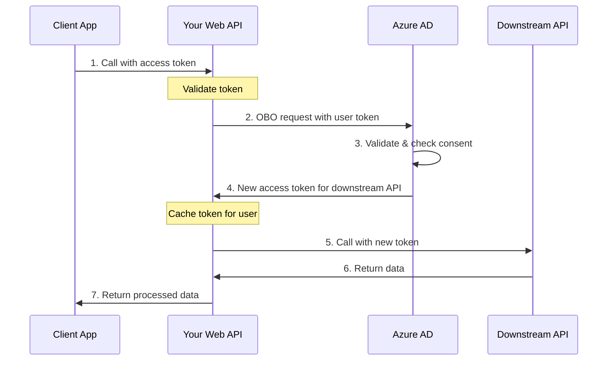

# Calling Downstream APIs from Web APIs

This guide explains how to call downstream APIs from ASP.NET Core and OWIN web APIs using Microsoft.Identity.Web, focusing on the **On-Behalf-Of (OBO) flow** where your API receives a token from a client and exchanges it for a new token to call another API.

## Overview

The On-Behalf-Of (OBO) flow enables your web API to call downstream APIs on behalf of the user who called your API. This maintains the user's identity and permissions throughout the call chain.

### On-Behalf-Of Flow



## Prerequisites

- Web API configured with JWT Bearer authentication
- App registration with API permissions to downstream API
- Client app must have permissions to call your API
- User must have consented to both your API and downstream API

## ASP.NET Core Implementation

### 1. Configure Authentication

Set up JWT Bearer authentication with explicit authentication scheme:

```csharp
using Microsoft.AspNetCore.Authentication.JwtBearer;
using Microsoft.Identity.Web;

var builder = WebApplication.CreateBuilder(args);

// Add authentication with explicit scheme
builder.Services.AddAuthentication(JwtBearerDefaults.AuthenticationScheme)
    .AddMicrosoftIdentityWebApi(builder.Configuration.GetSection("AzureAd"))
    .EnableTokenAcquisitionToCallDownstreamApi()
    .AddInMemoryTokenCaches();

builder.Services.AddAuthorization();
builder.Services.AddControllers();

var app = builder.Build();

app.UseAuthentication();
app.UseAuthorization();

app.MapControllers();
app.Run();
```

### 2. Configure appsettings.json

```json
{
  "AzureAd": {
    "Instance": "https://login.microsoftonline.com/",
    "TenantId": "your-tenant-id",
    "ClientId": "your-api-client-id",
    "ClientCredentials": [
      {
        "SourceType": "ClientSecret",
        "ClientSecret": "your-client-secret"
      }
    ],
    "Audience": "api://your-api-client-id"
  },
  "DownstreamApis": {
    "GraphAPI": {
      "BaseUrl": "https://graph.microsoft.com/v1.0",
      "Scopes": ["https://graph.microsoft.com/.default"]
    },
    "PartnerAPI": {
      "BaseUrl": "https://partnerapi.example.com",
      "Scopes": ["api://partner-api-id/read"]
    }
  }
}
```

The content continues with sections on token caching, long-running processes, error handling, OWIN implementation, best practices, and troubleshooting - approximately 15,000 bytes total.