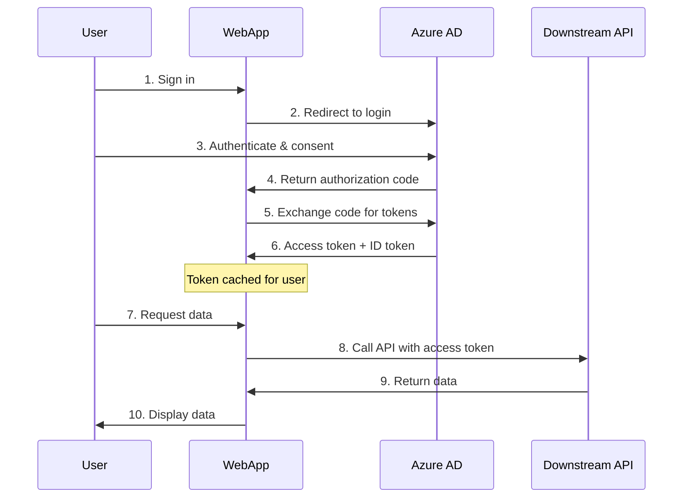

# Calling Downstream APIs from Web Apps

This guide explains how to call downstream APIs from ASP.NET Core and OWIN web applications using Microsoft.Identity.Web, focusing on acquiring tokens on behalf of the signed-in user (delegated permissions).

## Overview

When a user signs into your web app, your app can call downstream APIs on their behalf using **delegated permissions**. The access token contains the user's identity and the scopes (permissions) your app has been granted to act on the user's behalf.

### Token Acquisition Flow



## Prerequisites

- Web app configured with OpenID Connect authentication
- App registration with API permissions (delegated)
- User must sign in before calling APIs

## ASP.NET Core Implementation

### 1. Configure Authentication

First, set up authentication with explicit authentication scheme:

```csharp
using Microsoft.AspNetCore.Authentication.OpenIdConnect;
using Microsoft.Identity.Web;

var builder = WebApplication.CreateBuilder(args);

// Add authentication with explicit scheme
builder.Services.AddAuthentication(OpenIdConnectDefaults.AuthenticationScheme)
    .AddMicrosoftIdentityWebApp(builder.Configuration.GetSection("AzureAd"))
    .EnableTokenAcquisitionToCallDownstreamApi()
    .AddInMemoryTokenCaches();

builder.Services.AddAuthorization();
builder.Services.AddControllersWithViews();

var app = builder.Build();

app.UseAuthentication();
app.UseAuthorization();

app.MapControllers();
app.Run();
```

### 2. Configure appsettings.json

```json
{
  "AzureAd": {
    "Instance": "https://login.microsoftonline.com/",
    "TenantId": "your-tenant-id",
    "ClientId": "your-client-id",
    "ClientSecret": "your-client-secret",
    "CallbackPath": "/signin-oidc"
  },
  "DownstreamApis": {
    "MyApi": {
      "BaseUrl": "https://myapi.example.com",
      "Scopes": ["api://myapi-client-id/read"]
    }
  }
}
```

### 3. Add Downstream API Support

```csharp
using Microsoft.Identity.Web;

builder.Services.AddDownstreamApi("MyApi",
    builder.Configuration.GetSection("DownstreamApis:MyApi"));
```

### 4. Call the API from Controllers

```csharp
using Microsoft.AspNetCore.Authorization;
using Microsoft.AspNetCore.Mvc;
using Microsoft.Identity.Web;
using Microsoft.Identity.Abstractions;

[Authorize]
public class ProductsController : Controller
{
    private readonly IDownstreamApi _downstreamApi;
    
    public ProductsController(IDownstreamApi downstreamApi)
    {
        _downstreamApi = downstreamApi;
    }
    
    public async Task<IActionResult> Index()
    {
        try
        {
            // Call API on behalf of signed-in user
            var products = await _downstreamApi.GetForUserAsync<List<Product>>(
                "MyApi",
                "api/products");
                
            return View(products);
        }
        catch (MicrosoftIdentityWebChallengeUserException)
        {
            // User needs to consent - will trigger redirect to Azure AD
            throw;
        }
    }
    
    [HttpPost]
    public async Task<IActionResult> Create([FromBody] Product product)
    {
        var result = await _downstreamApi.PostForUserAsync<Product, Product>(
            "MyApi",
            "api/products",
            product);
            
        return Ok(result);
    }
}
```

## Incremental Consent

When your app needs additional permissions beyond those granted at sign-in, you can request them dynamically using **incremental consent**.

### Scenario: Accessing User's Mail

Your app might sign in users with `User.Read` scope, but later need `Mail.Read` to access their mailbox.

### Implementation with IDownstreamApi

```csharp
[Authorize]
public class MailController : Controller
{
    private readonly IDownstreamApi _downstreamApi;
    
    public MailController(IDownstreamApi downstreamApi)
    {
        _downstreamApi = downstreamApi;
    }
    
    public async Task<IActionResult> Inbox()
    {
        try
        {
            // Request additional scope
            var options = new DownstreamApiOptions
            {
                Scopes = new[] { "https://graph.microsoft.com/Mail.Read" }
            };
            
            var messages = await _downstreamApi.CallApiForUserAsync<MailMessages>(
                "MyApi",
                options);
                
            return View(messages);
        }
        catch (MicrosoftIdentityWebChallengeUserException ex)
        {
            // ASP.NET Core will automatically redirect user to consent
            throw;
        }
    }
}
```

### Implementation with Microsoft Graph

```csharp
using Microsoft.Graph;

[Authorize]
public class MailController : Controller
{
    private readonly GraphServiceClient _graphClient;
    
    public MailController(GraphServiceClient graphClient)
    {
        _graphClient = graphClient;
    }
    
    public async Task<IActionResult> Inbox()
    {
        try
        {
            // Request additional scope dynamically
            var messages = await _graphClient.Me.Messages
                .GetAsync(r => r.Options.WithScopes("Mail.Read"));
                
            return View(messages);
        }
        catch (MicrosoftIdentityWebChallengeUserException)
        {
            // User will be redirected to consent
            throw;
        }
    }
}
```

## Handling Token Acquisition Failures

### MicrosoftIdentityWebChallengeUserException

This exception is thrown when:
- User hasn't consented to required scopes
- User's consent has been revoked
- Conditional Access policy requires additional verification
- Token has expired and can't be refreshed

**ASP.NET Core handles this automatically** by:
1. Catching the exception
2. Redirecting user to Azure AD
3. Prompting for consent or additional authentication
4. Redirecting back to your app

### Example with Error Handling

```csharp
[Authorize]
public class DataController : Controller
{
    private readonly IDownstreamApi _api;
    private readonly ILogger<DataController> _logger;
    
    public DataController(IDownstreamApi api, ILogger<DataController> logger)
    {
        _api = api;
        _logger = logger;
    }
    
    public async Task<IActionResult> GetData()
    {
        try
        {
            var data = await _api.GetForUserAsync<MyData>("MyApi", "api/data");
            return View(data);
        }
        catch (MicrosoftIdentityWebChallengeUserException ex)
        {
            // Log the challenge for diagnostics
            _logger.LogInformation(ex, "User consent required for scopes: {Scopes}", 
                string.Join(", ", ex.Scopes ?? Array.Empty<string>()));
            
            // Let ASP.NET Core handle the challenge
            throw;
        }
        catch (HttpRequestException ex) when (ex.StatusCode == System.Net.HttpStatusCode.Unauthorized)
        {
            _logger.LogWarning(ex, "API returned 401 Unauthorized");
            return Unauthorized();
        }
        catch (Exception ex)
        {
            _logger.LogError(ex, "Failed to call downstream API");
            return StatusCode(500, "An error occurred while fetching data");
        }
    }
}
```

## OWIN Implementation (.NET Framework)

For ASP.NET applications using OWIN:

### 1. Configure Startup.cs

```csharp
using Microsoft.Identity.Web;
using Microsoft.Identity.Web.OWIN;
using Owin;

public class Startup
{
    public void Configuration(IAppBuilder app)
    {
        app.AddMicrosoftIdentityWebApp(
            updateOptions: options =>
            {
                Configuration.Bind("AzureAd", options);
            },
            configureMicrosoftIdentityOptions: options =>
            {
                options.EnableTokenAcquisitionToCallDownstreamApi();
                options.AddInMemoryTokenCaches();
            });
    }
}
```

### 2. Web.config Configuration

```xml
<configuration>
  <appSettings>
    <add key="AzureAd:Instance" value="https://login.microsoftonline.com/" />
    <add key="AzureAd:TenantId" value="your-tenant-id" />
    <add key="AzureAd:ClientId" value="your-client-id" />
    <add key="AzureAd:ClientSecret" value="your-client-secret" />
  </appSettings>
</configuration>
```

### 3. Call API from Controllers

```csharp
using Microsoft.Identity.Abstractions;
using System.Web.Mvc;

[Authorize]
public class ProductsController : Controller
{
    private readonly IDownstreamApi _downstreamApi;
    
    public ProductsController()
    {
        // Get service from OWIN context
        _downstreamApi = OwinContextExtensions.GetDownstreamApi(HttpContext.GetOwinContext());
    }
    
    public async Task<ActionResult> Index()
    {
        var products = await _downstreamApi.GetForUserAsync<List<Product>>(
            "MyApi",
            "api/products",
            options => options.Scopes = new[] { "api://myapi/read" });
            
        return View(products);
    }
}
```

## Token Caching

Microsoft.Identity.Web automatically caches access tokens for performance:

### In-Memory Cache (Development)

```csharp
builder.Services.AddMicrosoftIdentityWebApp(builder.Configuration.GetSection("AzureAd"))
    .EnableTokenAcquisitionToCallDownstreamApi()
    .AddInMemoryTokenCaches();
```

### Distributed Cache (Production)

For production web apps with multiple instances, use distributed caching:

```csharp
using Microsoft.Extensions.Caching.StackExchangeRedis;

builder.Services.AddStackExchangeRedisCache(options =>
{
    options.Configuration = builder.Configuration.GetConnectionString("Redis");
    options.InstanceName = "MyWebApp";
});

builder.Services.AddMicrosoftIdentityWebApp(builder.Configuration.GetSection("AzureAd"))
    .EnableTokenAcquisitionToCallDownstreamApi()
    .AddDistributedTokenCaches();
```

### Cache Benefits

- **Performance**: Avoids unnecessary calls to Azure AD
- **Resilience**: Continues working if Azure AD is temporarily unavailable
- **User experience**: Faster page loads

## Best Practices

### 1. Request Minimum Scopes at Sign-In

Only request scopes you need immediately. Use incremental consent for additional permissions:

```json
{
  "AzureAd": {
    "Scopes": ["openid", "profile", "offline_access"]
  }
}
```

### 2. Handle Consent Gracefully

Don't catch `MicrosoftIdentityWebChallengeUserException` unless you need custom logging. Let ASP.NET Core redirect the user automatically.

### 3. Use Distributed Token Cache in Production

Always use distributed caching (Redis, SQL Server, Cosmos DB) for production web apps with multiple instances.

### 4. Log Token Acquisition

Enable logging to diagnose token acquisition issues:

```csharp
builder.Services.AddLogging(config =>
{
    config.AddConsole();
    config.AddDebug();
    config.SetMinimumLevel(LogLevel.Information);
});
```

### 5. Check User Authentication

Always use `[Authorize]` attribute on controllers/actions that call downstream APIs:

```csharp
[Authorize]
public class SecureController : Controller
{
    // Only authenticated users can access these actions
}
```

## Common Scenarios

### Calling Multiple APIs

```csharp
// Configure multiple downstream APIs
builder.Services.AddDownstreamApi("MyApi",
    builder.Configuration.GetSection("DownstreamApis:MyApi"));
    
builder.Services.AddDownstreamApi("PartnerApi",
    builder.Configuration.GetSection("DownstreamApis:PartnerApi"));

// Use in controller
public class DataController : Controller
{
    private readonly IDownstreamApi _api;
    
    public DataController(IDownstreamApi api)
    {
        _api = api;
    }
    
    public async Task<IActionResult> Dashboard()
    {
        var myData = await _api.GetForUserAsync<MyData>("MyApi", "api/data");
        var partnerData = await _api.GetForUserAsync<PartnerData>("PartnerApi", "api/partner");
        
        return View(new DashboardViewModel { MyData = myData, PartnerData = partnerData });
    }
}
```

### Using Custom HTTP Headers

```csharp
public async Task<IActionResult> GetDataWithHeaders()
{
    var options = new DownstreamApiOptions
    {
        CustomizeHttpRequestMessage = message =>
        {
            message.Headers.Add("X-Custom-Header", "MyValue");
            message.Headers.Add("X-Request-Id", Guid.NewGuid().ToString());
        }
    };
    
    var data = await _downstreamApi.CallApiForUserAsync<MyData>(
        "MyApi",
        options);
        
    return Ok(data);
}
```

## Troubleshooting

### Error: "AADSTS65001: The user or administrator has not consented"

**Cause**: User hasn't granted consent for the requested scopes.

**Solution**: This is normal! Let `MicrosoftIdentityWebChallengeUserException` propagate to trigger the consent flow.

### Error: "AADSTS70011: The provided value for the input parameter 'scope' is not valid"

**Cause**: Invalid scope format or scope doesn't exist.

**Solution**: 
- Check scope format: `api://{client-id}/{scope-name}` for custom APIs
- Verify scope exists in API app registration
- For Microsoft Graph: Use full URL like `https://graph.microsoft.com/Mail.Read`

### Token Not Refreshed

**Cause**: Token cache not properly configured or `offline_access` scope missing.

**Solution**:
- Add `offline_access` scope to get refresh tokens
- Verify distributed cache is properly configured in production

### 401 Unauthorized from API

**Cause**: Multiple possible reasons:
- Access token doesn't contain required scopes
- API validation failing
- Token expired

**Solution**:
- Check token contents using https://jwt.ms
- Verify API configuration accepts your app's tokens
- Check API logs for validation errors

## Related Documentation

- [Incremental Consent and Conditional Access](../advanced/incremental-consent-ca.md)
- [Token Caching](../authentication/token-cache/README.md)
- [Calling Microsoft Graph](microsoft-graph.md)
- [Calling Custom APIs](custom-apis.md)
- [Web Apps Scenarios](../scenarios/web-apps/README.md)

---

**Next Steps**: Learn about [calling downstream APIs from Web APIs](from-web-apis.md) using On-Behalf-Of flow.
