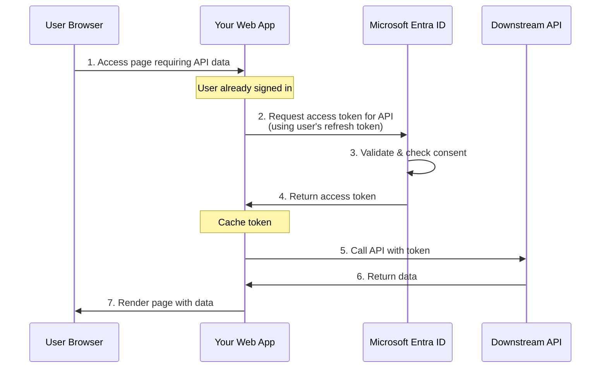

# Calling Downstream APIs from Web Apps

This guide explains how to call downstream APIs from ASP.NET Core and OWIN web applications using Microsoft.Identity.Web. In web apps, you acquire tokens **on behalf of the signed-in user** to call APIs with delegated permissions.

## Overview

When a user signs into your web application, you can call downstream APIs (Microsoft Graph, Azure services, or custom APIs) on their behalf. Microsoft.Identity.Web handles token acquisition, caching, and automatic refresh.

### User Token Flow



## Prerequisites

- Web app configured with OpenID Connect authentication
- User sign-in working
- App registration with API permissions configured
- User consent obtained (or admin consent granted)

## ASP.NET Core Implementation

### 1. Configure Authentication and Token Acquisition

```csharp
using Microsoft.AspNetCore.Authentication.OpenIdConnect;
using Microsoft.Identity.Web;

var builder = WebApplication.CreateBuilder(args);

// Add authentication with explicit scheme
builder.Services.AddAuthentication(OpenIdConnectDefaults.AuthenticationScheme)
    .AddMicrosoftIdentityWebApp(builder.Configuration.GetSection("AzureAd"))
    .EnableTokenAcquisitionToCallDownstreamApi()
    .AddInMemoryTokenCaches();

builder.Services.AddRazorPages()
    .AddMicrosoftIdentityUI();

builder.Services.AddAuthorization(options =>
{
    options.FallbackPolicy = options.DefaultPolicy;
});

var app = builder.Build();

app.UseAuthentication();
app.UseAuthorization();

app.MapRazorPages();
app.Run();
```

### 2. Configure appsettings.json

```json
{
  "AzureAd": {
    "Instance": "https://login.microsoftonline.com/",
    "TenantId": "your-tenant-id",
    "ClientId": "your-client-id",
    "CallbackPath": "/signin-oidc",
    "SignedOutCallbackPath": "/signout-callback-oidc",
    "ClientCredentials": [
      {
        "SourceType": "ClientSecret",
        "ClientSecret": "your-client-secret"
      }
    ]
  },
  "DownstreamApis": {
    "GraphAPI": {
      "BaseUrl": "https://graph.microsoft.com/v1.0",
      "Scopes": ["user.read", "mail.read"]
    },
    "MyAPI": {
      "BaseUrl": "https://myapi.example.com",
      "Scopes": ["api://my-api-id/access_as_user"]
    }
  }
}
```

**Important:** For web apps calling downstream APIs, you need **client credentials** (certificate or secret) in addition to sign-in configuration.

### 3. Add Downstream API Support

**Option A: Register Named APIs**

```csharp
using Microsoft.Identity.Web;

// Register multiple downstream APIs
builder.Services.AddDownstreamApis(
    builder.Configuration.GetSection("DownstreamApis"));
```

**Option B: Use Microsoft Graph Helper**

```csharp
// Install: Microsoft.Identity.Web.GraphServiceClient
builder.Services.AddMicrosoftGraph(builder.Configuration.GetSection("DownstreamApis:GraphAPI"));
```

### 4. Call Downstream API from Controller

```csharp
using Microsoft.AspNetCore.Authorization;
using Microsoft.AspNetCore.Mvc;
using Microsoft.Identity.Web;
using Microsoft.Identity.Abstractions;

[Authorize]
public class ProfileController : Controller
{
    private readonly IDownstreamApi _downstreamApi;
    private readonly ILogger<ProfileController> _logger;

    public ProfileController(
        IDownstreamApi downstreamApi,
        ILogger<ProfileController> logger)
    {
        _downstreamApi = downstreamApi;
        _logger = logger;
    }

    public async Task<IActionResult> Index()
    {
        try
        {
            // Call downstream API on behalf of user
            var userData = await _downstreamApi.GetForUserAsync<UserData>(
                "MyAPI",
                options => options.RelativePath = "api/profile");

            return View(userData);
        }
        catch (MicrosoftIdentityWebChallengeUserException ex)
        {
            // Incremental consent required
            // Redirect user to consent page
            return Challenge(
                new AuthenticationProperties
                {
                    RedirectUri = "/Profile"
                },
                OpenIdConnectDefaults.AuthenticationScheme);
        }
        catch (HttpRequestException ex)
        {
            _logger.LogError(ex, "Failed to call downstream API");
            return View("Error");
        }
    }
}
```

### 5. Call Downstream API from Razor Page

```csharp
using Microsoft.AspNetCore.Authorization;
using Microsoft.AspNetCore.Mvc.RazorPages;
using Microsoft.Identity.Web;
using Microsoft.Identity.Abstractions;

[Authorize]
public class ProfileModel : PageModel
{
    private readonly IDownstreamApi _downstreamApi;

    public UserData UserData { get; set; }

    public ProfileModel(IDownstreamApi downstreamApi)
    {
        _downstreamApi = downstreamApi;
    }

    public async Task OnGetAsync()
    {
        try
        {
            UserData = await _downstreamApi.GetForUserAsync<UserData>(
                "MyAPI",
                options => options.RelativePath = "api/profile");
        }
        catch (MicrosoftIdentityWebChallengeUserException)
        {
            // Handle incremental consent
            // User will be redirected to consent page
            throw;
        }
    }
}
```

---

## Using Microsoft Graph

For Microsoft Graph API calls, use the dedicated `GraphServiceClient`:

### Setup

```bash
dotnet add package Microsoft.Identity.Web.GraphServiceClient
```

```csharp
// Startup configuration
builder.Services.AddAuthentication(OpenIdConnectDefaults.AuthenticationScheme)
    .AddMicrosoftIdentityWebApp(builder.Configuration.GetSection("AzureAd"))
    .EnableTokenAcquisitionToCallDownstreamApi()
    .AddMicrosoftGraph(options =>
    {
        options.Scopes = "user.read mail.read";
    })
    .AddInMemoryTokenCaches();
```

### Usage

```csharp
using Microsoft.AspNetCore.Authorization;
using Microsoft.AspNetCore.Mvc;
using Microsoft.Graph;

[Authorize]
public class HomeController : Controller
{
    private readonly GraphServiceClient _graphClient;

    public HomeController(GraphServiceClient graphClient)
    {
        _graphClient = graphClient;
    }

    public async Task<IActionResult> Index()
    {
        // Get current user's profile
        var user = await _graphClient.Me.GetAsync();

        // Get user's emails
        var messages = await _graphClient.Me.Messages
            .GetAsync(config => config.QueryParameters.Top = 10);

        return View(new { User = user, Messages = messages });
    }
}
```

[📖 Learn more about Microsoft Graph integration](microsoft-graph.md)

---

## Using Azure SDK Clients

For calling Azure services, use `MicrosoftIdentityTokenCredential`:

### Setup

```bash
dotnet add package Microsoft.Identity.Web.Azure
dotnet add package Azure.Storage.Blobs
```

```csharp
using Microsoft.Identity.Web;

builder.Services.AddAuthentication(OpenIdConnectDefaults.AuthenticationScheme)
    .AddMicrosoftIdentityWebApp(builder.Configuration.GetSection("AzureAd"))
    .EnableTokenAcquisitionToCallDownstreamApi()
    .AddInMemoryTokenCaches();

// Add Azure token credential
builder.Services.AddMicrosoftIdentityAzureTokenCredential();
```

### Usage

```csharp
using Azure.Storage.Blobs;
using Microsoft.Identity.Web;

public class StorageController : Controller
{
    private readonly MicrosoftIdentityTokenCredential _credential;

    public StorageController(MicrosoftIdentityTokenCredential credential)
    {
        _credential = credential;
    }

    [Authorize]
    public async Task<IActionResult> ListBlobs()
    {
        var blobClient = new BlobServiceClient(
            new Uri("https://myaccount.blob.core.windows.net"),
            _credential);

        var container = blobClient.GetBlobContainerClient("mycontainer");
        var blobs = new List<string>();

        await foreach (var blob in container.GetBlobsAsync())
        {
            blobs.Add(blob.Name);
        }

        return View(blobs);
    }
}
```

[📖 Learn more about Azure SDK integration](azure-sdks.md)

---

## Using Custom APIs with IDownstreamApi

For your own REST APIs, `IDownstreamApi` provides a simple, configuration-driven approach:

### Configuration

```json
{
  "DownstreamApis": {
    "MyAPI": {
      "BaseUrl": "https://myapi.example.com",
      "Scopes": ["api://my-api-id/access_as_user"],
      "RequestAppToken": false
    }
  }
}
```

### Usage - GET Request

```csharp
// Simple GET
var data = await _downstreamApi.GetForUserAsync<MyData>(
    "MyAPI",
    options => options.RelativePath = "api/resource");

// GET with query parameters
var results = await _downstreamApi.GetForUserAsync<SearchResults>(
    "MyAPI",
    options =>
    {
        options.RelativePath = "api/search";
        options.QueryParameters = new Dictionary<string, string>
        {
            ["query"] = "test",
            ["limit"] = "10"
        };
    });
```

### Usage - POST Request

```csharp
var newItem = new CreateItemRequest
{
    Name = "New Item",
    Description = "Item description"
};

var created = await _downstreamApi.PostForUserAsync<CreateItemRequest, CreatedItem>(
    "MyAPI",
    newItem,
    options => options.RelativePath = "api/items");
```

### Usage - PUT and DELETE

```csharp
// PUT request
var updated = await _downstreamApi.PutForUserAsync<UpdateRequest, UpdatedItem>(
    "MyAPI",
    updateData,
    options => options.RelativePath = "api/items/123");

// DELETE request
await _downstreamApi.DeleteForUserAsync(
    "MyAPI",
    null,
    options => options.RelativePath = "api/items/123");
```

[📖 Learn more about custom API calls](custom-apis.md)

---

## Using IAuthorizationHeaderProvider (Advanced)

For maximum control over HTTP requests, use `IAuthorizationHeaderProvider`:

### Setup

```csharp
builder.Services.AddHttpClient("MyAPI", client =>
{
    client.BaseAddress = new Uri("https://myapi.example.com");
});
```

### Usage

```csharp
using Microsoft.Identity.Abstractions;

public class CustomApiService
{
    private readonly IAuthorizationHeaderProvider _authProvider;
    private readonly IHttpClientFactory _httpClientFactory;

    public CustomApiService(
        IAuthorizationHeaderProvider authProvider,
        IHttpClientFactory httpClientFactory)
    {
        _authProvider = authProvider;
        _httpClientFactory = httpClientFactory;
    }

    public async Task<MyData> GetDataAsync()
    {
        // Get authorization header
        var authHeader = await _authProvider.CreateAuthorizationHeaderForUserAsync(
            new[] { "api://my-api-id/access_as_user" });

        // Create HTTP request with custom logic
        var client = _httpClientFactory.CreateClient("MyAPI");
        var request = new HttpRequestMessage(HttpMethod.Get, "api/resource");
        request.Headers.Add("Authorization", authHeader);
        request.Headers.Add("X-Custom-Header", "custom-value");

        var response = await client.SendAsync(request);
        response.EnsureSuccessStatusCode();

        return await response.Content.ReadFromJsonAsync<MyData>();
    }
}
```

[📖 Learn more about custom HTTP logic](custom-apis.md#using-iauthorizationheaderprovider)

---

## Incremental Consent & Conditional Access

When calling downstream APIs, your application may need to handle scenarios where user interaction is required. This happens in three main scenarios:

1. **Incremental Consent** - Requesting additional permissions beyond what was initially granted
2. **Conditional Access** - Meeting security requirements like MFA, device compliance, or location policies
3. **Token Cache Eviction** - Repopulating the token cache after application restart or cache expiration

Microsoft.Identity.Web provides automatic handling of these scenarios with minimal code required.

### Understanding the Flow

When Microsoft.Identity.Web detects that user interaction is needed, it throws a `MicrosoftIdentityWebChallengeUserException`. The framework automatically handles this through the `[AuthorizeForScopes]` attribute or the `MicrosoftIdentityConsentAndConditionalAccessHandler` service (for Blazor), which:

1. Redirects the user to Microsoft Entra ID for consent/authentication
2. Preserves the original request URL
3. Returns the user to their intended destination after completing the flow
4. Caches the newly acquired tokens

### Prerequisites

To enable automatic consent handling, ensure your `Program.cs` includes:

```csharp
builder.Services.AddMicrosoftIdentityWebAppAuthentication(builder.Configuration, "AzureAd")
    .EnableTokenAcquisitionToCallDownstreamApi()
    .AddDownstreamApi("MyAPI", builder.Configuration.GetSection("MyAPI"))
    .AddInMemoryTokenCaches();

// For MVC applications - enables the account controller
builder.Services.AddControllersWithViews()
    .AddMicrosoftIdentityUI();

// Ensure routes are mapped
app.UseAuthentication();
app.UseAuthorization();

app.MapControllers(); // Required for AccountController
```

---

### MVC Controllers - Using [AuthorizeForScopes]

The `[AuthorizeForScopes]` attribute, set on controllers or controller actions, automatically handles `MicrosoftIdentityWebChallengeUserException` by challenging the user when additional permissions are needed.

#### Declarative Scopes

```csharp
using Microsoft.AspNetCore.Authorization;
using Microsoft.AspNetCore.Mvc;
using Microsoft.Identity.Web;
using Microsoft.Identity.Abstractions;

[Authorize]
[AuthorizeForScopes(Scopes = new[] { "user.read" })]
public class ProfileController : Controller
{
    private readonly IDownstreamApi _downstreamApi;

    public ProfileController(IDownstreamApi downstreamApi)
    {
        _downstreamApi = downstreamApi;
    }

    public async Task<IActionResult> Index()
    {
        // AuthorizeForScopes automatically handles consent challenges
        var userData = await _downstreamApi.GetForUserAsync<UserData>(
            "MyAPI",
            options => options.RelativePath = "api/profile");

        return View(userData);
    }

    // Different action requires additional scopes
    [AuthorizeForScopes(Scopes = new[] { "user.read", "mail.read" })]
    public async Task<IActionResult> Emails()
    {
        var emails = await _downstreamApi.GetForUserAsync<EmailList>(
            "GraphAPI",
            options => options.RelativePath = "me/messages");

        return View(emails);
    }
}
```

#### Configuration-Based Scopes

Store scopes in `appsettings.json` for better maintainability:

**appsettings.json:**
```json
{
  "AzureAd": {
    "Instance": "https://login.microsoftonline.com/",
    "TenantId": "common",
    "ClientId": "[Your-Client-ID]",
    "ClientCredentials": [
      {
        "SourceType": "ClientSecret",
        "ClientSecret": "[Your-Client-Secret]"
      }
    ]
  },
  "DownstreamApis": {
    "TodoList": {
      "BaseUrl": "https://localhost:5001",
      "Scopes": [ "api://[API-Client-ID]/access_as_user" ]
    },
    "GraphAPI": {
      "BaseUrl": "https://graph.microsoft.com/v1.0",
      "Scopes": [ "https://graph.microsoft.com/Mail.Read", "https://graph.microsoft.com/Mail.Send" ]
    }
  }
}
```

**Controller:**
```csharp
[Authorize]
[AuthorizeForScopes(ScopeKeySection = "DownstreamApis:TodoList:Scopes:0")]
public class TodoListController : Controller
{
    private readonly IDownstreamApi _downstreamApi;

    public TodoListController(IDownstreamApi downstreamApi)
    {
        _downstreamApi = downstreamApi;
    }

    public async Task<IActionResult> Index()
    {
        var todos = await _downstreamApi.GetForUserAsync<IEnumerable<TodoItem>>(
            "TodoList",
            options => options.RelativePath = "api/todolist");

        return View(todos);
    }

    [AuthorizeForScopes(ScopeKeySection = "DownstreamApis:GraphAPI:Scopes:0")]
    public async Task<IActionResult> EmailTodos()
    {
        // If user hasn't consented to Mail.Send, they'll be prompted
        await _downstreamApi.PostForUserAsync<EmailMessage, object>(
            "GraphAPI",
            new EmailMessage { /* ... */ },
            options => options.RelativePath = "me/sendMail");

        return RedirectToAction("Index");
    }
}
```

#### Azure AD B2C with User Flows

For B2C applications with multiple user flows:

```csharp
[Authorize]
public class AccountController : Controller
{
    private const string SignUpSignInFlow = "b2c_1_susi";
    private const string EditProfileFlow = "b2c_1_edit_profile";
    private const string ResetPasswordFlow = "b2c_1_reset";

    [AuthorizeForScopes(
        ScopeKeySection = "DownstreamApis:TodoList:Scopes:0",
        UserFlow = SignUpSignInFlow)]
    public async Task<IActionResult> Index()
    {
        var data = await _downstreamApi.GetForUserAsync<UserData>(
            "TodoList",
            options => options.RelativePath = "api/data");

        return View(data);
    }

    [AuthorizeForScopes(
        Scopes = new[] { "openid", "offline_access" },
        UserFlow = EditProfileFlow)]
    public async Task<IActionResult> EditProfile()
    {
        // This triggers the B2C edit profile flow
        return RedirectToAction("Index");
    }
}
```

---

### Razor Pages - Using [AuthorizeForScopes]

Apply `[AuthorizeForScopes]` to the page model class:

```csharp
using Microsoft.AspNetCore.Authorization;
using Microsoft.AspNetCore.Mvc.RazorPages;
using Microsoft.Identity.Web;
using Microsoft.Identity.Abstractions;

[Authorize]
[AuthorizeForScopes(ScopeKeySection = "DownstreamApis:MyAPI:Scopes:0")]
public class IndexModel : PageModel
{
    private readonly IDownstreamApi _downstreamApi;

    public UserData UserData { get; set; }

    public IndexModel(IDownstreamApi downstreamApi)
    {
        _downstreamApi = downstreamApi;
    }

    public async Task OnGetAsync()
    {
        // Automatically handles consent challenges
        UserData = await _downstreamApi.GetForUserAsync<UserData>(
            "MyAPI",
            options => options.RelativePath = "api/profile");
    }
}
```

---

### Blazor Server - Using MicrosoftIdentityConsentAndConditionalAccessHandler

Blazor Server applications require explicit exception handling using the `MicrosoftIdentityConsentAndConditionalAccessHandler` service.

#### Program.cs Configuration

```csharp
builder.Services.AddMicrosoftIdentityWebAppAuthentication(builder.Configuration, "AzureAd")
    .EnableTokenAcquisitionToCallDownstreamApi()
    .AddDownstreamApis("TodoList", builder.Configuration.GetSection("DownstreamApis"))
    .AddInMemoryTokenCaches();

// Register the consent handler for Blazor
builder.Services.AddServerSideBlazor()
    .AddMicrosoftIdentityConsentHandler();
```

#### Blazor Component

```c#
@page "/todolist"
@using Microsoft.Identity.Web
@using Microsoft.Identity.Abstractions
@using MyApp.Models

@inject MicrosoftIdentityConsentAndConditionalAccessHandler ConsentHandler
@inject IDownstreamApi DownstreamApi

<h3>My Todo List</h3>

@if (todos == null)
{
    <p><em>Loading...</em></p>
}
else
{
    <ul>
        @foreach (var todo in todos)
        {
            <li>@todo.Title</li>
        }
    </ul>
}

@code {
    private IEnumerable<TodoItem> todos;

    protected override async Task OnInitializedAsync()
    {
        await LoadTodosAsync();
    }

    [AuthorizeForScopes(ScopeKeySection = "DownstreamApis:TodoList:Scopes:0")]
    private async Task LoadTodosAsync()
    {
        try
        {
            todos = await DownstreamApi.GetForUserAsync<IEnumerable<TodoItem>>(
                "TodoList",
                options => options.RelativePath = "api/todolist");
        }
        catch (Exception ex)
        {
            // Handles MicrosoftIdentityWebChallengeUserException
            // and initiates user consent/authentication flow
            ConsentHandler.HandleException(ex);
        }
    }

    private async Task AddTodoAsync(string title)
    {
        try
        {
            await DownstreamApi.PostForUserAsync<TodoItem, TodoItem>(
                "TodoList",
                new TodoItem { Title = title },
                options => options.RelativePath = "api/todolist");

            await LoadTodosAsync();
        }
        catch (Exception ex)
        {
            ConsentHandler.HandleException(ex);
        }
    }
}
```

---

### Manual Exception Handling (Advanced)

If you need custom consent flow logic, handle `MicrosoftIdentityWebChallengeUserException` explicitly:

```csharp
[Authorize]
public class AdvancedController : Controller
{
    private readonly IDownstreamApi _downstreamApi;
    private readonly ILogger<AdvancedController> _logger;

    public AdvancedController(
        IDownstreamApi downstreamApi,
        ILogger<AdvancedController> logger)
    {
        _downstreamApi = downstreamApi;
        _logger = logger;
    }

    public async Task<IActionResult> SendEmail()
    {
        try
        {
            await _downstreamApi.PostForUserAsync<EmailMessage, object>(
                "GraphAPI",
                new EmailMessage
                {
                    Subject = "Test",
                    Body = "Test message"
                },
                options => options.RelativePath = "me/sendMail");

            return RedirectToAction("Success");
        }
        catch (MicrosoftIdentityWebChallengeUserException ex)
        {
            // Log the consent requirement
            _logger.LogWarning(
                "Consent required for scopes: {Scopes}. Challenging user.",
                string.Join(", ", ex.Scopes));

            // Custom properties for redirect
            var properties = new AuthenticationProperties
            {
                RedirectUri = Url.Action("SendEmail", "Advanced"),
            };

            // Add custom state if needed
            properties.Items["consent_attempt"] = "1";

            return Challenge(properties, OpenIdConnectDefaults.AuthenticationScheme);
        }
        catch (HttpRequestException ex)
        {
            _logger.LogError(ex, "Failed to send email");
            return View("Error");
        }
    }
}
```

---

### Conditional Access Scenarios

Conditional access policies can require additional authentication factors. The handling is identical to incremental consent:

```csharp
[Authorize]
[AuthorizeForScopes(ScopeKeySection = "DownstreamApis:SecureAPI:Scopes:0")]
public class SecureDataController : Controller
{
    private readonly IDownstreamApi _downstreamApi;

    public SecureDataController(IDownstreamApi downstreamApi)
    {
        _downstreamApi = downstreamApi;
    }

    public async Task<IActionResult> Index()
    {
        // If conditional access requires MFA, AuthorizeForScopes
        // automatically challenges the user
        var sensitiveData = await _downstreamApi.GetForUserAsync<SensitiveData>(
            "SecureAPI",
            options => options.RelativePath = "api/sensitive");

        return View(sensitiveData);
    }
}
```
    {
        // If conditional access requires MFA, AuthorizeForScopes
        // automatically challenges the user
        var sensitiveData = await _downstreamApi.GetForUserAsync<SensitiveData>(
            "SecureAPI",
            options => options.RelativePath = "api/sensitive");

        return View(sensitiveData);
    }
}
```

**Common conditional access triggers:**
- Multi-factor authentication (MFA)
- Compliant device requirement
- Trusted network location
- Terms of use acceptance
- Password change requirement

---

### Best Practices

✅ **Use `[AuthorizeForScopes]`** - Simplest approach for MVC controllers and Razor Pages

✅ **Store scopes in configuration** - Use `ScopeKeySection = "DownstreamApis:ApiName:Scopes:0"` to reference the scopes in `appsettings.json`

✅ **Apply at controller level** - Set default scopes on the controller, override on specific actions

✅ **Handle exceptions in Blazor** - Always wrap API calls with try-catch and use `ConsentHandler.HandleException()`

✅ **Let re-throw exceptions** - If you catch `MicrosoftIdentityWebChallengeUserException`, re-throw it so `[AuthorizeForScopes]` can process it

✅ **Test conditional access** - Verify your app handles MFA and other CA policies correctly

❌ **Don't suppress exceptions** - Catching without re-throwing breaks the consent flow

❌ **Don't cache responses indefinitely** - Tokens expire; design for re-authentication

---

### Static Permissions vs. Incremental Consent

**Static Permissions (Admin Consent)**

All permissions are requested during app registration and consented by a tenant administrator:

**Pros:**
- Users never see consent prompts
- Required for first-party Microsoft apps
- Simpler user experience

**Cons:**
- Requires tenant admin involvement
- Over-privileged from the start
- Less flexible for multi-tenant scenarios

**Configuration:**
```csharp
// Request all pre-approved scopes for Microsoft Graph
var scopes = new[] { "https://graph.microsoft.com/.default" };

var userData = await _downstreamApi.GetForUserAsync<UserData>(
    "GraphAPI",
    options =>
    {
        options.RelativePath = "me";
        options.Scopes = scopes; // Use .default scope
    });
```

**Incremental Consent (Dynamic)**

Permissions are requested as needed during runtime:

**Pros:**
- Better security (principle of least privilege)
- Users consent to what they actually use
- Works for multi-tenant apps

**Cons:**
- Users may be interrupted with consent prompts
- Requires handling `MicrosoftIdentityWebChallengeUserException`

**Recommendation:** Use incremental consent for multi-tenant applications; use static permissions for first-party enterprise apps where admin consent is guaranteed

---

## Token Caching

Microsoft.Identity.Web caches tokens to improve performance and reduce calls to Microsoft Entra ID.

### In-Memory Cache (Default)

```csharp
builder.Services.AddAuthentication(OpenIdConnectDefaults.AuthenticationScheme)
    .AddMicrosoftIdentityWebApp(builder.Configuration.GetSection("AzureAd"))
    .EnableTokenAcquisitionToCallDownstreamApi()
    .AddInMemoryTokenCaches(); // In-memory cache
```

**Use for:**
- ✅ Development
- ✅ Single-server deployments
- ✅ Small user base

**Limitations:**
- ❌ Not shared across instances
- ❌ Lost on app restart
- ❌ Memory consumption grows with users

### Distributed Cache (Recommended for Production)

```csharp
// Install: Microsoft.Identity.Web.TokenCache

// Redis
builder.Services.AddStackExchangeRedisCache(options =>
{
    options.Configuration = builder.Configuration["Redis:ConnectionString"];
    options.InstanceName = "MyApp_";
});

builder.Services.AddAuthentication(OpenIdConnectDefaults.AuthenticationScheme)
    .AddMicrosoftIdentityWebApp(builder.Configuration.GetSection("AzureAd"))
    .EnableTokenAcquisitionToCallDownstreamApi()
    .AddDistributedTokenCaches();

// SQL Server
builder.Services.AddDistributedSqlServerCache(options =>
{
    options.ConnectionString = builder.Configuration["SqlCache:ConnectionString"];
    options.SchemaName = "dbo";
    options.TableName = "TokenCache";
});

builder.Services.AddAuthentication(OpenIdConnectDefaults.AuthenticationScheme)
    .AddMicrosoftIdentityWebApp(builder.Configuration.GetSection("AzureAd"))
    .EnableTokenAcquisitionToCallDownstreamApi()
    .AddDistributedTokenCaches();
```

**Use for:**
- ✅ Multi-server deployments (load balanced)
- ✅ High-availability scenarios
- ✅ Large user base
- ✅ Persistent cache across restarts

---

## Handling Token Acquisition Failures

### Common Exceptions

```csharp
try
{
    var data = await _downstreamApi.GetForUserAsync<MyData>(
        "MyAPI",
        options => options.RelativePath = "api/resource");
}
catch (MicrosoftIdentityWebChallengeUserException ex)
{
    // User needs to consent or reauthenticate
    _logger.LogWarning($"User consent required: {ex.Message}");
    return Challenge(new AuthenticationProperties { RedirectUri = Request.Path });
}
catch (MsalUiRequiredException ex)
{
    // User interaction required (sign-in again, MFA, etc.)
    _logger.LogWarning($"User interaction required: {ex.Message}");
    return Challenge(OpenIdConnectDefaults.AuthenticationScheme);
}
catch (MsalServiceException ex)
{
    // Service error (Azure AD unavailable, etc.)
    _logger.LogError(ex, "Microsoft Entra ID service error");
    return StatusCode(503, "Authentication service temporarily unavailable");
}
catch (HttpRequestException ex)
{
    // Downstream API unreachable
    _logger.LogError(ex, "Downstream API call failed");
    return StatusCode(503, "Downstream service unavailable");
}
```

### Graceful Degradation

```csharp
public async Task<IActionResult> Dashboard()
{
    var model = new DashboardModel();

    // Try to load optional data from downstream API
    try
    {
        model.EnrichedData = await _downstreamApi.GetForUserAsync<EnrichedData>(
            "MyAPI",
            options => options.RelativePath = "api/enriched");
    }
    catch (Exception ex)
    {
        _logger.LogWarning(ex, "Failed to load enriched data, using defaults");
        model.EnrichedData = new EnrichedData { /* defaults */ };
    }

    return View(model);
}
```

---

## OWIN (.NET Framework) Implementation

For OWIN-based web applications on .NET Framework:

### 1. Install Packages

```powershell
Install-Package Microsoft.Identity.Web.OWIN
Install-Package Microsoft.Owin.Host.SystemWeb
```

### 2. Configure Startup

```csharp
using Microsoft.Identity.Web;
using Microsoft.Owin.Security;
using Microsoft.Owin.Security.Cookies;
using Owin;

public class Startup
{
    public void Configuration(IAppBuilder app)
    {
        app.SetDefaultSignInAsAuthenticationType(CookieAuthenticationDefaults.AuthenticationType);

        app.UseCookieAuthentication(new CookieAuthenticationOptions());

        app.AddMicrosoftIdentityWebApp(
            Configuration,
            configSectionName: "AzureAd",
            openIdConnectScheme: "OpenIdConnect",
            cookieScheme: CookieAuthenticationDefaults.AuthenticationType,
            subscribeToOpenIdConnectMiddlewareDiagnosticsEvents: true);

        app.EnableTokenAcquisitionToCallDownstreamApi();
        app.AddDistributedTokenCaches();
    }
}
```

### 3. Call Downstream API

```csharp
using Microsoft.Identity.Web;
using System.Threading.Tasks;
using System.Web.Mvc;

[Authorize]
public class ProfileController : Controller
{
    public async Task<ActionResult> Index()
    {
        var downstreamApi = TokenAcquirerFactory.GetDefaultInstance()
            .GetTokenAcquirer()
            .GetDownstreamApi();

        var userData = await downstreamApi.GetForUserAsync<UserData>(
            "MyAPI",
            options => options.RelativePath = "api/profile");

        return View(userData);
    }
}
```

**Note:** OWIN support has some differences from ASP.NET Core. See [OWIN documentation](../../scenarios/web-apps/owin.md) for details.

---

## Security Best Practices

### Scope Management

**Do:**
- ✅ Request only scopes you need
- ✅ Use incremental consent for advanced features
- ✅ Document required scopes in your app

**Don't:**
- ❌ Request unnecessary scopes upfront
- ❌ Request admin-only scopes without justification
- ❌ Assume all scopes will be granted

### Token Handling

**Do:**
- ✅ Let Microsoft.Identity.Web manage tokens
- ✅ Use distributed cache in production
- ✅ Handle token acquisition failures gracefully

**Don't:**
- ❌ Store tokens yourself
- ❌ Log access tokens
- ❌ Send tokens to client-side code

### Error Handling

**Do:**
- ✅ Catch and handle consent exceptions
- ✅ Provide clear error messages to users
- ✅ Log errors for debugging

**Don't:**
- ❌ Expose token errors to users
- ❌ Silently fail API calls
- ❌ Ignore authentication exceptions

---

## Troubleshooting

### Problem: "AADSTS65001: The user or administrator has not consented"

**Cause:** User hasn't consented to required scopes.

**Solution:**
```csharp
catch (MicrosoftIdentityWebChallengeUserException ex)
{
    // Redirect to consent page
    return Challenge(
        new AuthenticationProperties { RedirectUri = Request.Path },
        OpenIdConnectDefaults.AuthenticationScheme);
}
```

### Problem: "AADSTS50076: Multi-factor authentication required"

**Cause:** User needs to complete MFA.

**Solution:**
```csharp
catch (MsalUiRequiredException)
{
    // Redirect user to sign in with MFA
    return Challenge(OpenIdConnectDefaults.AuthenticationScheme);
}
```

### Problem: Tokens not persisting across app restarts

**Cause:** Using in-memory cache.

**Solution:** Switch to distributed cache (Redis, SQL Server, or Cosmos DB).

### Problem: 401 Unauthorized from downstream API

**Possible causes:**
- Wrong scopes requested
- API permission not granted in app registration
- Token expired

**Solution:**
1. Verify scopes in appsettings.json match API requirements
2. Check app registration has API permissions
3. Ensure tokens are being cached and refreshed

---

## Performance Considerations

### Token Caching Strategy

- ✅ Use distributed cache for multi-server deployments
- ✅ Configure appropriate cache expiration
- ✅ Monitor cache performance

### Minimize Token Requests

```csharp
// Bad: Multiple token acquisitions
var profile = await _downstreamApi.GetForUserAsync<Profile>(
    "API",
    options => options.RelativePath = "profile");
var settings = await _downstreamApi.GetForUserAsync<Settings>(
    "API",
    options => options.RelativePath = "settings");

// Good: Single token, multiple calls (token is cached)
// Both calls use the same cached token
var profile = await _downstreamApi.GetForUserAsync<Profile>(
    "API",
    options => options.RelativePath = "profile");
var settings = await _downstreamApi.GetForUserAsync<Settings>(
    "API",
    options => options.RelativePath = "settings");
```

### Parallel API Calls

```csharp
// Call multiple APIs in parallel
var profileTask = _downstreamApi.GetForUserAsync<Profile>(
    "API1",
    options => options.RelativePath = "profile");
var settingsTask = _downstreamApi.GetForUserAsync<Settings>(
    "API2",
    options => options.RelativePath = "settings");

await Task.WhenAll(profileTask, settingsTask);

var profile = profileTask.Result;
var settings = settingsTask.Result;
```

---

## Additional Resources

- **[Back to Downstream APIs Overview](./README.md)** - Compare all approaches
- **[Token Cache Configuration](../authentication/token-cache/README.md)** - Production cache strategies
- **[Microsoft Graph Integration](./microsoft-graph.md)** - Graph-specific guidance
- **[Azure SDK Integration](./azure-sdks.md)** - Azure service calls
- **[Custom API Calls](./custom-apis.md)** - Custom REST APIs
- **[Calling from Web APIs (OBO)](./from-web-apis.md)** - On-Behalf-Of flow

---

## Next Steps

1. **Choose your API type** and implementation approach
2. **Configure authentication** with token acquisition enabled
3. **Add downstream API** configuration
4. **Implement error handling** for consent and failures
5. **Test incremental consent** scenarios
6. **[Configure distributed cache](../authentication/token-cache/README.md)** for production

---

**Need help?** [Open an issue](https://github.com/AzureAD/microsoft-identity-web/issues) or check the [troubleshooting guide](../../scenarios/web-apps/troubleshooting.md).
