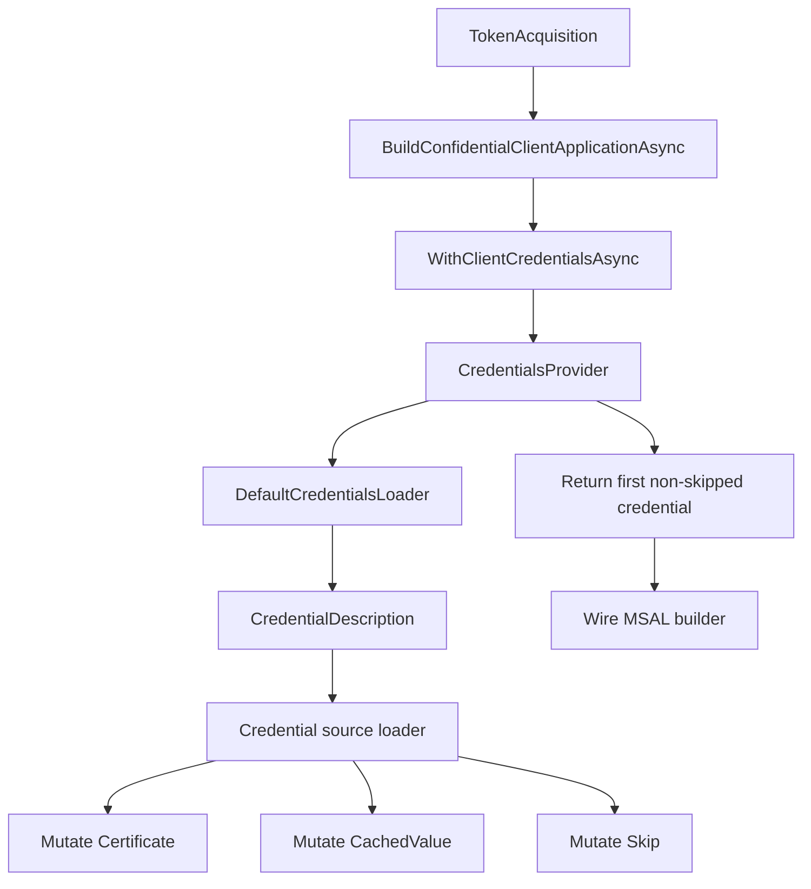
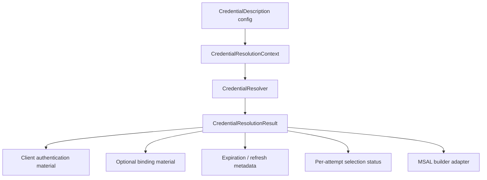
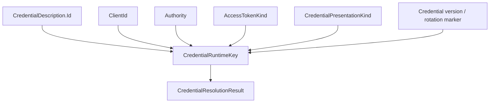
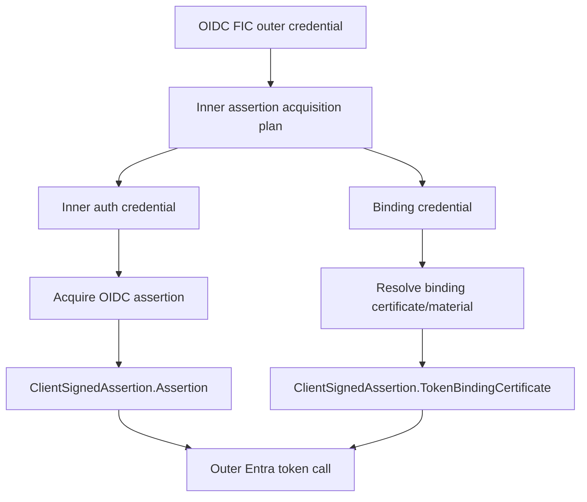

# Microsoft.Identity.Web - Credential architecture proposal

> Status: Draft proposal.

## Summary

Microsoft.Identity.Web's credential pipeline should separate static credential
configuration from runtime credential material. Today `CredentialDescription`
is both the user-facing descriptor and the mutable runtime cache for loaded
certificates, custom assertion providers, failure state, and protocol-specific
binding decisions. That coupling makes the current pipeline hard to reason
about, especially for sender-constrained credentials.

This proposal recommends moving runtime state out of `CredentialDescription`
and into a typed, mode-aware credential resolver. The resolver would return a
credential result that explicitly describes:

- the client-authentication material to wire into MSAL,
- whether the credential must be presented in bound mode,
- the optional binding certificate/material returned to downstream callers,
- per-attempt failure/fallback state.

The goal is to support both bound-token and bearer-token flows without relying
on `CachedValue`, sticky `Skip`, or ad-hoc checks spread across credential
loaders.

## Problems in the current model

### `CredentialDescription` mixes configuration and runtime state

`CredentialDescription` currently carries user configuration and runtime
material:

| Field | Current role |
| --- | --- |
| `SourceType`, certificate settings, `ClientSecret`, `CustomSignedAssertionProviderData` | Static configuration |
| `Certificate` | Runtime material loaded from Key Vault, store, file, or base64 |
| `CachedValue` | Runtime provider/cache slot, often an `X509Certificate2` or `ClientAssertionProviderBase` |
| `Skip` | Per-attempt failure/fallback state stored on the descriptor |
| `UseBoundCredential` | Credential-binding opt-in, currently interpreted differently by credential type |

Because the same object is reused across calls, fields such as `CachedValue`
and `Skip` can accidentally become global state. A credential loaded for one
mode can affect later calls in another mode.

### `CachedValue` is not mode-aware

The runtime object required for a credential can vary by credential mode:

- normal bearer credential,
- bearer token using a bound credential,
- mTLS PoP token requiring a bound credential.

`CachedValue` is keyed only by the descriptor instance, so it cannot naturally
distinguish these modes. This creates risks such as a bearer-first call caching
an unbound signed assertion provider that a later mTLS PoP call incorrectly
reuses.

### `Skip` is sticky and overloaded

`Skip` currently means "do not select this credential", but callers also use it
to model per-attempt failures. Bound credential work introduces another
temptation: marking a credential skipped so it is not selected for one role
while still needing its material for another role. That is fragile because
authentication and binding are different roles, not success/failure states.

### Bound credentials have two different product modes

There are two related but distinct scenarios:

| Scenario | Access token type | Credential presentation | Downstream call |
| --- | --- | --- | --- |
| Bound token | `mtls_pop` / `MTLS_POP` | Credential must be bound | Authorization header is `mtls_pop`, and the HTTP call presents the binding cert |
| Bearer token with bound credential | `Bearer` | Credential is presented over mTLS to Entra | Authorization header remains `Bearer`; downstream API is unchanged |

The current implementation tends to collapse these into a single
`isTokenBinding` concept. Internally we should model them separately:

```csharp
bool requiresBoundToken = protocol == ProtocolNames.MtlsPop;
bool requiresBoundCredential = requiresBoundToken || credential.UseBoundCredential;
```

## Current credential flow



This works for simple credential loading, but it makes mode-specific behavior
depend on mutable fields on a shared descriptor.

## Proposed architecture

Introduce an internal credential resolver that produces a typed runtime result
from immutable configuration plus an explicit resolution context.



### Resolution context

The resolver should know the mode before loading or caching the credential.

```csharp
internal enum AccessTokenKind
{
    Bearer,
    MtlsPop,
}

internal enum CredentialPresentationKind
{
    Normal,
    Bound,
}

internal sealed record CredentialResolutionContext(
    string ClientId,
    string Authority,
    AccessTokenKind AccessTokenKind,
    CredentialPresentationKind PresentationKind,
    string? ApiUrl,
    CancellationToken CancellationToken);
```

The key invariant is:

```csharp
CredentialPresentationKind presentation =
    accessTokenKind == AccessTokenKind.MtlsPop || credential.UseBoundCredential
        ? CredentialPresentationKind.Bound
        : CredentialPresentationKind.Normal;
```

### Resolution result

The result should expose typed runtime material. It should not require callers
to cast from `object`.

```csharp
internal sealed record CredentialResolutionResult(
    CredentialDescription Descriptor,
    ClientAuthenticationMaterial Authentication,
    CredentialBindingMaterial? Binding,
    DateTimeOffset? ExpiresOn,
    string CacheKey);

internal abstract record ClientAuthenticationMaterial;

internal sealed record SecretAuthentication(string Secret)
    : ClientAuthenticationMaterial;

internal sealed record CertificateAuthentication(X509Certificate2 Certificate)
    : ClientAuthenticationMaterial;

internal sealed record SignedAssertionAuthentication(ClientAssertionProviderBase Provider)
    : ClientAuthenticationMaterial;

internal abstract record CredentialBindingMaterial;

internal sealed record CertificateBinding(X509Certificate2 Certificate)
    : CredentialBindingMaterial;

internal sealed record SignedAssertionBinding(
    Func<AssertionRequestOptions?, CancellationToken, Task<ClientSignedAssertion>> Callback)
    : CredentialBindingMaterial;
```

The exact type names are illustrative. The important design point is that
client-authentication material and binding material are distinct.

## MSAL builder wiring matrix

The MSAL builder adapter should be the only place that translates a resolution
result into MSAL calls.

| Token mode | Credential presentation | Credential result | MSAL wiring |
| --- | --- | --- | --- |
| Bearer | Normal | Secret | `WithClientSecret` |
| Bearer | Normal | Certificate | `WithCertificate(certificate)` |
| Bearer | Normal | Signed assertion | `WithClientAssertion(string callback)` |
| Bearer | Bound | Certificate + certificate binding | `WithCertificate(certificate, new CertificateOptions { SendCertificateOverMtls = true })` |
| Bearer | Bound | Signed assertion bundle | `WithClientAssertion(ClientSignedAssertion callback)` |
| mTLS PoP | Bound | Certificate + certificate binding | `WithCertificate(certificate)` and `WithMtlsProofOfPossession()` |
| mTLS PoP | Bound | Signed assertion bundle | `WithClientAssertion(ClientSignedAssertion callback)` and `WithMtlsProofOfPossession()` |
| mTLS PoP | Normal only | Any unbound material | fail this credential and try the next candidate |

This matrix makes the distinction between bound credentials and bound tokens
explicit.

## Runtime caching

Caching should stay, but it should be owned by the resolver instead of being
stored as `CredentialDescription.CachedValue`.



Example key shape:

```csharp
internal sealed record CredentialRuntimeKey(
    string CredentialId,
    string ClientId,
    string Authority,
    AccessTokenKind AccessTokenKind,
    CredentialPresentationKind PresentationKind,
    string? Version);
```

This avoids using a bearer-loaded runtime value for a later mTLS PoP request.

## Credential roles

Some flows require more than one credential role. OIDC FIC with mTLS PoP is
the clearest example:



The binding credential should not be marked `Skip = true` to keep it off the
inner authentication menu. Instead, the resolver should select credentials by
role:

| Role | Meaning |
| --- | --- |
| Authentication | Material used to authenticate the token request or inner assertion acquisition |
| Binding | Material used to bind a credential or access token |
| Fallback | Candidate if a primary credential fails |

This avoids overloading `Skip` for role selection.

## Deprecation plan

### Phase 1: Add replacement internals

- Add `CredentialResolutionContext`.
- Add `CredentialResolutionResult`.
- Add resolver-owned runtime cache.
- Add a builder adapter that accepts `CredentialResolutionResult`.
- Add tests for the full matrix of bearer, bearer-bound, and mTLS PoP.

### Phase 2: Adapt existing loaders

Wrap current loaders so existing code keeps working:

- certificate loaders return `CertificateAuthentication`;
- secret loader returns `SecretAuthentication`;
- signed assertion loaders return `SignedAssertionAuthentication`;
- binding-capable assertion providers return `SignedAssertionBinding` when
  requested.

During this phase, `CachedValue`, `Certificate`, and `Skip` can still be
populated for compatibility.

### Phase 3: Move custom assertion providers off `CachedValue`

Add a replacement contract for custom assertion providers that returns typed
runtime material instead of mutating `CredentialDescription`.

For example:

```csharp
internal interface ICredentialRuntimeProvider
{
    Task<CredentialResolutionResult> ResolveAsync(
        CredentialDescription descriptor,
        CredentialResolutionContext context);
}
```

The exact public/internal split needs API review. The key requirement is that
custom providers have a supported way to return a provider or signed assertion
without writing to `CachedValue`.

### Phase 4: Obsolete public runtime mutation fields

Once all built-in and known downstream consumers have moved:

- mark `CredentialDescription.CachedValue` obsolete for direct use;
- mark `CredentialDescription.Skip` obsolete for direct use;
- document that `CredentialDescription.Certificate` is materialized state, not
  the preferred extension point;
- keep binary compatibility for at least one release train.

## Compatibility impact

### Microsoft.Identity.Web

The proposal is primarily internal, but it touches extension seams:

- `ICredentialSourceLoader`
- `ICustomSignedAssertionProvider`
- `ClientAssertionProviderBase`
- `ConfidentialClientApplicationBuilderExtension`
- `CredentialsProvider`
- `DefaultCredentialsLoader`

The safest path is additive first, obsolete later.

### MISE

MISE has direct dependencies on `CachedValue` and `Skip` in a few outbound
credential extension paths:

| MISE area | Current dependency | Migration |
| --- | --- | --- |
| FMI custom assertion loader | Writes provider to `CredentialDescription.CachedValue`; sets `Skip` on failure | Implement the new resolver/provider contract |
| UserFIC claims-principal factory | Calls `LoadIfNeededAsync`, then reads `CachedValue as ClientAssertionProviderBase` | Ask the provider/resolver directly for signed assertion material |
| NativeAOT direct signed assertion override | Creates a fake `SignedAssertionFilePath` credential with `CachedValue = DirectSignedAssertion` | Add first-class direct assertion credential support |
| Generated config migration code | Copies `CachedValue` and `Skip` | Stop copying runtime-only state |
| Credential telemetry allow-list | Allows `Skip` | Replace with resolver status if needed |

MISE's mTLS PoP validation and native downstream header paths already model
`BindingCertificate` explicitly, so they align well with this proposal.

## Additional design ideas considered

### Keep `CachedValue`, but make it a dictionary

One option is to replace `CachedValue` with a per-descriptor dictionary keyed
by mode. That would be smaller, but it still keeps runtime cache state on the
configuration object and preserves the object-casting problem. This proposal
prefers a resolver-owned cache.

### Add a second `BoundCachedValue`

This is also smaller, but it does not scale. We already need to distinguish
normal bearer, bearer with bound credential, and mTLS PoP. A second slot also
does not solve sticky `Skip`.

### Make every loader stateless

This is architecturally clean but likely too expensive. Certificates and
assertion providers need caching for performance and reliability. The proposal
keeps caching, but moves it to a typed cache with explicit invalidation.

### Use MSAL builders as the resolver output

Returning a pre-wired MSAL builder from credential resolution would reduce
types, but it would also couple credential loading to every MSAL acquisition
shape. Keeping an intermediate `CredentialResolutionResult` gives IdWeb a
testable boundary.

## Open questions

1. Should the new resolver contract be internal only, or should custom
   credential providers get a public replacement for `ICustomSignedAssertionProvider`?
2. Should bearer token plus bound credential return a `BindingCertificate` to
   `IAuthorizationHeaderProvider` callers, even though the downstream call does
   not need it?
3. How should credential rotation/version be represented in the runtime cache
   key?
4. Should `UseBoundCredential` remain a boolean, or should it evolve to a
   nullable/preference enum before the architecture hardens?
5. What is the minimum compatibility window before `CachedValue` and `Skip`
   can become obsolete?

## Recommendation

Proceed with the resolver-owned runtime model. Do not remove `CachedValue`
immediately. Instead:

1. introduce typed resolution results and a mode-aware runtime cache;
2. migrate built-in loaders and the MSAL builder adapter;
3. provide a replacement custom-provider contract;
4. migrate known consumers such as MISE;
5. obsolete `CachedValue` and `Skip` after the replacement path has shipped.

This addresses the current bound credential bugs while preserving performance,
fallback behavior, and compatibility for existing extensions.
