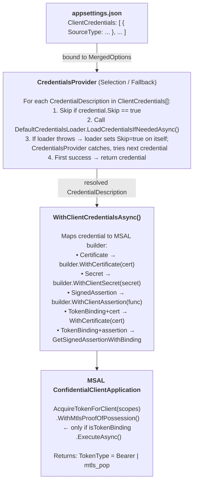
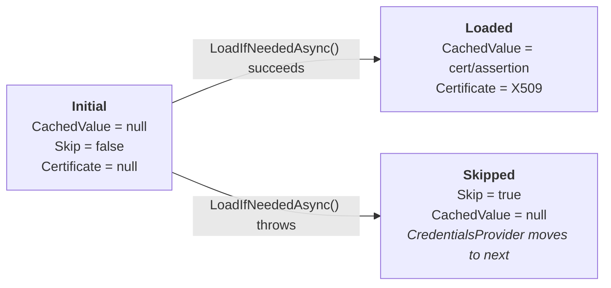
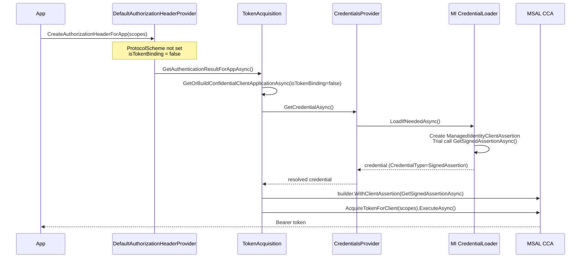
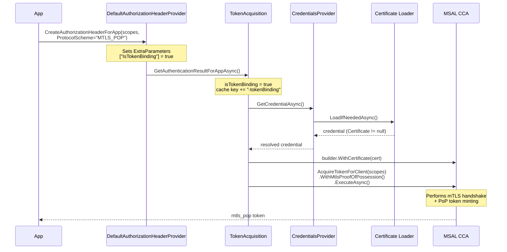

# Credential Architecture in Microsoft.Identity.Web

This document explains how credentials are loaded, resolved, and wired to MSAL at runtime.
It is intended for contributors and anyone extending the credential system.

For user-facing guidance on which credential to pick, see
[credentials-README.md](../authentication/credentials/credentials-README.md).

---

## High-Level Flow



---

## Key Interfaces

| Interface | Role | Defined in | Implemented in |
|-----------|------|-----------|---------------|
| `ICredentialsLoader` | Per-credential load (semaphore, caching) | `Microsoft.Identity.Abstractions` | `Microsoft.Identity.Web.Certificate` |
| `ICredentialSourceLoader` | Leaf — knows how to load one credential type | `Microsoft.Identity.Abstractions` | `Microsoft.Identity.Web.Certificate` |
| `ICredentialsProvider` | Selection/fallback — iterates `ClientCredentials[]`, skips failures, returns first success | `Microsoft.Identity.Web.TokenAcquisition` | `Microsoft.Identity.Web.TokenAcquisition` |
| `ICustomSignedAssertionProvider` | Extension point — plug-in a custom assertion generator (e.g. OIDC FIC) | `Microsoft.Identity.Abstractions` | Various (e.g. `Microsoft.Identity.Web.OidcFIC`) |

---

## Built-in Credential Source Loaders

| CredentialSource enum | Loader class | What it produces |
|-----------------------|--------------|-----------------|
| `KeyVault` | `KeyVaultCertificateLoader` | X509Certificate2 from Azure Key Vault |
| `Path` | `FromPathCertificateLoader` | X509Certificate2 from PFX file on disk |
| `StoreWithThumbprint` | `StoreWithThumbprintCertificateLoader` | X509Certificate2 from Windows cert store |
| `StoreWithDistinguishedName` | `StoreWithDistinguishedNameCertificateLoader` | X509Certificate2 from Windows cert store |
| `StoreWithSubjectName` | `StoreWithSubjectNameCertificateLoader` | X509Certificate2 from Windows cert store |
| `Base64Encoded` | `Base64EncodedCertificateLoader` | X509Certificate2 from inline base64 |
| `SignedAssertionFromManagedIdentity` | `SignedAssertionFromManagedIdentityCredentialLoader` | `ManagedIdentityClientAssertion` (FIC) |
| `SignedAssertionFilePath` | `SignedAssertionFilePathCredentialsLoader` | Assertion from Kubernetes projected token |
| `CustomSignedAssertion` | *(resolved via `ICustomSignedAssertionProvider`)* | Custom assertion (e.g. OIDC FIC) |

---

## CredentialDescription Lifecycle



**Architectural rule:** A loader may set `Skip = true` on *itself* (the credential it was asked to load)
when it cannot operate (e.g., MI not available locally). A loader must NOT set `Skip` on
other credentials in the collection — that is the orchestrator's responsibility.

---

## Token Binding (Bearer vs mTLS PoP)

Token binding determines the **token type** requested from Entra ID. It is orthogonal to
the credential type (how you authenticate the app).

### How `isTokenBinding` is determined

```csharp
// In TokenAcquisition.GetAuthenticationResultForAppAsync():
bool isTokenBinding = tokenAcquisitionOptions?.ExtraParameters?.TryGetValue(
        TokenBindingParameterName, out var isTokenBindingObject) == true
    && isTokenBindingObject is bool isTokenBindingValue
    && isTokenBindingValue;
```

`TokenBindingParameterName` is the constant `"IsTokenBinding"`. This is set by
`DefaultAuthorizationHeaderProvider` when the caller specifies
`ProtocolScheme = "MTLS_POP"` in `AuthorizationHeaderProviderOptions`.

### Bearer vs mTLS PoP — what changes

| Aspect | Bearer (`isTokenBinding = false`) | mTLS PoP (`isTokenBinding = true`) |
|--------|------|----------|
| CCA cache key | `{clientId}_{authority}` | `{clientId}_{authority}-tokenBinding` |
| Credential wiring | Normal (cert, secret, or assertion) | Must be cert or assertion with `SupportsTokenBinding` |
| MSAL request | `.AcquireTokenForClient(scopes)` | `.AcquireTokenForClient(scopes).WithMtlsProofOfPossession()` |
| Token type returned | `Bearer` | `mtls_pop` |
| Auth header format | `Bearer <token>` | `MTLS_POP <token>` |

### Managed Identity path

For MI, token binding works differently — no CCA is involved:

```csharp
var miBuilder = managedIdApp.AcquireTokenForManagedIdentity(scope);
if (isTokenBinding)
{
    miBuilder = miBuilder
        .WithMtlsProofOfPossession()
        .WithAttestationSupport();
}
```

MSAL handles the mTLS handshake with IMDS v2 internally.

---

## Credential Wiring to MSAL — Detail

`ConfidentialClientApplicationBuilderExtension.WithClientCredentialsAsync()` maps
the resolved credential to MSAL's builder API:

```
isTokenBinding = true?
├── credential.Certificate != null
│   └── builder.WithCertificate(cert)
│       (MSAL uses cert for mTLS + PoP in the token request)
│
├── credential is SignedAssertion + SupportsTokenBinding
│   └── builder.WithClientAssertion(GetSignedAssertionWithBindingAsync)
│       (provider returns assertion + binding cert for FIC mTLS PoP)
│
└── else → throw InvalidOperationException (IDW10115)
        "Token binding requires either a signing certificate or a binding-aware
         signed assertion (e.g., from a managed identity supporting mTLS PoP).
         The loaded credential provides neither."

isTokenBinding = false?
├── CredentialType.Certificate
│   ├── UseBoundCredential? → builder.WithCertificate(cert, SendCertificateOverMtls)
│   └── else → builder.WithCertificate(cert)
│
├── CredentialType.SignedAssertion
│   └── builder.WithClientAssertion(GetSignedAssertionAsync)
│
├── CredentialType.Secret
│   └── builder.WithClientSecret(secret)
│
└── null → builder (no credential — will fail at token acquisition time)
```

---

## Extension Points

### Adding a new credential source

1. Implement `ICredentialSourceLoader`:
   ```csharp
   public class MyCredentialLoader : ICredentialSourceLoader
   {
       public CredentialSource CredentialSource => CredentialSource.MySource;
       public Task LoadIfNeededAsync(
           CredentialDescription desc,
           CredentialSourceLoaderParameters? params) { ... }
   }
   ```
2. Register via DI — `DefaultCredentialsLoader` accepts `IEnumerable<ICredentialSourceLoader>`
   and merges them with built-in loaders.

### Adding a custom signed assertion provider (e.g. OIDC FIC)

1. Implement `ICustomSignedAssertionProvider`:
   ```csharp
   public class OidcIdpSignedAssertionLoader : ICustomSignedAssertionProvider
   {
       public string Name => "OidcIdpSignedAssertion";
       public Task<string> GetSignedAssertionAsync(/* ... */) { ... }
   }
   ```
2. Register via DI (e.g. `services.AddOidcFic()` or `services.AddFmiSignedAssertion()`) —
   the orchestrator finds it when `SourceType == CustomSignedAssertion`
   and `CustomSignedAssertionProviderName` matches.

   Built-in custom assertion providers:
   - **OIDC FIC** (`OidcIdpSignedAssertionLoader`, registered via `services.AddOidcFic()`) — federated identity via an OIDC IdP
   - **FMI** (registered via `services.AddFmiSignedAssertion()`) — federated managed identity (FMI-path) assertions

---

## Credential Fallback Chain

`ClientCredentials` is an **ordered array**. The orchestrator tries each in sequence:

```json
{
  "ClientCredentials": [
    { "SourceType": "SignedAssertionFromManagedIdentity", "ManagedIdentityClientId": "..." },
    { "SourceType": "KeyVault", "KeyVaultUrl": "...", "KeyVaultCertificateName": "..." },
    { "SourceType": "ClientSecret", "ClientSecret": "dev-only-secret" }
  ]
}
```

At runtime:
1. Try MI assertion → works in Azure ✅
2. Try KeyVault cert → works with network access ✅  
3. Try client secret → dev fallback ✅

First successful load wins. Failed credentials where the loader sets `Skip = true`
remain skipped on subsequent requests (CredentialsProvider checks `if (!credential.Skip)`).
To reset, call `ResetCredentials()` which clears both `CachedValue` and `Skip`.
For credentials that failed without setting Skip (rare), the `CachedValue == null` check
allows a natural retry on the next request.

---

## Diagrams: End-to-End Token Acquisition

### Scenario: FIC + Managed Identity requesting a Bearer token



### Scenario: Certificate requesting an mTLS PoP token



---

## Summary Table: Credential Type × Token Type

| Credential Source | Bearer token | mTLS PoP token |
|-------------------|:---:|:---:|
| Certificate (KeyVault, Store, Path, Base64) | ✅ `WithCertificate` | ✅ `WithCertificate` + `WithMtlsProofOfPossession` |
| Client Secret | ✅ `WithClientSecret` | ❌ Not supported (no private key for binding) |
| FIC via MI (`SignedAssertionFromManagedIdentity`) | ✅ `WithClientAssertion` | ✅ if `SupportsTokenBinding` (via `GetSignedAssertionWithBindingAsync`) |
| OIDC FIC (`CustomSignedAssertion`) | ✅ `WithClientAssertion` | ❌ Not yet (needs binding cert) |
| Managed Identity (direct, not FIC) | ✅ `AcquireTokenForMI` | ✅ `WithMtlsProofOfPossession` + `WithAttestationSupport` |
