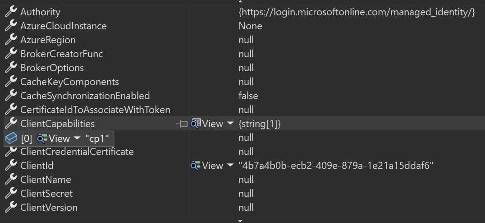

# Microsoft.Identity.Web – Continuous Access Evaluation (CAE) for Managed Identity

## Why Continuous Access Evaluation?

Continuous Access Evaluation (CAE) lets Microsoft Entra ID revoke tokens or demand extra claims almost immediately when risk changes (user disabled, password reset, network change, policy update, etc.).

A workload opts-in by sending the client-capability **`cp1`** when acquiring tokens. Entra then includes an **`xms_cc`** claim in the token so downstream Microsoft services know the caller can handle claims challenges.

## What this spec adds to **Microsoft.Identity.Web**

* **Declarative opt-in** – one configuration knob (`ClientCapabilities: [ "cp1" ]`).
* **Transparent 401 recovery** – when a downstream Microsoft API responds with a 401+claims challenge, Id.Web automatically:
  1. extracts the claims body;
  2. bypasses its token cache;
  3. requests a fresh token that satisfies the claims;
  4. retries the HTTP call **once**.

The goal is **zero-touch** for most developers.

## Typical Flow (Managed Identity → Downstream API)

```text
1. Id.Web → MSI endpoint   : GET /token?resource=...&xms_cc=cp1    ──▶
2. MSI  → ESTS             : request includes cp1              ──▶
3. ESTS → Id.Web           : access_token (xms_cc claim present)    ◀──
4. Id.Web → Downstream API : GET /resource  ⟶  200 OK               │
5. Policy change occurs                                             │
6. Id.Web → Downstream API : GET /resource  ⟶  401 + claims payload │
7. Id.Web handles challenge (steps 1-4 again, bypassing msal cache)      ──▶
```

## Design Goals

| #   | Goal                                                         | Success Metric                                           |
|-----|--------------------------------------------------------------|----------------------------------------------------------|
| G1  | Transparent CAE retry with cache-bypass on 401 claims challenge. | Downstream API call recovers without developer code.    |
| G2  | Declarative client capabilities via configuration.           | Single place to add `cp1`; all MI calls include it.      |

## Public API Impact

no changes to the public api.

## Configuration Example

```
{
  "AzureAd": {
    "ClientCapabilities": [ "cp1" ]
  },

  // Example downstream API definition (Contoso Storage API)
  "ContosoStorage": {
    "BaseUrl": "https://storage.contoso.com/",
    "RelativePath": "data/records?api-version=1.0",
    "RequestAppToken": true,
    "Scopes": [ "https://storage.contoso.com/.default" ],
    "AcquireTokenOptions": {
      "ManagedIdentity": {
        // optional – omit for system-assigned MI
        "UserAssignedClientId": "<client-id>"
      }
    }
  }
}
```

> **Note** : The same configuration block works in *appsettings.json* or can be supplied programmatically.


## Code Snippets

### Registering & Calling a Downstream API

```csharp
// 1 – set up the TokenAcquirerFactory (test-helper shown for brevity)
var factory = TokenAcquirerFactory.GetDefaultInstance();

// 2 – register the downstream API using section "ContosoStorage"
factory.Services.AddDownstreamApi("ContosoStorage",
    factory.Configuration.GetSection("ContosoStorage"));

IServiceProvider sp = factory.Build();
IDownstreamApi api   = sp.GetRequiredService<IDownstreamApi>();

// 3 – call the API (Id.Web handles CAE automatically)
HttpResponseMessage resp = await api.CallApiForAppAsync("ContosoStorage");
```

### Using **IAuthorizationHeaderProvider** (advanced)

`IAuthorizationHeaderProvider` is fully supported with Managed Identity. Claims challenges propagate the same way:

```csharp
var headerProvider = sp.GetRequiredService<IAuthorizationHeaderProvider>();
string header = await headerProvider.CreateAuthorizationHeaderForAppAsync(
    scope: "https://storage.contoso.com/.default",
    options: new AuthorizationHeaderProviderOptions
    {
        AcquireTokenOptions = new AcquireTokenOptions
        {
            ManagedIdentity = new ManagedIdentityOptions(), // system-assigned MI
            Claims = claimsChallengeJson // when retrying after 401
        }
    });
```

## Telemetry

We rely on server side telemetry for the token revocation features.

Server dashboards add MI success‑rate with/without cp1.

## Options as seen in MSAL 



### reference - [How to use Continuous Access Evaluation enabled APIs in your applications](https://learn.microsoft.com/en-us/entra/identity-platform/app-resilience-continuous-access-evaluation?tabs=dotnet)
