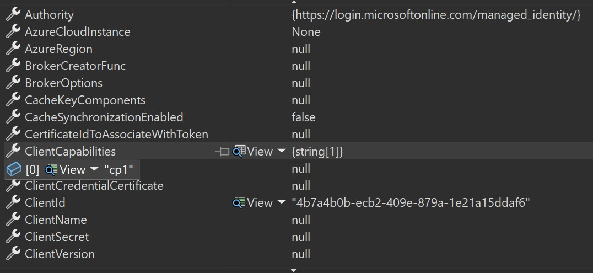

# Microsoft.Identity.Web – Claims & Client Capabilities Mini‑Spec (Managed Identity)

## Why ClientCapabilities (cp1)?

Adding the `cp1` client‑capability tells Microsoft Entra ID your service can handle Continuous Access Evaluation (CAE) claims challenges. Tokens will include an extra xms_cc claim, allowing near‑realtime revocation.

## Overview

`cp1` signals to Microsoft Entra ID that a workload identity can handle Continuous Access Evaluation (CAE) claims challenges. When a token includes the extra claim, a CAE capable resource can revoke the token, and respond with a 401 Unauthorized, accompanied by a WWW-Authenticate header which contains a claims challenge in the `claims` attribute. 

CAE has already been implemented for confidential client - user flows (web apps, web apis), and certificate based authentication. This spec extends the functionality to Managed Identity. The goal is zero‑touch for most developers: a single configuration knob at startup, automatic 401/claims recovery at runtime.

## Typical Flow   (MI + Downstream API)

- MI token request – Id.Web sends xms_cc=cp1 at app creation.
- Access granted – Downstream API returns 200.
- Policy change – Token later revoked; next call to Downstream API gets 401 + claims.
- Transparent recovery – Id.Web detects challenge ⇒ forwards claims body, acquires fresh token, retries once.

_app developer does not need to handle claims, downstream api takes care of this_

## Design Goals

| #   | Goal                                                         | Success Metric                                           |
|-----|--------------------------------------------------------------|----------------------------------------------------------|
| G1  | Transparent CAE retry with cache-bypass on 401 claims challenge. | Secret or Graph call recovers without developer code.    |
| G2  | Declarative client capabilities via configuration.           | Single place to add `cp1`; all MI calls include it.      |

## 5 · Public API Impact

no changes to the public api.

## Configuration 

```
{
  "AzureAd": {
    "ClientCapabilities": [ "cp1" ]
  },

  // Resource entry (example)
  "AzureKeyVault": {
    "BaseUrl": "https://<your‑vault>.vault.azure.net/",
    "RelativePath": "secrets/<secret-name>?api-version=7.4",
    "RequestAppToken": true,
    "Scopes": [ "https://vault.azure.net/.default" ],

    "AcquireTokenOptions": {
      "ManagedIdentity": {
        "UserAssignedClientId": "<user-assigned-mi-client-id>"
      }
    }
  }
}
```

## Code 

```cs
// register the downstream API using the "AzureKeyVault" section ────
factory.Services.AddDownstreamApi("AzureKeyVault",
    factory.Configuration.GetSection("AzureKeyVault"));
IServiceProvider sp = factory.Build();
IDownstreamApi api = sp.GetRequiredService<IDownstreamApi>();

// ── 3. call the vault (app-token path) ──────────────────────────────────
HttpResponseMessage response = await api.CallApiForAppAsync("AzureKeyVault");
```

## Telemetry

We rely on server side telemetry for the token revocation features.

Server dashboards add MI success‑rate with/without cp1.

## Options as seen in MSAL 



### reference - [How to use Continuous Access Evaluation enabled APIs in your applications](https://learn.microsoft.com/en-us/entra/identity-platform/app-resilience-continuous-access-evaluation?tabs=dotnet)
