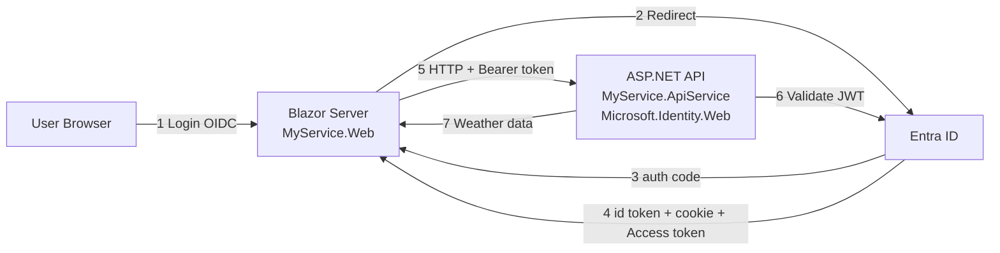

# Manually add Entra ID authentication and authorization to an Aspire App

This guide shows how to secure a **.NET Aspire** distributed application with **Microsoft Entra ID** (Azure AD) authentication and authorization. It covers:

1. **Blazor Server frontend** (`MyService.Web`): User sign-in with OpenID Connect and token acquisition
2. **Protected API backend** (`MyService.ApiService`): JWT validation using **Microsoft.Identity.Web**
3. **End-to-end flow**:  Blazor acquires access tokens and calls the protected API with Aspire service discovery

It assumes you started with an Aspire project created using the following command:

```sh
aspire new aspire-starter --name MyService
```

---

## Prerequisites

- **.NET 10 SDK** or later
- **.NET Aspire CLI** - See [Install Aspire CLI](https://aspire.dev/get-started/install-cli/)
- **Azure AD tenant** with two app registrations

<details>
<summary><strong>📋 App Registration Details</strong></summary>

- **Web app** (Blazor): supports redirect URIs (configured to `{URL of the blazorapp}/signin-oidc`). For details see:
  - [How to add a redirect URI to your application](https://learn.microsoft.com/entra/identity-platform/how-to-add-redirect-uri)
- **API app** (ApiService): exposes scopes (e.g., App ID URI is `api://<client-id>`). For details, see:
  - [Configure an application to expose a web API](https://learn.microsoft.com/entra/identity-platform/quickstart-configure-app-expose-web-apis)
- **Client credentials** (certificate or secret) for the web app registration. For details see:
  - [Add and manage application credentials in Microsoft Entra ID](https://learn.microsoft.com/entra/identity-platform/how-to-add-credentials?tabs=certificate) and [Client credentials](../authentication/credentials/credentials-README.md)

</details>

> 📚 **New to Aspire?** See [.NET Aspire Overview](https://learn.microsoft.com/dotnet/aspire/get-started/aspire-overview)

---

> **Note:** The Aspire starter template automatically creates a `WeatherApiClient` class in the `MyService.Web` project. This "typed HttpClient" is used throughout this guide to demonstrate calling the protected API. You don't need to create this class yourself—it's part of the template.

## Quick Start (TL;DR)

<details>
<summary><strong>Click to expand the 5-minute version</strong></summary>

### API (`MyService.ApiService`)

```powershell
dotnet add package Microsoft.Identity.Web
```

**appsettings.json:**
```json
{
  "AzureAd": {
    "Instance": "https://login.microsoftonline.com/",
    "TenantId": "<tenant-id>",
    "ClientId": "<api-client-id>",
    "Audiences": ["api://<api-client-id>"]
  }
}
```

**Program.cs:**
```csharp
builder.Services.AddAuthentication(JwtBearerDefaults.AuthenticationScheme)
    .AddMicrosoftIdentityWebApi(builder.Configuration.GetSection("AzureAd"));
builder.Services.AddAuthorization();
// ...
app.UseAuthentication();
app.UseAuthorization();
// ...
app.MapGet("/weatherforecast", () => { /* ... */ }).RequireAuthorization();
```

### Web App (`MyService.Web`)

```powershell
dotnet add package Microsoft.Identity.Web
```

**appsettings.json:**
```json
{
  "AzureAd": {
    "Instance": "https://login.microsoftonline.com/",
    "TenantId": "<tenant-id>",
    "ClientId": "<web-client-id>",
    "CallbackPath": "/signin-oidc",
    "ClientCredentials": [{ "SourceType": "ClientSecret", "ClientSecret": "<secret>" }]
  },
  "WeatherApi": { "Scopes": ["api://<api-client-id>/.default"] }
}
```

**Program.cs:**
```csharp
builder.Services.AddAuthentication(OpenIdConnectDefaults.AuthenticationScheme)
    .AddMicrosoftIdentityWebApp(builder.Configuration.GetSection("AzureAd"))
    .EnableTokenAcquisitionToCallDownstreamApi()
    .AddInMemoryTokenCaches();

builder.Services.AddHttpClient<WeatherApiClient>(client =>
    client.BaseAddress = new("https+http://apiservice"))
    .AddMicrosoftIdentityMessageHandler(builder.Configuration.GetSection("WeatherApi"));
// ...
app.UseAuthentication();
app.UseAuthorization();
```

**That's it!** The `MicrosoftIdentityMessageHandler` automatically acquires and attaches tokens.

</details>

---

## Files You'll Modify

| Project | File | Changes |
|---------|------|---------|
| **ApiService** | `Program.cs` | JWT Bearer auth, authorization middleware |
| | `appsettings.json` | Azure AD configuration |
| | `.csproj` | Add `Microsoft.Identity.Web` |
| **Web** | `Program.cs` | OIDC auth, token acquisition, message handler |
| | `appsettings.json` | Azure AD config, downstream API scopes |
| | `.csproj` | Add `Microsoft.Identity.Web` |
| | `LoginLogoutEndpointRouteBuilderExtensions.cs` | Login/logout endpoints *(new file)* |
| | `Components/Layout/LogInOrOut.razor` | Login/logout UI *(new file)* |

---

## What you'll Build & How It Works



**Key Technologies:**
- **Microsoft.Identity.Web** (Blazor & API): OIDC authentication, JWT validation, token acquisition
- **.NET Aspire**: Service discovery (`https+http://apiservice`), orchestration, health checks

### How the Authentication Flow Works

1. **User visits Blazor app** → Not authenticated → sees "Login" button
2. **User clicks Login** → Redirects to `/authentication/login` → OIDC challenge → Entra ID
3. **User signs in** → Entra ID redirects to `/signin-oidc` → cookie established
4. **User navigates to Weather page** → Blazor calls `WeatherApiClient.GetAsync()`
5. **`MicrosoftIdentityMessageHandler`** intercepts the request:
   - Checks token cache for valid access token
   - If expired/missing, silently acquires new token using refresh token
   - Attaches `Authorization: Bearer <token>` header
   - Automatically handles WWW-Authenticate challenges for Conditional Access
6. **API receives request** → Microsoft.Identity.Web validates JWT → returns data
7. **Blazor renders weather data**

<details>
<summary><strong>🔍 Aspire Service Discovery Details</strong></summary>

In `Program.cs`, the HttpClient uses:

```csharp
client.BaseAddress = new("https+http://apiservice");
```

**At runtime:**
- Aspire resolves `"apiservice"` to the actual endpoint (e.g., `https://localhost:7123`)
- No hardcoded URLs needed
- Works in local dev, Docker, Kubernetes, Azure Container Apps

📚 [Aspire Service Discovery](https://learn.microsoft.com/dotnet/aspire/service-discovery/overview)

</details>

---

## Solution Structure

```
MyService/
├── MyService.AppHost/           # Aspire orchestration
├── MyService.ApiService/        # Protected API (Microsoft.Identity.Web)
├── MyService.Web/               # Blazor Server (Microsoft.Identity.Web)
├── MyService.ServiceDefaults/   # Shared defaults
└── MyService.Tests/             # Tests
```

---

## Part 1: Secure the API Backend with Microsoft.Identity.Web

**Microsoft.Identity.Web** provides streamlined JWT Bearer authentication for ASP.NET Core APIs with minimal configuration.

📚 **Learn more:** [Microsoft.Identity.Web Documentation](https://github.com/AzureAD/microsoft-identity-web/tree/master/docs)

### 1.1: Add Microsoft.Identity.Web Package

```powershell
cd MyService.ApiService
dotnet add package Microsoft.Identity.Web
```

<details>
<summary><strong>📄 View updated csproj</strong></summary>

```xml
<ItemGroup>
  <PackageReference Include="Microsoft.AspNetCore.OpenApi" Version="9.0.0" />
  <PackageReference Include="Microsoft.Identity.Web" Version="4.3.0" />
</ItemGroup>
```

</details>

### 1.2: Configure Azure AD Settings

Add Azure AD configuration to `MyService.ApiService/appsettings.json`:

```json
{
  "AzureAd": {
    "Instance": "https://login.microsoftonline.com/",
    "TenantId": "<your-tenant-id>",
    "ClientId": "<your-api-client-id>",
    "Audiences": [
      "api://<your-api-client-id>"
    ]
  },
  "Logging": {
    "LogLevel": {
      "Default": "Information",
      "Microsoft.AspNetCore": "Warning"
    }
  },
  "AllowedHosts": "*"
}
```

<details>
<summary><strong>🔑 Key Properties Explained</strong></summary>

- **`ClientId`**: Entra ID API app registration ID
- **`TenantId`**: Your Azure AD tenant ID, or `"organizations"` for multi-tenant, or `"common"` for any Microsoft account
- **`Audiences`**: Valid token audiences (typically your App ID URI)

</details>

### 1.3: Update `MyService.ApiService/Program.cs`

```csharp
using Microsoft.AspNetCore.Authentication.JwtBearer;
using Microsoft.Identity.Web;

var builder = WebApplication.CreateBuilder(args);

builder.AddServiceDefaults();

// Add Microsoft.Identity.Web JWT Bearer authentication
builder.Services.AddAuthentication(JwtBearerDefaults.AuthenticationScheme)
    .AddMicrosoftIdentityWebApi(builder.Configuration.GetSection("AzureAd"));

builder.Services.AddProblemDetails();
builder.Services.AddOpenApi();

// Authorization
builder.Services.AddAuthorization();

var app = builder.Build();

app.UseExceptionHandler();

app.UseAuthentication();
app.UseAuthorization();

if (app.Environment.IsDevelopment())
{
    app.MapOpenApi();
}

string[] summaries = ["Freezing", "Bracing", "Chilly", "Cool", "Mild", "Warm", "Balmy", "Hot", "Sweltering", "Scorching"];

app.MapGet("/", () => "API service is running.  Navigate to /weatherforecast to see sample data.");

app.MapGet("/weatherforecast", () =>
{
    var forecast = Enumerable.Range(1, 5).Select(index =>
        new WeatherForecast
        (
            DateOnly.FromDateTime(DateTime.Now.AddDays(index)),
            Random.Shared.Next(-20, 55),
            summaries[Random.Shared.Next(summaries.Length)]
        ))
        .ToArray();
    return forecast;
})
.WithName("GetWeatherForecast")
.RequireAuthorization();

app.MapDefaultEndpoints();
app.Run();

record WeatherForecast(DateOnly Date, int TemperatureC, string? Summary)
{
    public int TemperatureF => 32 + (int)(TemperatureC / 0.5556);
}
```

<details>
<summary><strong>🔑 Key Changes Explained</strong></summary>

- Register JWT Bearer authentication with `AddMicrosoftIdentityWebApi`
- Add `app.UseAuthentication()` and `app.UseAuthorization()` middleware
- Apply `.RequireAuthorization()` to protected endpoints

</details>

### 1.4: Test the Protected API

<details>
<summary><strong>🧪 Test with curl</strong></summary>

Without a token:

```powershell
curl https://localhost:<PORT>/weatherforecast
# Expected: 401 Unauthorized
```

With a valid token:

```powershell
curl -H "Authorization: Bearer <TOKEN>" https://localhost:<PORT>/weatherforecast
# Expected: 200 OK with weather data
```

</details>

---

## Part 2: Configure Blazor Frontend for Authentication

The Blazor Server app uses **Microsoft.Identity.Web** to:
- Sign users in with OIDC
- Acquire access tokens to call the API
- Attach tokens to outgoing HTTP requests

### 2.1: Add Microsoft.Identity.Web Package

```powershell
cd MyService.Web
dotnet add package Microsoft.Identity.Web
```

<details>
<summary><strong>📄 View updated csproj</strong></summary>

```xml
<ItemGroup>
  <PackageReference Include="Microsoft.Identity.Web" Version="4.3.0" />
</ItemGroup>
```

</details>

### 2.2: Configure Azure AD Settings

Add Azure AD configuration and downstream API scopes to `MyService.Web/appsettings.json`:

```json
{
  "AzureAd": {
    "Instance": "https://login.microsoftonline.com/",
    "Domain": "<your-tenant>.onmicrosoft.com",
    "TenantId": "<tenant-guid>",
    "ClientId":  "<web-app-client-id>",
    "CallbackPath": "/signin-oidc",
    "ClientCredentials": [
      {
        "SourceType": "ClientSecret",
        "ClientSecret": "<your-client-secret>"
      }
    ]
  },
  "WeatherApi": {
    "Scopes": [ "api://<api-client-id>/.default" ]
  },
  "Logging": {
    "LogLevel":  {
      "Default": "Information",
      "Microsoft.AspNetCore": "Warning"
    }
  },
  "AllowedHosts": "*"
}
```

<details>
<summary><strong>🔑 Configuration Details</strong></summary>

- **`ClientId`**: Web app registration ID (not the API ID)
- **`ClientCredentials`**: Credentials for the web app to acquire tokens. Supports multiple credential types including certificates, Key Vault, managed identity, and client secrets. See [Credentials documentation](../authentication/credentials/credentials-README.md) for production-ready options.
- **`Scopes`**: Must match the API's App ID URI with `/.default` suffix
- Replace `<api-client-id>` with the **API** app registration client ID

</details>

> ⚠️ **Security Note:** For production, use certificates or managed identity instead of client secrets. See [Certificateless authentication](../authentication/credentials/certificateless.md) for the recommended approach.

### 2.3: Update `MyService.Web/Program.cs`

```csharp
using Microsoft.AspNetCore.Authentication.OpenIdConnect;
using Microsoft.Identity.Abstractions;
using Microsoft.Identity.Web;
using MyService.Web;
using MyService.Web.Components;

var builder = WebApplication.CreateBuilder(args);

builder.AddServiceDefaults();

// 1) Authentication + Microsoft Identity Web
builder.Services.AddAuthentication(OpenIdConnectDefaults.AuthenticationScheme)
    .AddMicrosoftIdentityWebApp(builder.Configuration.GetSection("AzureAd"))
    .EnableTokenAcquisitionToCallDownstreamApi()
    .AddInMemoryTokenCaches();

builder.Services.Configure<OpenIdConnectOptions>(OpenIdConnectDefaults.AuthenticationScheme, options =>
{
    options.Prompt = "login"; // Optional: force fresh sign-in each time
});

builder.Services.AddCascadingAuthenticationState();

// 2) Blazor + consent handler
builder.Services.AddRazorComponents().AddInteractiveServerComponents();
builder.Services.AddServerSideBlazor().AddMicrosoftIdentityConsentHandler();

builder.Services.AddOutputCache();

// 3) Downstream API client with MicrosoftIdentityMessageHandler
builder.Services.AddHttpClient<WeatherApiClient>(client =>
{
    // Aspire service discovery:  resolves "apiservice" at runtime
    client.BaseAddress = new("https+http://apiservice");
})
.AddMicrosoftIdentityMessageHandler(builder.Configuration.GetSection("WeatherApi"));

var app = builder.Build();

if (! app.Environment.IsDevelopment())
{
    app.UseExceptionHandler("/Error", createScopeForErrors: true);
    app.UseHsts();
}

app.UseHttpsRedirection();
app.UseAuthentication();
app.UseAuthorization();
app.UseAntiforgery();
app.UseOutputCache();

app.MapStaticAssets();
app.MapRazorComponents<App>()
   .AddInteractiveServerRenderMode();

// 4) Login/Logout endpoints
app.MapGroup("/authentication").MapLoginAndLogout();

app.MapDefaultEndpoints();
app.Run();
```

<details>
<summary><strong>🔑 Key Points Explained</strong></summary>

- **`AddMicrosoftIdentityWebApp`**: Configures OIDC authentication
- **`EnableTokenAcquisitionToCallDownstreamApi`**: Enables token acquisition for downstream APIs
- **`AddMicrosoftIdentityMessageHandler`**: Attaches bearer tokens to HttpClient requests automatically. Reads scopes from the `WeatherApi` configuration section.
- **`https+http://apiservice`**: Aspire service discovery resolves this to the actual API URL
- **Middleware order**: `UseAuthentication()` → `UseAuthorization()` → endpoints

📚 **Deep dive:** [MicrosoftIdentityMessageHandler documentation](../calling-downstream-apis/custom-apis.md#microsoftidentitymessagehandler---for-httpclient-integration)

</details>

<details>
<summary><strong>⚙️ Alternative Configuration Approaches</strong></summary>

#### Alternative Configuration Approaches

The `AddMicrosoftIdentityMessageHandler` extension supports multiple configuration patterns:

**Option 1: Configuration from appsettings.json (shown above)**
```csharp
.AddMicrosoftIdentityMessageHandler(builder.Configuration.GetSection("WeatherApi"));
```

**Option 2: Inline configuration with Action delegate**
```csharp
.AddMicrosoftIdentityMessageHandler(options =>
{
    options.Scopes.Add("api://<api-client-id>/.default");
});
```

**Option 3: Per-request configuration (parameterless)**
```csharp
.AddMicrosoftIdentityMessageHandler();

// Then in your service, configure per-request:
var request = new HttpRequestMessage(HttpMethod.Get, "/weatherforecast")
    .WithAuthenticationOptions(options =>
    {
        options.Scopes.Add("api://<api-client-id>/.default");
    });
var response = await _httpClient.SendAsync(request);
```

**Option 4: Pre-configured options object**
```csharp
var options = new MicrosoftIdentityMessageHandlerOptions
{
    Scopes = { "api://<api-client-id>/.default" }
};
builder.Services.AddHttpClient<WeatherApiClient>(client =>
{
    client.BaseAddress = new("https+http://apiservice");
})
.AddMicrosoftIdentityMessageHandler(options);
```

</details>

### 2.4: Add Login/Logout Endpoints

**Create `MyService.Web/LoginLogoutEndpointRouteBuilderExtensions.cs`:**

```csharp
using Microsoft.AspNetCore.Authentication;
using Microsoft.AspNetCore.Authentication.Cookies;
using Microsoft.AspNetCore.Authentication.OpenIdConnect;
using Microsoft.AspNetCore.Mvc;

namespace MyService.Web;

internal static class LoginLogoutEndpointRouteBuilderExtensions
{
    internal static IEndpointConventionBuilder MapLoginAndLogout(this IEndpointRouteBuilder endpoints)
    {
        var group = endpoints.MapGroup("");

        group.MapGet("/login", (string? returnUrl) => TypedResults.Challenge(GetAuthProperties(returnUrl)))
            .AllowAnonymous();

        group.MapPost("/logout", ([FromForm] string? returnUrl) => TypedResults.SignOut(GetAuthProperties(returnUrl),
            [CookieAuthenticationDefaults.AuthenticationScheme, OpenIdConnectDefaults.AuthenticationScheme]));

        return group;
    }

    private static AuthenticationProperties GetAuthProperties(string? returnUrl)
    {
        const string pathBase = "/";
        if (string.IsNullOrEmpty(returnUrl)) returnUrl = pathBase;
        else if (returnUrl.StartsWith("//", StringComparison.Ordinal)) returnUrl = pathBase; // Prevent protocol-relative redirects
        else if (!Uri.IsWellFormedUriString(returnUrl, UriKind.Relative)) returnUrl = new Uri(returnUrl, UriKind.Absolute).PathAndQuery;
        else if (returnUrl[0] != '/') returnUrl = $"{pathBase}{returnUrl}";
        return new AuthenticationProperties { RedirectUri = returnUrl };
    }
}
```

**Features:**
- `GET /authentication/login`: Initiates OIDC challenge
- `POST /authentication/logout`: Signs out of both cookie and OIDC schemes
- Prevents open redirects with URL validation

### 2.5: Add Blazor UI Components

<details>
<summary><strong>📄 Create LogInOrOut.razor component</strong></summary>

**Create `MyService.Web/Components/Layout/LogInOrOut.razor`:**

```razor
@implements IDisposable
@inject NavigationManager Navigation

<div class="nav-item px-3">
    <AuthorizeView>
        <Authorized>
            <form action="authentication/logout" method="post">
                <AntiforgeryToken />
                <input type="hidden" name="ReturnUrl" value="@currentUrl" />
                <button type="submit" class="nav-link">
                    <span class="bi bi-arrow-bar-left-nav-menu" aria-hidden="true"></span> Logout
                </button>
            </form>
        </Authorized>
        <NotAuthorized>
            <a class="nav-link" href="authentication/login">
                <span class="bi bi-person-badge-nav-menu" aria-hidden="true"></span> Login
            </a>
        </NotAuthorized>
    </AuthorizeView>
</div>

@code {
    private string? currentUrl;

    protected override void OnInitialized()
    {
        currentUrl = Navigation.Uri;
        Navigation.LocationChanged += OnLocationChanged;
    }

    private void OnLocationChanged(object? sender, LocationChangedEventArgs e)
    {
        currentUrl = Navigation.Uri;
        StateHasChanged();
    }

    public void Dispose() => Navigation.LocationChanged -= OnLocationChanged;
}
```

**Key Features:**
- `<AuthorizeView>`: Renders different UI based on auth state
- Tracks `currentUrl` for proper post-login/logout redirection
- Implements `IDisposable` to clean up event handlers

</details>

**Add to Navigation:** Include `<LogInOrOut />` in your `NavMenu.razor` or `MainLayout.razor`.

---

## Part 3: Testing and Troubleshooting

### 3.1: Run the Application

```powershell
# From solution root
dotnet restore
dotnet build

# Launch AppHost (starts both Web and API)
dotnet run --project .\MyService.AppHost\MyService.AppHost.csproj
```

### 3.2: Test Flow

1. Open browser → Blazor Web UI (check Aspire dashboard for URL)
2. Click **Login** → Sign in with Azure AD
3. Navigate to **Weather** page
4. Verify weather data loads (from protected API)

### 3.3: Common Issues

| Issue | Solution |
|-------|----------|
| **401 on API calls** | Verify scopes in `appsettings.json` match the API's App ID URI |
| **OIDC redirect fails** | Add `/signin-oidc` to Azure AD redirect URIs |
| **Token not attached** | Ensure `AddMicrosoftIdentityMessageHandler` is called on the `HttpClient` |
| **Service discovery fails** | Check `AppHost.cs` references both projects and they're running |
| **AADSTS65001** | Admin consent required - grant consent in Azure Portal |
| **CORS errors** | Add CORS policy in API `Program.cs` if needed |

### 3.4: Enable MSAL Logging

<details>
<summary><strong>🔍 Debug authentication with MSAL logs</strong></summary>

When troubleshooting authentication issues, enable detailed MSAL (Microsoft Authentication Library) logging to see token acquisition details:

**In `Program.cs` (both Web and API):**

```csharp
// Add detailed logging for Microsoft.Identity
builder.Logging.AddFilter("Microsoft.Identity", LogLevel.Debug);
builder.Logging.AddFilter("Microsoft.IdentityModel", LogLevel.Debug);
```

**Or in `appsettings.json`:**

```json
{
  "Logging": {
    "LogLevel": {
      "Default": "Information",
      "Microsoft.AspNetCore": "Warning",
      "Microsoft.Identity": "Debug",
      "Microsoft.IdentityModel": "Debug"
    }
  }
}
```

**What the logs show:**
- Token cache hits/misses
- Token acquisition attempts (silent vs interactive)
- Token expiration and refresh
- Claims in the token
- Errors with detailed AADSTS codes

**Example log output:**
```
dbug: Microsoft.Identity.Web.TokenAcquisition[0]
      AcquireTokenSilent returned a token from the cache
dbug: Microsoft.Identity.Web.MicrosoftIdentityMessageHandler[0]
      Attaching token to request: https://localhost:7123/weatherforecast
```

> ⚠️ **Security Note:** Disable debug logging in production as it may be very verbose.

</details>

### 3.5: Inspect Tokens

<details>
<summary><strong>🎫 Decode and verify JWT tokens</strong></summary>

To debug token issues, decode your JWT at [jwt.ms](https://jwt.ms) and verify:

- **`aud` (audience)**: Matches your API's Client ID or App ID URI
- **`iss` (issuer)**: Matches your tenant (`https://login.microsoftonline.com/<tenant-id>/v2.0`)
- **`scp` (scopes)**: Contains the required scopes
- **`exp` (expiration)**: Token hasn't expired

</details>

---

## Part 4: Common Scenarios

### 4.1: Protect Blazor Pages

Add `[Authorize]` to pages requiring authentication:

```razor
@page "/weather"
@attribute [Authorize]
```

Or use authorization policies:

```csharp
// Program.cs
builder.Services.AddAuthorization(options =>
{
    options.AddPolicy("AdminOnly", policy => policy.RequireRole("Admin"));
});
```

```razor
@attribute [Authorize(Policy = "AdminOnly")]
```

### 4.2: Scope Validation in the API

To ensure the API only accepts tokens with specific scopes:

```csharp
// In MyService.ApiService/Program.cs
app.MapGet("/weatherforecast", () =>
{
    // ...  implementation
})
.RequireAuthorization()
.RequireScope("access_as_user"); // Requires this specific scope
```

Or configure scope validation globally:

```csharp
builder.Services.AddAuthentication(JwtBearerDefaults.AuthenticationScheme)
    .AddMicrosoftIdentityWebApi(builder.Configuration.GetSection("AzureAd"));

builder.Services.AddAuthorization(options =>
{
    options.AddPolicy("ReadWeather", policy =>
        policy.RequireScope("Weather.Read"));
});
```

### 4.3: Use App-Only Tokens (Service-to-Service)

For daemon scenarios or service-to-service calls without a user context:

```csharp
// Configure with RequestAppToken = true
builder.Services.AddHttpClient<WeatherApiClient>(client =>
{
    client.BaseAddress = new("https+http://apiservice");
})
.AddMicrosoftIdentityMessageHandler(options =>
{
    options.Scopes.Add("api://<api-client-id>/.default");
    options.RequestAppToken = true;
});
```

### 4.4: Override Options Per Request

Override default options on a per-request basis using the `WithAuthenticationOptions` extension method:

```csharp
public class WeatherApiClient
{
    private readonly HttpClient _httpClient;

    public WeatherApiClient(HttpClient httpClient)
    {
        _httpClient = httpClient;
    }

    public async Task<WeatherForecast[]?> GetSensitiveDataAsync()
    {
        // Override scopes for this specific request
        var request = new HttpRequestMessage(HttpMethod.Get, "/weatherforecast")
            .WithAuthenticationOptions(options =>
            {
                options.Scopes.Clear();
                options.Scopes.Add("api://<api-client-id>/sensitive.read");
            });

        var response = await _httpClient.SendAsync(request);
        response.EnsureSuccessStatusCode();
        return await response.Content.ReadFromJsonAsync<WeatherForecast[]>();
    }
}
```

### 4.5: Use Federated identity credentials with Managed Identity (Production)

For production deployments in Azure, use managed identity instead of client secrets:

```json
{
  "AzureAd": {
    "Instance": "https://login.microsoftonline.com/",
    "TenantId": "<tenant-guid>",
    "ClientId":  "<web-app-client-id>",
    "ClientCredentials": [
      {
        "SourceType": "SignedAssertionFromManagedIdentity",
        "ManagedIdentityClientId": "<user-assigned-mi-client-id>"
      }
    ]
  }
}
```

📚 [Certificateless Authentication](../authentication/credentials/certificateless.md)

### 4.6: Handle Conditional Access / MFA

`MicrosoftIdentityMessageHandler` automatically handles WWW-Authenticate challenges for Conditional Access scenarios. No additional code is needed - the handler will:
1. Detect 401 responses with WWW-Authenticate challenges
2. Extract required claims from the challenge
3. Acquire a new token with the additional claims
4. Retry the request with the new token

For scenarios where you need to handle consent in the UI:

```csharp
// In Weather.razor or API client
try
{
    forecasts = await WeatherApi.GetAsync();
}
catch (MicrosoftIdentityWebChallengeUserException ex)
{
    // Re-challenge user with additional claims
    ConsentHandler.HandleException(ex);
}
```

### 4.7: Multi-Tenant API

To accept tokens from any Azure AD tenant:

```jsonc
{
  "AzureAd": {
    "Instance": "https://login.microsoftonline.com/",
    "TenantId": "organizations", // or common
    "ClientId": "<your-api-client-id>"
  }
}
```

### 4.8: Call Downstream APIs from the API (On-Behalf-Of)

If your API needs to call another downstream API on behalf of the user:

```csharp
// MyService.ApiService/Program.cs
builder.Services.AddAuthentication(JwtBearerDefaults.AuthenticationScheme)
    .AddMicrosoftIdentityWebApi(builder.Configuration.GetSection("AzureAd"))
    .EnableTokenAcquisitionToCallDownstreamApi()
    .AddInMemoryTokenCaches();

builder.Services.AddDownstreamApi("GraphApi", builder.Configuration.GetSection("GraphApi"));
```

```json
{
  "GraphApi": {
    "BaseUrl": "https://graph.microsoft.com/v1.0",
    "Scopes": [ "User.Read" ]
  }
}
```

```csharp
// In a controller or endpoint
app.MapGet("/me", async (IDownstreamApi downstreamApi) =>
{
    var user = await downstreamApi.GetForUserAsync<JsonElement>("GraphApi", "me");
    return user;
}).RequireAuthorization();
```

📚 [Calling Downstream APIs](../calling-downstream-apis/calling-downstream-apis-README.md)

### 4.9: Composing with Other Handlers

Chain multiple handlers in the pipeline:

```csharp
builder.Services.AddHttpClient<WeatherApiClient>(client =>
{
    client.BaseAddress = new("https+http://apiservice");
})
.AddMicrosoftIdentityMessageHandler(options =>
{
    options.Scopes.Add("api://<api-client-id>/.default");
})
.AddHttpMessageHandler<LoggingHandler>()
.AddHttpMessageHandler<RetryHandler>();
```

---

## Resources

<details>
<summary><strong>📚 Microsoft.Identity.Web</strong></summary>

- 📘 [Microsoft.Identity.Web Documentation](https://github.com/AzureAD/microsoft-identity-web/tree/master/docs)
- 📘 [Quick Start: Web App](../getting-started/quickstart-webapp.md)
- 📘 [Quick Start: Web API](../getting-started/quickstart-webapi.md)
- 📘 [Calling Custom APIs](../calling-downstream-apis/custom-apis.md)
- 🔐 [Credentials Guide](../authentication/credentials/credentials-README.md)
- 🎫 [Microsoft Identity Platform](https://learn.microsoft.com/entra/identity-platform/)

</details>

<details>
<summary><strong>🚀 .NET Aspire</strong></summary>

- 📘 [Aspire Overview](https://learn.microsoft.com/dotnet/aspire/get-started/aspire-overview)
- 🚀 [Build Your First Aspire App](https://learn.microsoft.com/dotnet/aspire/get-started/build-your-first-aspire-app)
- 🔍 [Service Discovery](https://learn.microsoft.com/dotnet/aspire/service-discovery/overview)

</details>

<details>
<summary><strong>🧪 Samples</strong></summary>

- 🧪 [ASP.NET Core Web App signing-in users](https://github.com/Azure-Samples/active-directory-aspnetcore-webapp-openidconnect-v2/tree/master/1-WebApp-OIDC)
- 🧪 [ASP.NET Core Web API protected by Azure AD](https://github.com/Azure-Samples/active-directory-dotnet-native-aspnetcore-v2)

</details>

---

## 🤖 AI Coding Assistant Skill

A condensed version of this guide is available as an **AI Skill** for GitHub Copilot, Claude, and other AI coding assistants. The skill helps AI assistants implement this authentication pattern in your Aspire projects.

📁 **Location:** [.github/skills/entra-id-aspire-authentication/SKILL.md](../../.github/skills/entra-id-aspire-authentication/SKILL.md)

See the [Skills README](../../.github/skills/README.md) for installation instructions.

---

**Last Updated:** January 2025
**Solution:** MyService (.NET 10, Aspire, Microsoft.Identity.Web)
