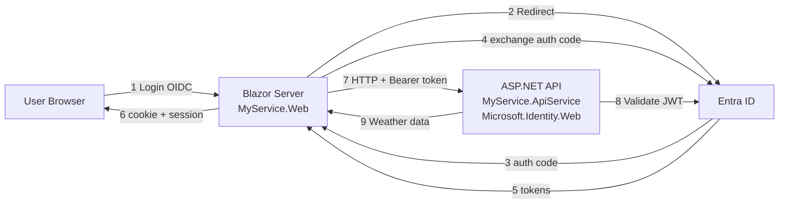

# Manually add Entra ID authentication and authorization to an Aspire App

This guide shows how to secure a **.NET Aspire** distributed application with **Microsoft Entra ID** (Azure AD) authentication and authorization. It covers:

1. **Blazor Server frontend** (`MyService.Web`): User sign-in with OpenID Connect and token acquisition
2. **Protected API backend** (`MyService.ApiService`): JWT validation using **Microsoft.Identity.Web**
3. **End-to-end flow**:  Blazor acquires access tokens and calls the protected API with Aspire service discovery

It assumes you started with an Aspire project created using the following command:

```sh
aspire new aspire-starter --name MyService
```

---

## Table of contents

- [Prerequisites](#prerequisites)
- [Two-phase implementation workflow](#two-phase-implementation-workflow)
- [App registrations in Entra ID](#app-registrations-in-entra-id)
- [Quick start (TL;DR)](#quick-start-tldr)
- [Files you'll modify](#files-youll-modify)
- [What you'll build & how it works](#what-youll-build--how-it-works)
- [Part 1: Secure the API (Phase 1)](#part-1-secure-the-api-backend-with-microsoftidentityweb)
- [Part 2: Configure Blazor frontend (Phase 1)](#part-2-configure-blazor-frontend-for-authentication)
- [Implementation checklist](#implementation-checklist)
- [Part 3: Testing and troubleshooting](#part-3-testing-and-troubleshooting)
- [Part 4: Common scenarios](#part-4-common-scenarios)
- [Resources](#resources)
- [AI coding assistant skills](#-ai-coding-assistant-skills)

---

## Prerequisites

- **.NET 9 SDK** or later (or .NET 10+ for latest features)
- **.NET Aspire CLI** - See [Install Aspire CLI](https://aspire.dev/get-started/install-cli/)
- **Azure AD tenant** — See [App Registrations in Entra ID](#app-registrations-in-entra-id) section below for setup

> 📚 **New to Aspire?** See [.NET Aspire Overview](https://learn.microsoft.com/dotnet/aspire/get-started/aspire-overview)

---

## Two-phase implementation workflow

This guide follows a **two-phase approach**:

| Phase | What Happens | Result |
|-------|--------------|--------|
| **Phase 1** | Add authentication code with placeholder values | App **builds** but won't **run** |
| **Phase 2** | Provision Entra ID app registrations | App **runs** with real authentication |

> 💡 **AI Assistant Tip:** If you're using GitHub Copilot or another AI assistant, the [entra-id-aspire-authentication](../../.github/skills/entra-id-aspire-authentication/SKILL.md) and [entra-id-aspire-provisioning](../../.github/skills/entra-id-aspire-provisioning/SKILL.md) skills can automate both phases.

---

## App registrations in Entra ID

<details>
<summary><strong>📋 Already have app registrations?</strong> Skip to <a href="#quick-start-tldr">Quick Start</a> or <a href="#part-1-secure-the-api-backend-with-microsoftidentityweb">Part 1</a>.</summary>

If you already have app registrations configured, you just need these values for your `appsettings.json`:
- **TenantId** — Your Azure AD tenant ID
- **API ClientId** — Application (client) ID of your API app registration
- **API App ID URI** — Usually `api://<api-client-id>` (used in `Audiences` and `Scopes`)
- **Web App ClientId** — Application (client) ID of your web app registration
- **Client Secret** (or certificate) — Credential for the web app (store in user-secrets, not appsettings.json)
- **Scopes** — The scope(s) your web app requests, e.g., `api://<api-client-id>/.default` or `api://<api-client-id>/access_as_user`

</details>

Before your app can authenticate users, you need **two app registrations** in Microsoft Entra ID:

| App Registration | Purpose | Key Configuration |
|------------------|---------|-------------------|
| **API** (`MyService.ApiService`) | Validates incoming tokens | App ID URI, `access_as_user` scope |
| **Web App** (`MyService.Web`) | Signs in users, acquires tokens | Redirect URIs, client secret, API permissions |

### Option A: Azure Portal (manual)

<details>
<summary><strong>📋 Step 1: Register the API</strong></summary>

1. Go to [Microsoft Entra admin center](https://entra.microsoft.com) > **Identity** > **Applications** > **App registrations**
2. Click **New registration**
   - **Name:** `MyService.ApiService`
   - **Supported account types:** Accounts in this organizational directory only (Single tenant)
   - Click **Register**
3. **Expose an API:**
   - Go to **Expose an API** > **Add** next to Application ID URI
   - Accept the default (`api://<client-id>`) or customize it
   - Click **Add a scope**:
     - **Scope name:** `access_as_user`
     - **Who can consent:** Admins and users
     - **Admin consent display name:** Access MyService API
     - **Admin consent description:** Allows the app to access MyService API on behalf of the signed-in user.
     - Click **Add scope**
4. Copy the **Application (client) ID** — you'll need this for both `appsettings.json` files

📚 [Quickstart: Configure an app to expose a web API](https://learn.microsoft.com/entra/identity-platform/quickstart-configure-app-expose-web-apis)

</details>

<details>
<summary><strong>📋 Step 2: Register the Web App</strong></summary>

1. Go to **App registrations** > **New registration**
   - **Name:** `MyService.Web`
   - **Supported account types:** Accounts in this organizational directory only
   - **Redirect URI:** Select **Web** and enter your app's URL + `/signin-oidc`
     - For local development: `https://localhost:7001/signin-oidc` (check your `launchSettings.json` for the actual port)
   - Click **Register**
2. **Configure redirect URIs:**
   - Go to **Authentication** > **Add URI** to add all your dev URLs (from `launchSettings.json`)
3. **Create a client secret:**
   - Go to **Certificates & secrets** > **Client secrets** > **New client secret**
   - Add a description and expiration
   - **Copy the secret value immediately** — it won't be shown again!

   > **Note:** Some organizations don't allow client secrets. Alternatives:
   > - **Certificates** — See [Certificate credentials](https://learn.microsoft.com/entra/identity-platform/certificate-credentials) and [Microsoft.Identity.Web certificate support](../authentication/credentials/credentials-README.md#certificates)
   > - **Federated Identity Credentials (FIC) + Managed Identity** — See [Workload identity federation](https://learn.microsoft.com/entra/workload-id/workload-identity-federation) and [Certificateless authentication](../authentication/credentials/certificateless.md)

4. **Add API permission:**
   - Go to **API permissions** > **Add a permission** > **My APIs**
   - Select `MyService.ApiService`
   - Check `access_as_user` > **Add permissions**
   - Click **Grant admin consent for [tenant]** (or users will be prompted)
5. Copy the **Application (client) ID** for the web app's `appsettings.json`

📚 [Quickstart: Register an application](https://learn.microsoft.com/entra/identity-platform/quickstart-register-app)
📚 [Add credentials to your app](https://learn.microsoft.com/entra/identity-platform/quickstart-register-app#add-credentials)
📚 [Add a redirect URI](https://learn.microsoft.com/entra/identity-platform/quickstart-register-app#add-a-redirect-uri)

</details>

<details>
<summary><strong>📋 Step 3: Update Configuration</strong></summary>

After creating the app registrations, update your `appsettings.json` files:

**API (`MyService.ApiService/appsettings.json`):**
```json
{
  "AzureAd": {
    "Instance": "https://login.microsoftonline.com/",
    "TenantId": "YOUR_TENANT_ID",
    "ClientId": "YOUR_API_CLIENT_ID",
    "Audiences": ["api://YOUR_API_CLIENT_ID"]
  }
}
```

**Web App (`MyService.Web/appsettings.json`):**
```json
{
  "AzureAd": {
    "Instance": "https://login.microsoftonline.com/",
    "TenantId": "YOUR_TENANT_ID",
    "ClientId": "YOUR_WEB_CLIENT_ID",
    "CallbackPath": "/signin-oidc",
    "ClientCredentials": [
      { "SourceType": "ClientSecret" }
    ]
  },
  "WeatherApi": {
    "Scopes": ["api://YOUR_API_CLIENT_ID/.default"]
  }
}
```

**Store the secret securely:**
```powershell
cd MyService.Web
dotnet user-secrets set "AzureAd:ClientCredentials:0:ClientSecret" "YOUR_SECRET_VALUE"
```

| Value | Where to Find |
|-------|---------------|
| `TenantId` | Azure Portal > Entra ID > Overview > Tenant ID |
| `API ClientId` | App registrations > MyService.ApiService > Application (client) ID |
| `Web ClientId` | App registrations > MyService.Web > Application (client) ID |
| `Client Secret` | Created in Step 2 (copy immediately when created) |

</details>

### Option B: Automated with PowerShell

For automated provisioning using Microsoft Graph PowerShell, use the **entra-id-aspire-provisioning** skill:

```powershell
# Prerequisites (one-time)
Install-Module Microsoft.Graph.Applications -Scope CurrentUser

# Connect to your tenant
Connect-MgGraph -Scopes "Application.ReadWrite.All"
```

Then ask your AI assistant:
> "Using the entra-id-aspire-provisioning skill, create app registrations for my Aspire solution"

📚 [Microsoft Graph PowerShell SDK](https://learn.microsoft.com/powershell/microsoftgraph/installation)
📁 [Provisioning Skill](../../.github/skills/entra-id-aspire-provisioning/SKILL.md)

---

> **Note:** The Aspire starter template automatically creates a `WeatherApiClient` class in the `MyService.Web` project. This "typed HttpClient" is used throughout this guide to demonstrate calling the protected API. You don't need to create this class yourself—it's part of the template.

## Quick start (TL;DR)

<details>
<summary><strong>Click to expand the 5-minute version</strong></summary>

### API (`MyService.ApiService`)

```powershell
dotnet add package Microsoft.Identity.Web
```

**appsettings.json:**
```json
{
  "AzureAd": {
    "Instance": "https://login.microsoftonline.com/",
    "TenantId": "<tenant-id>",
    "ClientId": "<api-client-id>",
    "Audiences": ["api://<api-client-id>"]
  }
}
```

**Program.cs:**
```csharp
builder.Services.AddAuthentication(JwtBearerDefaults.AuthenticationScheme)
    .AddMicrosoftIdentityWebApi(builder.Configuration.GetSection("AzureAd"));
builder.Services.AddAuthorization();
// ...
app.UseAuthentication();
app.UseAuthorization();
// ...
app.MapGet("/weatherforecast", () => { /* ... */ }).RequireAuthorization();
```

### Web App (`MyService.Web`)

```powershell
dotnet add package Microsoft.Identity.Web
```

**appsettings.json:**
```json
{
  "AzureAd": {
    "Instance": "https://login.microsoftonline.com/",
    "TenantId": "<tenant-id>",
    "ClientId": "<web-client-id>",
    "CallbackPath": "/signin-oidc",
    "ClientCredentials": [{ "SourceType": "ClientSecret", "ClientSecret": "<secret>" }]
  },
  "WeatherApi": { "Scopes": ["api://<api-client-id>/.default"] }
}
```

**Program.cs:**
```csharp
builder.Services.AddAuthentication(OpenIdConnectDefaults.AuthenticationScheme)
    .AddMicrosoftIdentityWebApp(builder.Configuration.GetSection("AzureAd"))
    .EnableTokenAcquisitionToCallDownstreamApi()
    .AddInMemoryTokenCaches();

builder.Services.AddCascadingAuthenticationState();
builder.Services.AddScoped<BlazorAuthenticationChallengeHandler>();

builder.Services.AddHttpClient<WeatherApiClient>(client =>
    client.BaseAddress = new("https+http://apiservice"))
    .AddMicrosoftIdentityMessageHandler(builder.Configuration.GetSection("WeatherApi"));
// ...
app.UseAuthentication();
app.UseAuthorization();
app.MapGroup("/authentication").MapLoginAndLogout();
```

> 💡 **Important:** The Blazor helpers (`BlazorAuthenticationChallengeHandler` and `LoginLogoutEndpointRouteBuilderExtensions`) ship in the `Microsoft.Identity.Web` NuGet package (v3.3.0+). Simply add `using Microsoft.Identity.Web;` — no file copying required. Don't forget to create `UserInfo.razor` for the login button. See [Part 2](#part-2-configure-blazor-frontend-for-authentication) for details.

**That's it!** The `MicrosoftIdentityMessageHandler` automatically acquires and attaches tokens, and `BlazorAuthenticationChallengeHandler` handles consent/Conditional Access challenges.

</details>

---

## Files you'll modify

| Project | File | Changes |
|---------|------|---------|
| **ApiService** | `Program.cs` | JWT Bearer auth, authorization middleware |
| | `appsettings.json` | Azure AD configuration |
| | `.csproj` | Add `Microsoft.Identity.Web` |
| **Web** | `Program.cs` | OIDC auth, token acquisition, BlazorAuthenticationChallengeHandler |
| | `appsettings.json` | Azure AD config, downstream API scopes |
| | `.csproj` | Add `Microsoft.Identity.Web` (v3.3.0+) |
| | `Components/UserInfo.razor` | **Login button UI** *(new file)* |
| | `Components/Layout/MainLayout.razor` | Include UserInfo component |
| | `Components/Routes.razor` | AuthorizeRouteView for protected pages |
| | Pages calling APIs | Try/catch with ChallengeHandler |

> **Note:** The Blazor helpers (`BlazorAuthenticationChallengeHandler` and `LoginLogoutEndpointRouteBuilderExtensions`) are included in Microsoft.Identity.Web v3.3.0+ — no file copying required.

---

## What you'll build & how it works



**Key Technologies:**
- **Microsoft.Identity.Web** (Blazor & API): OIDC authentication, JWT validation, token acquisition
- **.NET Aspire**: Service discovery (`https+http://apiservice`), orchestration, health checks

### How the authentication flow works

1. **User visits Blazor app** → Not authenticated → sees "Login" button
2. **User clicks Login** → Redirects to `/authentication/login` → OIDC challenge → Entra ID
3. **User signs in** → Entra ID redirects to `/signin-oidc` → cookie established
4. **User navigates to Weather page** → Blazor calls `WeatherApiClient.GetAsync()`
5. **`MicrosoftIdentityMessageHandler`** intercepts the request:
   - Checks token cache for valid access token
   - If expired/missing, silently acquires new token using refresh token
   - Attaches `Authorization: Bearer <token>` header
   - Automatically handles WWW-Authenticate challenges for Conditional Access
6. **API receives request** → Microsoft.Identity.Web validates JWT → returns data
7. **Blazor renders weather data**

<details>
<summary><strong>🔍 Aspire Service Discovery Details</strong></summary>

In `Program.cs`, the HttpClient uses:

```csharp
client.BaseAddress = new("https+http://apiservice");
```

**At runtime:**
- Aspire resolves `"apiservice"` to the actual endpoint (e.g., `https://localhost:7123`)
- No hardcoded URLs needed
- Works in local dev, Docker, Kubernetes, Azure Container Apps

📚 [Aspire Service Discovery](https://learn.microsoft.com/dotnet/aspire/service-discovery/overview)

</details>

---

## Solution structure

```
MyService/
├── MyService.AppHost/           # Aspire orchestration
├── MyService.ApiService/        # Protected API (Microsoft.Identity.Web)
├── MyService.Web/               # Blazor Server (Microsoft.Identity.Web)
├── MyService.ServiceDefaults/   # Shared defaults
└── MyService.Tests/             # Tests
```

---

## Part 1: Secure the API backend with Microsoft.Identity.Web

> 📍 **You are in Phase 1** — Parts 1 and 2 add the authentication code. After completing both, proceed to [App Registrations](#app-registrations-in-entra-id) if you haven't already.

**Microsoft.Identity.Web** provides streamlined JWT Bearer authentication for ASP.NET Core APIs with minimal configuration.

📚 **Learn more:** [Microsoft.Identity.Web Documentation](https://github.com/AzureAD/microsoft-identity-web/tree/master/docs)

### 1.1: Add Microsoft.Identity.Web package

```powershell
cd MyService.ApiService
dotnet add package Microsoft.Identity.Web
```

<details>
<summary><strong>📄 View updated csproj</strong></summary>

```xml
<ItemGroup>
  <PackageReference Include="Microsoft.AspNetCore.OpenApi" Version="9.0.0" />
  <PackageReference Include="Microsoft.Identity.Web" Version="4.3.0" />
</ItemGroup>
```

</details>

### 1.2: Configure Azure AD settings

Add Azure AD configuration to `MyService.ApiService/appsettings.json`:

```json
{
  "AzureAd": {
    "Instance": "https://login.microsoftonline.com/",
    "TenantId": "<your-tenant-id>",
    "ClientId": "<your-api-client-id>",
    "Audiences": [
      "api://<your-api-client-id>"
    ]
  },
  "Logging": {
    "LogLevel": {
      "Default": "Information",
      "Microsoft.AspNetCore": "Warning"
    }
  },
  "AllowedHosts": "*"
}
```

<details>
<summary><strong>🔑 Key Properties Explained</strong></summary>

- **`ClientId`**: Entra ID API app registration ID
- **`TenantId`**: Your Azure AD tenant ID, or `"organizations"` for multi-tenant, or `"common"` for any Microsoft account
- **`Audiences`**: Valid token audiences (typically your App ID URI)

</details>

### 1.3: Update `MyService.ApiService/Program.cs`

```csharp
using Microsoft.AspNetCore.Authentication.JwtBearer;
using Microsoft.Identity.Web;

var builder = WebApplication.CreateBuilder(args);

builder.AddServiceDefaults();

// Add Microsoft.Identity.Web JWT Bearer authentication
builder.Services.AddAuthentication(JwtBearerDefaults.AuthenticationScheme)
    .AddMicrosoftIdentityWebApi(builder.Configuration.GetSection("AzureAd"));

builder.Services.AddProblemDetails();
builder.Services.AddOpenApi();

// Authorization
builder.Services.AddAuthorization();

var app = builder.Build();

app.UseExceptionHandler();

app.UseAuthentication();
app.UseAuthorization();

if (app.Environment.IsDevelopment())
{
    app.MapOpenApi();
}

string[] summaries = ["Freezing", "Bracing", "Chilly", "Cool", "Mild", "Warm", "Balmy", "Hot", "Sweltering", "Scorching"];

app.MapGet("/", () => "API service is running.  Navigate to /weatherforecast to see sample data.");

app.MapGet("/weatherforecast", () =>
{
    var forecast = Enumerable.Range(1, 5).Select(index =>
        new WeatherForecast
        (
            DateOnly.FromDateTime(DateTime.Now.AddDays(index)),
            Random.Shared.Next(-20, 55),
            summaries[Random.Shared.Next(summaries.Length)]
        ))
        .ToArray();
    return forecast;
})
.WithName("GetWeatherForecast")
.RequireAuthorization();

app.MapDefaultEndpoints();
app.Run();

record WeatherForecast(DateOnly Date, int TemperatureC, string? Summary)
{
    public int TemperatureF => 32 + (int)(TemperatureC / 0.5556);
}
```

<details>
<summary><strong>🔑 Key Changes Explained</strong></summary>

- Register JWT Bearer authentication with `AddMicrosoftIdentityWebApi`
- Add `app.UseAuthentication()` and `app.UseAuthorization()` middleware
- Apply `.RequireAuthorization()` to protected endpoints

</details>

### 1.4: Test the protected API

<details>
<summary><strong>🧪 Test with curl</strong></summary>

Without a token:

```powershell
curl https://localhost:<PORT>/weatherforecast
# Expected: 401 Unauthorized
```

With a valid token:

```powershell
curl -H "Authorization: Bearer <TOKEN>" https://localhost:<PORT>/weatherforecast
# Expected: 200 OK with weather data
```

</details>

---

## Part 2: Configure Blazor frontend for authentication

> 📍 **Still in Phase 1** — This part completes the code implementation. The Blazor helpers ship in Microsoft.Identity.Web (v3.3.0+), so no file copying is required.

The Blazor Server app uses **Microsoft.Identity.Web** to:
- Sign users in with OIDC
- Acquire access tokens to call the API
- Attach tokens to outgoing HTTP requests

### 2.1: Add Microsoft.Identity.Web package

```powershell
cd MyService.Web
dotnet add package Microsoft.Identity.Web
```

<details>
<summary><strong>📄 View updated csproj</strong></summary>

```xml
<ItemGroup>
  <PackageReference Include="Microsoft.Identity.Web" Version="4.3.0" />
</ItemGroup>
```

</details>

### 2.2: Configure Azure AD settings

Add Azure AD configuration and downstream API scopes to `MyService.Web/appsettings.json`:

```json
{
  "AzureAd": {
    "Instance": "https://login.microsoftonline.com/",
    "Domain": "<your-tenant>.onmicrosoft.com",
    "TenantId": "<tenant-guid>",
    "ClientId":  "<web-app-client-id>",
    "CallbackPath": "/signin-oidc",
    "ClientCredentials": [
      {
        "SourceType": "ClientSecret",
        "ClientSecret": "<your-client-secret>"
      }
    ]
  },
  "WeatherApi": {
    "Scopes": [ "api://<api-client-id>/.default" ]
  },
  "Logging": {
    "LogLevel":  {
      "Default": "Information",
      "Microsoft.AspNetCore": "Warning"
    }
  },
  "AllowedHosts": "*"
}
```

<details>
<summary><strong>🔑 Configuration Details</strong></summary>

- **`ClientId`**: Web app registration ID (not the API ID)
- **`ClientCredentials`**: Credentials for the web app to acquire tokens. Supports multiple credential types including certificates, Key Vault, managed identity, and client secrets. See [Credentials documentation](../authentication/credentials/credentials-README.md) for production-ready options.
- **`Scopes`**: Must match the API's App ID URI with `/.default` suffix
- Replace `<api-client-id>` with the **API** app registration client ID

</details>

> ⚠️ **Security Note:** For production, use certificates or managed identity instead of client secrets. See [Certificateless authentication](../authentication/credentials/certificateless.md) for the recommended approach.

### 2.3: Update `MyService.Web/Program.cs`

```csharp
using Microsoft.AspNetCore.Authentication.OpenIdConnect;
using Microsoft.Identity.Abstractions;
using Microsoft.Identity.Web;
using MyService.Web;
using MyService.Web.Components;

var builder = WebApplication.CreateBuilder(args);

builder.AddServiceDefaults();

// 1) Authentication + Microsoft Identity Web
builder.Services.AddAuthentication(OpenIdConnectDefaults.AuthenticationScheme)
    .AddMicrosoftIdentityWebApp(builder.Configuration.GetSection("AzureAd"))
    .EnableTokenAcquisitionToCallDownstreamApi()
    .AddInMemoryTokenCaches();

builder.Services.Configure<OpenIdConnectOptions>(OpenIdConnectDefaults.AuthenticationScheme, options =>
{
    options.Prompt = "login"; // Optional: force fresh sign-in each time
});

builder.Services.AddCascadingAuthenticationState();

// 2) Blazor components
builder.Services.AddRazorComponents().AddInteractiveServerComponents();

// 3) Blazor authentication challenge handler for incremental consent & Conditional Access
builder.Services.AddScoped<BlazorAuthenticationChallengeHandler>();

builder.Services.AddOutputCache();

// 4) Downstream API client with MicrosoftIdentityMessageHandler
builder.Services.AddHttpClient<WeatherApiClient>(client =>
{
    // Aspire service discovery: resolves "apiservice" at runtime
    client.BaseAddress = new("https+http://apiservice");
})
.AddMicrosoftIdentityMessageHandler(builder.Configuration.GetSection("WeatherApi"));

var app = builder.Build();

if (!app.Environment.IsDevelopment())
{
    app.UseExceptionHandler("/Error", createScopeForErrors: true);
    app.UseHsts();
}

app.UseHttpsRedirection();
app.UseAuthentication();
app.UseAuthorization();
app.UseAntiforgery();
app.UseOutputCache();

app.MapStaticAssets();
app.MapRazorComponents<App>()
   .AddInteractiveServerRenderMode();

// 5) Login/Logout endpoints with incremental consent support
app.MapGroup("/authentication").MapLoginAndLogout();

app.MapDefaultEndpoints();
app.Run();
```

<details>
<summary><strong>🔑 Key Points Explained</strong></summary>

- **`AddMicrosoftIdentityWebApp`**: Configures OIDC authentication
- **`EnableTokenAcquisitionToCallDownstreamApi`**: Enables token acquisition for downstream APIs
- **`AddScoped<BlazorAuthenticationChallengeHandler>`**: Handles incremental consent and Conditional Access in Blazor Server
- **`AddMicrosoftIdentityMessageHandler`**: Attaches bearer tokens to HttpClient requests automatically
- **`https+http://apiservice`**: Aspire service discovery resolves this to the actual API URL
- **Middleware order**: `UseAuthentication()` → `UseAuthorization()` → endpoints

📚 **Deep dive:** [MicrosoftIdentityMessageHandler documentation](../calling-downstream-apis/custom-apis.md#microsoftidentitymessagehandler---for-httpclient-integration)

</details>

<details>
<summary><strong>⚙️ Alternative Configuration Approaches</strong></summary>

#### Alternative configuration approaches

The `AddMicrosoftIdentityMessageHandler` extension supports multiple configuration patterns:

**Option 1: Configuration from appsettings.json (shown above)**
```csharp
.AddMicrosoftIdentityMessageHandler(builder.Configuration.GetSection("WeatherApi"));
```

**Option 2: Inline configuration with Action delegate**
```csharp
.AddMicrosoftIdentityMessageHandler(options =>
{
    options.Scopes.Add("api://<api-client-id>/.default");
});
```

**Option 3: Per-request configuration (parameterless)**
```csharp
.AddMicrosoftIdentityMessageHandler();

// Then in your service, configure per-request:
var request = new HttpRequestMessage(HttpMethod.Get, "/weatherforecast")
    .WithAuthenticationOptions(options =>
    {
        options.Scopes.Add("api://<api-client-id>/.default");
    });
var response = await _httpClient.SendAsync(request);
```

**Option 4: Pre-configured options object**
```csharp
var options = new MicrosoftIdentityMessageHandlerOptions
{
    Scopes = { "api://<api-client-id>/.default" }
};
builder.Services.AddHttpClient<WeatherApiClient>(client =>
{
    client.BaseAddress = new("https+http://apiservice");
})
.AddMicrosoftIdentityMessageHandler(options);
```

</details>

### 2.4: Blazor helper classes

The authentication implementation uses two helper classes that ship in the `Microsoft.Identity.Web` NuGet package (v3.3.0+):

- **`LoginLogoutEndpointRouteBuilderExtensions`**: Provides the `MapLoginAndLogout()` extension method with support for incremental consent and Conditional Access
- **`BlazorAuthenticationChallengeHandler`**: Handles authentication challenges in Blazor Server components

**No file copying is required** — these are available once you reference Microsoft.Identity.Web and add `using Microsoft.Identity.Web;`.

> 💡 **For older package versions**: If you're using Microsoft.Identity.Web < v3.3.0, you can find these files in the [skill folder](../../.github/skills/entra-id-aspire-authentication/) as a workaround.

<details>
<summary><strong>📄 View LoginLogoutEndpointRouteBuilderExtensions.cs (Reference)</strong></summary>

> **Note:** This code is **for reference only** — the actual implementation ships in the Microsoft.Identity.Web NuGet package.

This enhanced version supports **incremental consent** and **Conditional Access** via query parameters:

```csharp
using Microsoft.AspNetCore.Authentication;
using Microsoft.AspNetCore.Authentication.Cookies;
using Microsoft.AspNetCore.Authentication.OpenIdConnect;
using Microsoft.IdentityModel.Protocols.OpenIdConnect;

namespace Microsoft.Identity.Web;

/// <summary>
/// Extension methods for mapping login and logout endpoints that support
/// incremental consent and Conditional Access scenarios.
/// </summary>
public static class LoginLogoutEndpointRouteBuilderExtensions
{
    /// <summary>
    /// Maps login and logout endpoints under the current route group.
    /// The login endpoint supports incremental consent via scope, loginHint, domainHint, and claims parameters.
    /// </summary>
    public static IEndpointConventionBuilder MapLoginAndLogout(this IEndpointRouteBuilder endpoints)
    {
        var group = endpoints.MapGroup("");

        // Enhanced login endpoint that supports incremental consent and Conditional Access
        group.MapGet("/login", (
            string? returnUrl,
            string? scope,
            string? loginHint,
            string? domainHint,
            string? claims) =>
        {
            var properties = GetAuthProperties(returnUrl);

            // Add scopes if provided (for incremental consent)
            if (!string.IsNullOrEmpty(scope))
            {
                var scopes = scope.Split(' ', StringSplitOptions.RemoveEmptyEntries);
                properties.SetParameter(OpenIdConnectParameterNames.Scope, scopes);
            }

            // Add login hint (pre-fills username)
            if (!string.IsNullOrEmpty(loginHint))
            {
                properties.SetParameter(OpenIdConnectParameterNames.LoginHint, loginHint);
            }

            // Add domain hint (skips home realm discovery)
            if (!string.IsNullOrEmpty(domainHint))
            {
                properties.SetParameter(OpenIdConnectParameterNames.DomainHint, domainHint);
            }

            // Add claims challenge (for Conditional Access / step-up auth)
            if (!string.IsNullOrEmpty(claims))
            {
                properties.Items["claims"] = claims;
            }

            return TypedResults.Challenge(properties, [OpenIdConnectDefaults.AuthenticationScheme]);
        })
        .AllowAnonymous();

        group.MapPost("/logout", async (HttpContext context) =>
        {
            string? returnUrl = null;
            if (context.Request.HasFormContentType)
            {
                var form = await context.Request.ReadFormAsync();
                returnUrl = form["ReturnUrl"];
            }

            return TypedResults.SignOut(GetAuthProperties(returnUrl),
                [CookieAuthenticationDefaults.AuthenticationScheme, OpenIdConnectDefaults.AuthenticationScheme]);
        })
        .DisableAntiforgery();

        return group;
    }

    private static AuthenticationProperties GetAuthProperties(string? returnUrl)
    {
        const string pathBase = "/";
        if (string.IsNullOrEmpty(returnUrl)) returnUrl = pathBase;
        else if (returnUrl.StartsWith("//", StringComparison.Ordinal)) returnUrl = pathBase;
        else if (!Uri.IsWellFormedUriString(returnUrl, UriKind.Relative)) returnUrl = new Uri(returnUrl, UriKind.Absolute).PathAndQuery;
        else if (returnUrl[0] != '/') returnUrl = $"{pathBase}{returnUrl}";
        return new AuthenticationProperties { RedirectUri = returnUrl };
    }
}
```

**Key features:**
- `scope`: Request additional scopes (incremental consent)
- `loginHint`: Pre-fill username field
- `domainHint`: Skip home realm discovery (`organizations` or `consumers`)
- `claims`: Pass Conditional Access claims challenge

</details>

<details>
<summary><strong>📄 View BlazorAuthenticationChallengeHandler.cs (Reference)</strong></summary>

> **Note:** This code is **for reference only** — the actual implementation ships in the Microsoft.Identity.Web NuGet package.

This handler manages authentication challenges in Blazor Server components:

```csharp
using System.Security.Claims;
using Microsoft.AspNetCore.Components;
using Microsoft.AspNetCore.Components.Authorization;

namespace Microsoft.Identity.Web;

/// <summary>
/// Handles authentication challenges for Blazor Server components.
/// Provides functionality for incremental consent and Conditional Access scenarios.
/// </summary>
public class BlazorAuthenticationChallengeHandler(
    NavigationManager navigation,
    AuthenticationStateProvider authenticationStateProvider,
    IConfiguration configuration)
{
    private const string MsaTenantId = "9188040d-6c67-4c5b-b112-36a304b66dad";

    /// <summary>
    /// Gets the current user's authentication state.
    /// </summary>
    public async Task<ClaimsPrincipal> GetUserAsync()
    {
        var authState = await authenticationStateProvider.GetAuthenticationStateAsync();
        return authState.User;
    }

    /// <summary>
    /// Checks if the current user is authenticated.
    /// </summary>
    public async Task<bool> IsAuthenticatedAsync()
    {
        var user = await GetUserAsync();
        return user.Identity?.IsAuthenticated == true;
    }

    /// <summary>
    /// Handles exceptions that may require user re-authentication.
    /// Returns true if a challenge was initiated, false otherwise.
    /// </summary>
    public async Task<bool> HandleExceptionAsync(Exception exception)
    {
        var challengeException = exception as MicrosoftIdentityWebChallengeUserException
            ?? exception.InnerException as MicrosoftIdentityWebChallengeUserException;

        if (challengeException != null)
        {
            var user = await GetUserAsync();
            ChallengeUser(user, challengeException.Scopes, challengeException.MsalUiRequiredException?.Claims);
            return true;
        }

        return false;
    }

    /// <summary>
    /// Initiates a challenge to authenticate the user or request additional consent.
    /// </summary>
    public void ChallengeUser(ClaimsPrincipal user, string[]? scopes = null, string? claims = null)
    {
        var currentUri = navigation.Uri;

        // Build scopes string (add OIDC scopes)
        var allScopes = (scopes ?? [])
            .Union(["openid", "offline_access", "profile"])
            .Distinct();
        var scopeString = Uri.EscapeDataString(string.Join(" ", allScopes));

        // Get login hint from user claims
        var loginHint = Uri.EscapeDataString(GetLoginHint(user));

        // Get domain hint
        var domainHint = Uri.EscapeDataString(GetDomainHint(user));

        // Build the challenge URL
        var challengeUrl = $"/authentication/login?returnUrl={Uri.EscapeDataString(currentUri)}" +
                          $"&scope={scopeString}" +
                          $"&loginHint={loginHint}" +
                          $"&domainHint={domainHint}";

        // Add claims if present (for Conditional Access)
        if (!string.IsNullOrEmpty(claims))
        {
            challengeUrl += $"&claims={Uri.EscapeDataString(claims)}";
        }

        navigation.NavigateTo(challengeUrl, forceLoad: true);
    }

    /// <summary>
    /// Initiates a challenge with scopes from configuration.
    /// </summary>
    public async Task ChallengeUserWithConfiguredScopesAsync(string configurationSection)
    {
        var user = await GetUserAsync();
        var scopes = configuration.GetSection(configurationSection).Get<string[]>();
        ChallengeUser(user, scopes);
    }

    private static string GetLoginHint(ClaimsPrincipal user)
    {
        return user.FindFirst("preferred_username")?.Value ??
               user.FindFirst("login_hint")?.Value ??
               string.Empty;
    }

    private static string GetDomainHint(ClaimsPrincipal user)
    {
        var tenantId = user.FindFirst("http://schemas.microsoft.com/identity/claims/tenantid")?.Value ??
                      user.FindFirst("tid")?.Value;

        if (string.IsNullOrEmpty(tenantId))
            return "organizations";

        // MSA tenant
        if (tenantId == MsaTenantId)
            return "consumers";

        return "organizations";
    }
}
```

**Key methods:**
- `IsAuthenticatedAsync()`: Check if user is signed in before API calls
- `HandleExceptionAsync(ex)`: Catches `MicrosoftIdentityWebChallengeUserException` and redirects for re-auth
- `ChallengeUser()`: Manually trigger authentication with specific scopes/claims
- `ChallengeUserWithConfiguredScopesAsync()`: Challenge with scopes from config section

</details>

### 2.5: Add Blazor UI components

> ⚠️ **CRITICAL: This step is frequently forgotten!** Without the UserInfo component, users have **no way to log in**.

<details>
<summary><strong>📄 Create UserInfo.razor component (THE LOGIN BUTTON)</strong></summary>

**Create `MyService.Web/Components/UserInfo.razor`:**

```razor
@using Microsoft.AspNetCore.Components.Authorization

<AuthorizeView>
    <Authorized>
        <span class="nav-item">Hello, @context.User.Identity?.Name</span>
        <form action="/authentication/logout" method="post" class="nav-item">
            <AntiforgeryToken />
            <input type="hidden" name="returnUrl" value="/" />
            <button type="submit" class="btn btn-link nav-link">Logout</button>
        </form>
    </Authorized>
    <NotAuthorized>
        <a href="/authentication/login?returnUrl=/" class="nav-link">Login</a>
    </NotAuthorized>
</AuthorizeView>
```

**Key Features:**
- `<AuthorizeView>`: Renders different UI based on auth state
- Shows username when authenticated
- Login link redirects to OIDC flow
- Logout form posts to sign-out endpoint

</details>

**Add to Layout:** Include `<UserInfo />` in your `MainLayout.razor`:

```razor
@inherits LayoutComponentBase

<div class="page">
    <div class="sidebar">
        <NavMenu />
    </div>

    <main>
        <div class="top-row px-4">
            <UserInfo />  @* <-- THE LOGIN BUTTON *@
        </div>

        <article class="content px-4">
            @Body
        </article>
    </main>
</div>
```

### 2.6: Update Routes.razor for AuthorizeRouteView

Replace `RouteView` with `AuthorizeRouteView` in `Components/Routes.razor`:

```razor
@using Microsoft.AspNetCore.Components.Authorization

<Router AppAssembly="typeof(Program).Assembly">
    <Found Context="routeData">
        <AuthorizeRouteView RouteData="routeData" DefaultLayout="typeof(Layout.MainLayout)">
            <NotAuthorized>
                <p>You are not authorized to view this page.</p>
                <a href="/authentication/login">Login</a>
            </NotAuthorized>
        </AuthorizeRouteView>
        <FocusOnNavigate RouteData="routeData" Selector="h1" />
    </Found>
</Router>
```

### 2.7: Handle exceptions on pages calling APIs

> ⚠️ **This is NOT optional** — Blazor Server requires explicit exception handling for Conditional Access and consent.

When calling APIs, Conditional Access policies or consent requirements can trigger `MicrosoftIdentityWebChallengeUserException`. You **MUST** handle this on **every page that calls a downstream API** unless your app is pre-authrorized and you have requested all the scopes ahead of time (in the Program.cs), which is possible if you call only one downstream API.

**Example: Weather.razor with proper exception handling:**

```razor
@page "/weather"
@attribute [Authorize]

@using Microsoft.AspNetCore.Authorization
@using Microsoft.Identity.Web

@inject WeatherApiClient WeatherApi
@inject BlazorAuthenticationChallengeHandler ChallengeHandler

<PageTitle>Weather</PageTitle>

<h1>Weather</h1>

@if (!string.IsNullOrEmpty(errorMessage))
{
    <div class="alert alert-warning">@errorMessage</div>
}
else if (forecasts == null)
{
    <p><em>Loading...</em></p>
}
else
{
    <table class="table">
        <thead>
            <tr>
                <th>Date</th>
                <th>Temp. (C)</th>
                <th>Summary</th>
            </tr>
        </thead>
        <tbody>
            @foreach (var forecast in forecasts)
            {
                <tr>
                    <td>@forecast.Date.ToShortDateString()</td>
                    <td>@forecast.TemperatureC</td>
                    <td>@forecast.Summary</td>
                </tr>
            }
        </tbody>
    </table>
}

@code {
    private WeatherForecast[]? forecasts;
    private string? errorMessage;

    protected override async Task OnInitializedAsync()
    {
        // Check authentication before making API calls
        if (!await ChallengeHandler.IsAuthenticatedAsync())
        {
            // Not authenticated - redirect to login with required scopes
            await ChallengeHandler.ChallengeUserWithConfiguredScopesAsync("WeatherApi:Scopes");
            return;
        }

        try
        {
            forecasts = await WeatherApi.GetWeatherAsync();
        }
        catch (Exception ex)
        {
            // Handle incremental consent / Conditional Access
            if (!await ChallengeHandler.HandleExceptionAsync(ex))
            {
                // Not a challenge exception - show error to user
                errorMessage = $"Error loading weather data: {ex.Message}";
            }
            // If HandleExceptionAsync returned true, user is being redirected
        }
    }
}
```

<details>
<summary><strong>🧠 Why this pattern?</strong></summary>

1. **`IsAuthenticatedAsync()`** checks if user is signed in before making API calls
2. **`HandleExceptionAsync()`** catches `MicrosoftIdentityWebChallengeUserException` (or as InnerException)
3. If it **is** a challenge exception → redirects user to re-authenticate with required claims/scopes
4. If it is **NOT** a challenge exception → returns false so you can handle the error

**Why isn't this automatic?** Blazor Server's circuit-based architecture requires explicit handling. The handler re-challenges the user by navigating to the login endpoint with the required claims/scopes.

</details>

### 2.8: Store client secret in user secrets

> ⚠️ **Never commit secrets to source control!**

```powershell
cd MyService.Web
dotnet user-secrets init
dotnet user-secrets set "AzureAd:ClientCredentials:0:ClientSecret" "<your-client-secret>"
```

Then update `appsettings.json` to reference user secrets (remove the hardcoded secret):

```jsonc
{
  "AzureAd": {
    "ClientCredentials": [
      {
        // Secret is stored in user-secrets, not here
        // For more options see https://aka.ms/ms-id-web/credentials
        "SourceType": "ClientSecret"
      }
    ]
  }
}
```

Alternatively, Microsoft.Identity.Web offers all kind of client credentials. See [Client credentials](../authentication/credentials/credentials-README.md)

---

## Implementation checklist

Use this checklist to verify all steps are complete:

### API project
- [ ] Added `Microsoft.Identity.Web` package
- [ ] Updated `appsettings.json` with `AzureAd` section
- [ ] Updated `Program.cs` with `AddMicrosoftIdentityWebApi`
- [ ] Added `.RequireAuthorization()` to protected endpoints

### Web/Blazor project
- [ ] Added `Microsoft.Identity.Web` package (v3.3.0+ includes Blazor helpers)
- [ ] Updated `appsettings.json` with `AzureAd` and `WeatherApi` sections
- [ ] Updated `Program.cs` with OIDC, token acquisition
- [ ] Added `AddScoped<BlazorAuthenticationChallengeHandler>()`
- [ ] Created `Components/UserInfo.razor` (**THE LOGIN BUTTON**)
- [ ] Updated `MainLayout.razor` to include `<UserInfo />`
- [ ] Updated `Routes.razor` with `AuthorizeRouteView`
- [ ] Added try/catch with `ChallengeHandler` on **every page calling APIs**
- [ ] Stored client secret in user-secrets

### Verification
- [ ] `dotnet build` succeeds
- [ ] App registrations created (via provisioning skill or Azure Portal)
- [ ] `appsettings.json` has real GUIDs (no placeholders)

---

## Part 3: Testing and troubleshooting

### 3.1: Run the application

```powershell
# From solution root
dotnet restore
dotnet build

# Launch AppHost (starts both Web and API)
dotnet run --project .\MyService.AppHost\MyService.AppHost.csproj
```

### 3.2: Test flow

1. Open browser → Blazor Web UI (check Aspire dashboard for URL)
2. Click **Login** → Sign in with Azure AD
3. Navigate to **Weather** page
4. Verify weather data loads (from protected API)

### 3.3: Common issues

| Issue | Solution |
|-------|----------|
| **401 on API calls** | Verify scopes in `appsettings.json` match the API's App ID URI |
| **OIDC redirect fails** | Add `/signin-oidc` to Azure AD redirect URIs |
| **Token not attached** | Ensure `AddMicrosoftIdentityMessageHandler` is called on the `HttpClient` |
| **Service discovery fails** | Check `AppHost.cs` references both projects and they're running |
| **AADSTS65001** | Admin consent required - grant consent in Azure Portal |
| **CORS errors** | Add CORS policy in API `Program.cs` if needed |
| **No login button** | Ensure `UserInfo.razor` exists and is included in `MainLayout.razor` |
| **404 on `/MicrosoftIdentity/Account/Challenge`** | Use `BlazorAuthenticationChallengeHandler` instead of old `MicrosoftIdentityConsentHandler` |
| **Consent loop** | Ensure try/catch with `HandleExceptionAsync` is on all API-calling pages |

### 3.4: Enable MSAL logging

<details>
<summary><strong>🔍 Debug authentication with MSAL logs</strong></summary>

When troubleshooting authentication issues, enable detailed MSAL (Microsoft Authentication Library) logging to see token acquisition details:

**In `Program.cs` (both Web and API):**

```csharp
// Add detailed logging for Microsoft.Identity
builder.Logging.AddFilter("Microsoft.Identity", LogLevel.Debug);
builder.Logging.AddFilter("Microsoft.IdentityModel", LogLevel.Debug);
```

**Or in `appsettings.json`:**

```json
{
  "Logging": {
    "LogLevel": {
      "Default": "Information",
      "Microsoft.AspNetCore": "Warning",
      "Microsoft.Identity": "Debug",
      "Microsoft.IdentityModel": "Debug"
    }
  }
}
```

**What the logs show:**
- Token cache hits/misses
- Token acquisition attempts (silent vs interactive)
- Token expiration and refresh
- Claims in the token
- Errors with detailed AADSTS codes

**Example log output:**
```
dbug: Microsoft.Identity.Web.TokenAcquisition[0]
      AcquireTokenSilent returned a token from the cache
dbug: Microsoft.Identity.Web.MicrosoftIdentityMessageHandler[0]
      Attaching token to request: https://localhost:7123/weatherforecast
```

> ⚠️ **Security Note:** Disable debug logging in production as it may be very verbose.

</details>

### 3.5: Inspect tokens

<details>
<summary><strong>🎫 Decode and verify JWT tokens</strong></summary>

To debug token issues, decode your JWT at [jwt.ms](https://jwt.ms) and verify:

- **`aud` (audience)**: Matches your API's Client ID or App ID URI
- **`iss` (issuer)**: Matches your tenant (`https://login.microsoftonline.com/<tenant-id>/v2.0`)
- **`scp` (scopes)**: Contains the required scopes
- **`exp` (expiration)**: Token hasn't expired

</details>

---

## Part 4: Common scenarios

### 4.1: Protect Blazor pages

Add `[Authorize]` to pages requiring authentication:

```razor
@page "/weather"
@attribute [Authorize]
```

Or use authorization policies:

```csharp
// Program.cs
builder.Services.AddAuthorization(options =>
{
    options.AddPolicy("AdminOnly", policy => policy.RequireRole("Admin"));
});
```

```razor
@attribute [Authorize(Policy = "AdminOnly")]
```

### 4.2: Scope validation in the API

To ensure the API only accepts tokens with specific scopes:

```csharp
// In MyService.ApiService/Program.cs
app.MapGet("/weatherforecast", () =>
{
    // ...  implementation
})
.RequireAuthorization()
.RequireScope("access_as_user"); // Requires this specific scope
```

Or configure scope validation globally:

```csharp
builder.Services.AddAuthentication(JwtBearerDefaults.AuthenticationScheme)
    .AddMicrosoftIdentityWebApi(builder.Configuration.GetSection("AzureAd"));

builder.Services.AddAuthorization(options =>
{
    options.AddPolicy("ReadWeather", policy =>
        policy.RequireScope("Weather.Read"));
});
```

### 4.3: Use app-only tokens (service-to-service)

For daemon scenarios or service-to-service calls without a user context:

```csharp
// Configure with RequestAppToken = true
builder.Services.AddHttpClient<WeatherApiClient>(client =>
{
    client.BaseAddress = new("https+http://apiservice");
})
.AddMicrosoftIdentityMessageHandler(options =>
{
    options.Scopes.Add("api://<api-client-id>/.default");
    options.RequestAppToken = true;
});
```

### 4.4: Override options per request

Override default options on a per-request basis using the `WithAuthenticationOptions` extension method:

```csharp
public class WeatherApiClient
{
    private readonly HttpClient _httpClient;

    public WeatherApiClient(HttpClient httpClient)
    {
        _httpClient = httpClient;
    }

    public async Task<WeatherForecast[]?> GetSensitiveDataAsync()
    {
        // Override scopes for this specific request
        var request = new HttpRequestMessage(HttpMethod.Get, "/weatherforecast")
            .WithAuthenticationOptions(options =>
            {
                options.Scopes.Clear();
                options.Scopes.Add("api://<api-client-id>/sensitive.read");
            });

        var response = await _httpClient.SendAsync(request);
        response.EnsureSuccessStatusCode();
        return await response.Content.ReadFromJsonAsync<WeatherForecast[]>();
    }
}
```

### 4.5: Use federated identity credentials with Managed Identity (production)

For production deployments in Azure, use managed identity instead of client secrets:

```json
{
  "AzureAd": {
    "Instance": "https://login.microsoftonline.com/",
    "TenantId": "<tenant-guid>",
    "ClientId":  "<web-app-client-id>",
    "ClientCredentials": [
      {
        "SourceType": "SignedAssertionFromManagedIdentity",
        "ManagedIdentityClientId": "<user-assigned-mi-client-id>"
      }
    ]
  }
}
```

📚 [Certificateless Authentication](../authentication/credentials/certificateless.md)

### 4.6: Handle Conditional Access / MFA

`MicrosoftIdentityMessageHandler` automatically handles WWW-Authenticate challenges for Conditional Access scenarios. No additional code is needed - the handler will:
1. Detect 401 responses with WWW-Authenticate challenges
2. Extract required claims from the challenge
3. Acquire a new token with the additional claims
4. Retry the request with the new token

For Blazor Server, use the `BlazorAuthenticationChallengeHandler` to handle consent and Conditional Access in the UI:

```razor
@inject BlazorAuthenticationChallengeHandler ChallengeHandler

@code {
    try
    {
        forecasts = await WeatherApi.GetWeatherAsync();
    }
    catch (Exception ex)
    {
        // Handles MicrosoftIdentityWebChallengeUserException and redirects for re-auth
        if (!await ChallengeHandler.HandleExceptionAsync(ex))
        {
            errorMessage = $"Error: {ex.Message}";
        }
    }
}
```

> 📚 See [Section 2.7](#27-handle-exceptions-on-pages-calling-apis) for the complete pattern.

### 4.7: Multi-tenant API

To accept tokens from any Azure AD tenant:

```jsonc
{
  "AzureAd": {
    "Instance": "https://login.microsoftonline.com/",
    "TenantId": "organizations", // or common
    "ClientId": "<your-api-client-id>"
  }
}
```

### 4.8: Call downstream APIs from the API (on-behalf-of)

If your API needs to call another downstream API on behalf of the user:

```csharp
// MyService.ApiService/Program.cs
builder.Services.AddAuthentication(JwtBearerDefaults.AuthenticationScheme)
    .AddMicrosoftIdentityWebApi(builder.Configuration.GetSection("AzureAd"))
    .EnableTokenAcquisitionToCallDownstreamApi()
    .AddInMemoryTokenCaches();

builder.Services.AddDownstreamApi("GraphApi", builder.Configuration.GetSection("GraphApi"));
```

```json
{
  "GraphApi": {
    "BaseUrl": "https://graph.microsoft.com/v1.0",
    "Scopes": [ "User.Read" ]
  }
}
```

```csharp
// In a controller or endpoint
app.MapGet("/me", async (IDownstreamApi downstreamApi) =>
{
    var user = await downstreamApi.GetForUserAsync<JsonElement>("GraphApi", "me");
    return user;
}).RequireAuthorization();
```

📚 [Calling Downstream APIs](../calling-downstream-apis/calling-downstream-apis-README.md)

### 4.9: Composing with other handlers

Chain multiple handlers in the pipeline:

```csharp
builder.Services.AddHttpClient<WeatherApiClient>(client =>
{
    client.BaseAddress = new("https+http://apiservice");
})
.AddMicrosoftIdentityMessageHandler(options =>
{
    options.Scopes.Add("api://<api-client-id>/.default");
})
.AddHttpMessageHandler<LoggingHandler>()
.AddHttpMessageHandler<RetryHandler>();
```

---

## Resources

<details>
<summary><strong>📚 Microsoft.Identity.Web</strong></summary>

- 📘 [Microsoft.Identity.Web Documentation](https://github.com/AzureAD/microsoft-identity-web/tree/master/docs)
- 📘 [Quick Start: Web App](../getting-started/quickstart-webapp.md)
- 📘 [Quick Start: Web API](../getting-started/quickstart-webapi.md)
- 📘 [Calling Custom APIs](../calling-downstream-apis/custom-apis.md)
- 🔐 [Credentials Guide](../authentication/credentials/credentials-README.md)
- 🎫 [Microsoft Identity Platform](https://learn.microsoft.com/entra/identity-platform/)

</details>

<details>
<summary><strong>🚀 .NET Aspire</strong></summary>

- 📘 [Aspire Overview](https://learn.microsoft.com/dotnet/aspire/get-started/aspire-overview)
- 🚀 [Build Your First Aspire App](https://learn.microsoft.com/dotnet/aspire/get-started/build-your-first-aspire-app)
- 🔍 [Service Discovery](https://learn.microsoft.com/dotnet/aspire/service-discovery/overview)

</details>

<details>
<summary><strong>🧪 Samples</strong></summary>

- 🧪 [ASP.NET Core Web App signing-in users](https://github.com/Azure-Samples/active-directory-aspnetcore-webapp-openidconnect-v2/tree/master/1-WebApp-OIDC)
- 🧪 [ASP.NET Core Web API protected by Azure AD](https://github.com/Azure-Samples/active-directory-dotnet-native-aspnetcore-v2)

</details>

---

## 🤖 AI coding assistant skills

This guide has companion **AI Skills** for GitHub Copilot, Claude, and other AI coding assistants. The skills help automate both phases of the implementation:

| Skill | Purpose | Location |
|-------|---------|----------|
| **entra-id-aspire-authentication** | Phase 1: Add authentication code | [SKILL.md](../../.github/skills/entra-id-aspire-authentication/SKILL.md) |
| **entra-id-aspire-provisioning** | Phase 2: Create app registrations | [SKILL.md](../../.github/skills/entra-id-aspire-provisioning/SKILL.md) |

The authentication skill folder contains **reference implementations** of the Blazor helpers:
- `BlazorAuthenticationChallengeHandler.cs` - Handles incremental consent and Conditional Access
- `LoginLogoutEndpointRouteBuilderExtensions.cs` - Enhanced login/logout endpoints

> **Note:** These helpers are included in Microsoft.Identity.Web (v3.3.0+) and do not need to be copied. The files in the skill folder serve as reference and for compatibility with older package versions.

See the [Skills README](../../.github/skills/README.md) for installation instructions.

---

**Last Updated:** February 2026
**Solution:** MyService (.NET Aspire, Microsoft.Identity.Web)
