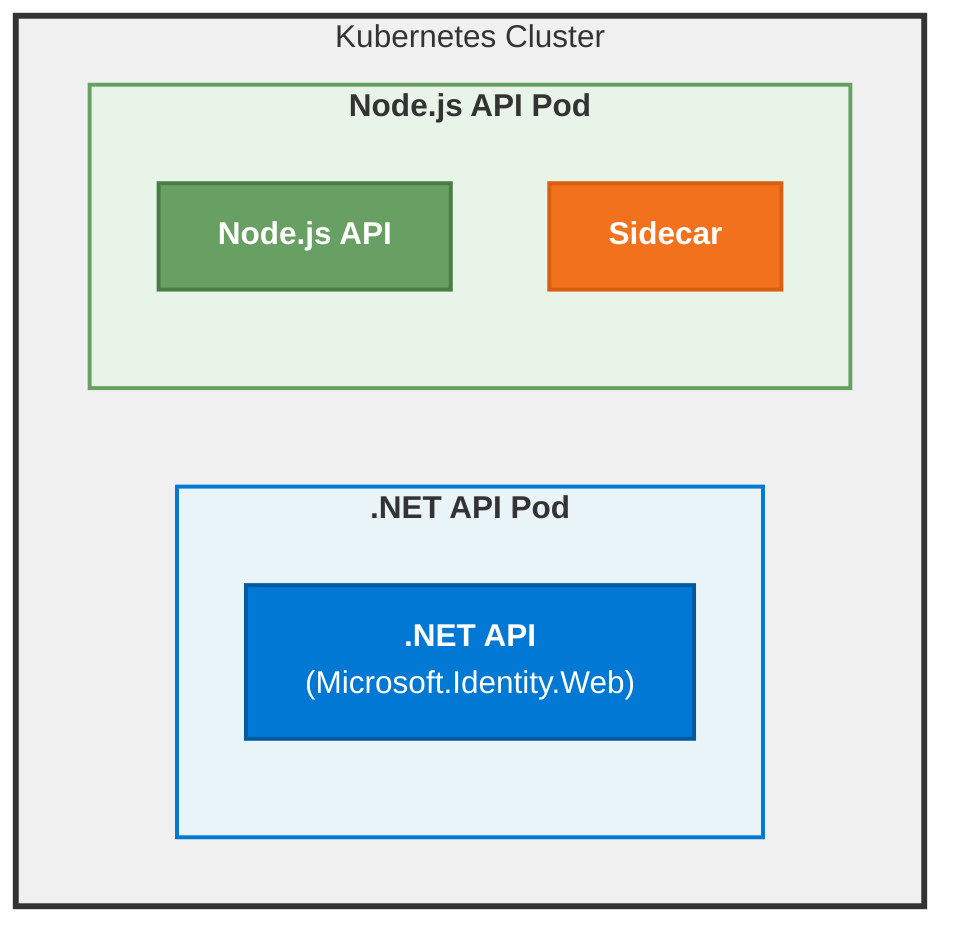

# Comparison with Microsoft.Identity.Web

This document compares the Microsoft Entra Identity Sidecar with the in-process Microsoft.Identity.Web library and provides migration guidance.

## Architectural Differences

### Microsoft.Identity.Web (In-Process)

Microsoft.Identity.Web is a .NET library that integrates directly into your ASP.NET Core application:

```csharp
// Startup configuration
services.AddMicrosoftIdentityWebApiAuthentication(Configuration)
    .EnableTokenAcquisitionToCallDownstreamApi()
    .AddDownstreamApi("Graph", Configuration.GetSection("DownstreamApis:Graph"))
    .AddInMemoryTokenCaches();

// Usage in controller
public class MyController : ControllerBase
{
    private readonly IDownstreamApi _downstreamApi;
    
    public MyController(IDownstreamApi downstreamApi)
    {
        _downstreamApi = downstreamApi;
    }
    
    public async Task<ActionResult> GetUserData()
    {
        var user = await _downstreamApi.GetForUserAsync<User>("Graph", 
            options => options.RelativePath = "me");
        return Ok(user);
    }
}
```

### Sidecar (Out-of-Process)

The sidecar runs as a separate container that your application calls via HTTP:

```typescript
// Configuration
const sidecarUrl = process.env.SIDECAR_URL || "http://localhost:5000";

// Usage in application
async function getUserData(incomingToken: string) {
  const response = await fetch(
    `${sidecarUrl}/DownstreamApi/Graph?optionsOverride.RelativePath=me`,
    {
      headers: {
        'Authorization': `Bearer ${incomingToken}`
      }
    }
  );
  
  const result = await response.json();
  return JSON.parse(result.content);
}
```

## Feature Comparison

| Feature | Microsoft.Identity.Web | Sidecar |
|---------|------------------------|---------|
| **Language Support** | C# / .NET only | Any language (HTTP) |
| **Deployment** | In-process library | Separate container |
| **Token Acquisition** | ✅ Direct MSAL.NET | ✅ Via HTTP API |
| **Token Caching** | ✅ In-memory, ❌distributed | ✅ In-memory, ❌distributed |
| **OBO Flow** | ✅ Native support | ✅ Via HTTP endpoint |
| **Client Credentials** | ✅ Native support | ✅ Via HTTP endpoint |
| **Managed Identity** | ✅ Direct support | ✅ Direct support |
| **Agent Identities** | ✅ Via extensions | ✅ Query parameters |
| **Token Validation** | ✅ Middleware | ✅ /Validate endpoint |
| **Downstream API** | ✅ IDownstreamApi | ✅ /DownstreamApi endpoint |
| **Microsoft Graph** | ✅ Graph SDK integration | ⚠️ Via DownstreamApi |
| **Performance** | ⚡ In-process (fastest) | 🔄 HTTP overhead |
| **Configuration** | appsettings.json, code | appsettings.json, Environment variables |
| **Debugging** | ✅ Standard .NET debugging | ⚠️ Container debugging |
| **Hot Reload** | ✅ .NET Hot Reload | ❌ Container restart |
| **Package Updates** | 📦 NuGet packages | 🐳 Container images |
| **License** | MIT | MIT |

## When to Use Each Approach

### Use Microsoft.Identity.Web (In-Process) When:

1. **Building .NET Applications Exclusively**
   - ASP.NET Core Web APIs
   - ASP.NET Core Web Apps
   - .NET Worker Services
   - Blazor applications
   - Daemon apps

2. **Performance is Critical**
   - High-throughput scenarios
   - Latency-sensitive operations
   - Every millisecond counts

3. **Deep Integration Required**
   - Custom MSAL.NET configuration
   - Direct access to MSAL features
   - Advanced token cache strategies

4. **Rapid Development**
   - Quick prototyping
   - Hot reload for development
   - Standard .NET debugging

5. **Single-Language Stack**
   - Team expertise in C#/.NET
   - No multi-language requirements

### Use Sidecar (Out-of-Process) When:

1. **Multi-Language Microservices**
   - Node.js, Python, Go, Java services
   - Polyglot architectures
   - Services in multiple languages

2. **Containerized Deployments**
   - Kubernetes environments
   - Docker Compose setups
   - Service mesh architectures

3. **Centralized Authentication Logic**
   - Standardized auth across services
   - Consistent token handling
   - Shared configuration management

4. **Technology Diversity**
   - Mix of frameworks and languages
   - Non-.NET services
   - Legacy systems integration

5. **Operational Benefits**
   - Independent scaling of auth logic
   - Separate auth updates from app code
   - Centralized monitoring of auth

## Migration Guidance

### Migrating from Microsoft.Identity.Web to Sidecar

#### Step 1: Deploy Sidecar Container

Add sidecar container to your pod:

```yaml
# Before: Single ASP.NET Core container
containers:
- name: app
  image: myregistry/myapp:latest

# After: App + Sidecar
containers:
- name: app
  image: myregistry/myapp:latest
  env:
  - name: SIDECAR_URL
    value: "http://localhost:5000"

- name: sidecar
  image: mcr.microsoft.com/identity/sidecar:latest
  env:
  - name: AzureAd__TenantId
    value: "your-tenant-id"
  - name: AzureAd__ClientId
    value: "your-client-id"
```

#### Step 2: Migrate Configuration

Transfer settings from `appsettings.json` to environment variables:

**Before (appsettings.json)**:
```json
{
  "AzureAd": {
    "Instance": "https://login.microsoftonline.com/",
    "TenantId": "your-tenant-id",
    "ClientId": "your-client-id"
  },
  "DownstreamApis": {
    "Graph": {
      "BaseUrl": "https://graph.microsoft.com/v1.0",
      "Scopes": "User.Read Mail.Read", 
      "RelativePath": "/me"
    }
  }
}
```

**After (Kubernetes ConfigMap / Environment Variables)**:
```yaml
apiVersion: v1
kind: ConfigMap
metadata:
  name: sidecar-config
data:
  AzureAd__Instance: "https://login.microsoftonline.com/"
  AzureAd__TenantId: "your-tenant-id"
  AzureAd__ClientId: "your-client-id"
  DownstreamApis__Graph__BaseUrl: "https://graph.microsoft.com/v1.0"
  DownstreamApis__Graph__Scopes: "User.Read Mail.Read"
  DownstreamApis__Graph__RelativePath: "/me"
```

#### Step 3: Update Application Code

Replace in-process calls with HTTP requests:

**Before (C# with IDownstreamApi)**:
```csharp
public class UserController : ControllerBase
{
    private readonly IDownstreamApi _downstreamApi;
    
    public UserController(IDownstreamApi downstreamApi)
    {
        _downstreamApi = downstreamApi;
    }
    
    [HttpGet]
    public async Task<ActionResult<User>> GetMe()
    {
        var user = await _downstreamApi.GetForUserAsync<User>(
            "Graph",
            options => options.RelativePath = "me"
        );
        return Ok(user);
    }
}
```

**After (Any language with HTTP client)**:

C#:
```csharp
public class UserController : ControllerBase
{
    private readonly HttpClient _httpClient;
    private readonly string _sidecarUrl;
    
    public UserController(IHttpClientFactory httpClientFactory, IConfiguration config)
    {
        _httpClient = httpClientFactory.CreateClient();
        _sidecarUrl = config["SIDECAR_URL"];
    }
    
    [HttpGet]
    public async Task<ActionResult<User>> GetMe()
    {
        var inboundAuthorizationHeader = Request.Headers["Authorization"].ToString();
        // this validates the inbound authorization header and calls the downstream API.
        // If you don't call a downstream API, Do validate the inbound authorization header 
        // (calling the /Validate endpoint)
        var request = new HttpRequestMessage(
            HttpMethod.Get,
            $"{_sidecarUrl}/DownstreamApi/Graph?optionsOverride.RelativePath=me"
        );
        request.Headers.Add("Authorization", inboundAuthorizationHeader);
        
        var response = await _httpClient.SendAsync(request);
        var result = await response.Content.ReadFromJsonAsync<SidecarResponse>();
        var user = JsonSerializer.Deserialize<User>(result.Content);
        return Ok(user);
    }
}
```

TypeScript:
```typescript
export async function getMe(incomingToken: string): Promise<User> {
  const sidecarUrl = process.env.SIDECAR_URL!;
  
  const response = await fetch(
    `${sidecarUrl}/DownstreamApi/Graph?optionsOverride.RelativePath=me`,
    {
      headers: {
        'Authorization': incomingToken
      }
    }
  );
  
  const result = await response.json();
  return JSON.parse(result.content) as User;
}
```

#### Step 4: Remove Microsoft.Identity.Web Dependencies

Remove NuGet packages from your project:

```xml
<!-- Remove these from .csproj -->
<PackageReference Include="Microsoft.Identity.Web" Version="..." />
<PackageReference Include="Microsoft.Identity.Web.MicrosoftGraph" Version="..." />
<PackageReference Include="Microsoft.Identity.Web.DownstreamApi" Version="..." />
```

Remove authentication configuration:

```csharp
// Remove from Program.cs or Startup.cs
services.AddMicrosoftIdentityWebApiAuthentication(Configuration)
    .EnableTokenAcquisitionToCallDownstreamApi()
    .AddDownstreamApi("Graph", Configuration.GetSection("DownstreamApis:Graph"))
    .AddInMemoryTokenCaches();
```

If still validating tokens in your app, you can continue using authentication middleware, or delegate validation to the sidecar entirely.

#### Step 5: Test and Validate

1. **Unit Tests**: Update tests to mock HTTP calls to sidecar
2. **Integration Tests**: Test sidecar communication in staging
3. **Performance Tests**: Measure HTTP overhead impact
4. **Security Tests**: Validate token handling and network policies

## Performance Considerations

### Sidecar Overhead

The sidecar introduces HTTP communication overhead:

- **Latency**: ~1-5ms per request for localhost communication
- **Throughput**: Limited by HTTP connection pooling
- **Memory**: Additional container memory overhead

**Mitigation Strategies**:
1. **Use HTTP/2**: Reduce connection overhead
2. **Connection Pooling**: Reuse HTTP connections
3. **Batch Requests**: Combine multiple operations when possible
4. **Token Caching**: Leverage sidecar's token cache
5. **Resource Allocation**: Ensure adequate sidecar resources

### In-Process Performance

Microsoft.Identity.Web has minimal overhead:

- **Latency**: Native method calls (microseconds)
- **Throughput**: No HTTP limitations
- **Memory**: Shared process memory

## Cost Considerations

### Sidecar Costs

- **Compute**: Additional container resources per pod
- **Network**: Minimal (localhost communication)
- **Storage**: Container image storage
- **Management**: Container orchestration overhead

**Example**: For 10 replicas with 128Mi/100m sidecar:
- Memory: 10 × 128Mi = 1.28GB
- CPU: 10 × 100m = 1 core

### In-Process Costs

- **Compute**: Minimal additional CPU/memory in application process
- **Network**: No additional overhead
- **Storage**: NuGet package size (~10MB)

## Support and Maintenance

| Aspect | Microsoft.Identity.Web | Sidecar |
|--------|------------------------|---------|
| **Updates** | NuGet package updates | Container image updates |
| **Breaking Changes** | Via package versioning | Via container tags |
| **Bug Fixes** | Compile-time integration | Runtime container updates |
| **Security Patches** | Rebuild application | Redeploy container |
| **Documentation** | Extensive .NET docs | This documentation |
| **Community** | Large .NET community | Growing community |

## Hybrid Approach

You can use both approaches in the same architecture:

- **ASP.NET Core services**: Use Microsoft.Identity.Web (in-process)
- **Non-.NET services**: Use sidecar
- **Shared configuration**: Centralize auth configuration
- **Consistent patterns**: Use similar patterns across services

Example architecture:



## Next Steps

- [Installation Guide](installation.md) - Deploy the sidecar
- [Configuration Reference](configuration.md) - Configure the sidecar
- [Scenarios](scenarios/README.md) - Practical examples
- [Microsoft.Identity.Web Documentation](https://github.com/AzureAD/microsoft-identity-web/wiki) - Learn about in-process library
