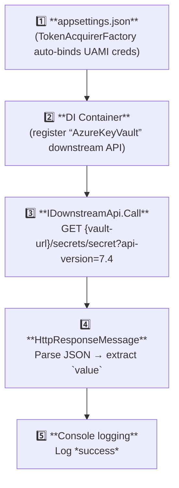

# VM-Hosted Key Vault Secret Retriever

Tiny console app that runs **inside an Azure VM** configured with a **User-Assigned Managed Identity (UAMI)**.  
Its only job is to fetch **Secret** from an Azure Key Vault section specified in the *appsettings.json*.

---

## 1. Prerequisites

| Requirement | Notes |
|-------------|-------|
| Azure VM     | Any OS; the UAMI must be **assigned** to the VM. |
| User-Assigned Managed Identity | Needs ** `Get`** permission on the Key Vault’s **Secrets**. |
| Key Vault    | Secret named `secret` (or whatever your *AzureKeyVault* section points to). |
| .NET 8 SDK   | Build / run the app locally or on the VM. |
| *appsettings.json* | Contains an `AzureKeyVault` block with `BaseUrl`, `RelativePath`, etc. |

> 💡 **Least privilege**: grant the UAMI only the `secrets/get` permission.

---

## 2. How the Code Works

