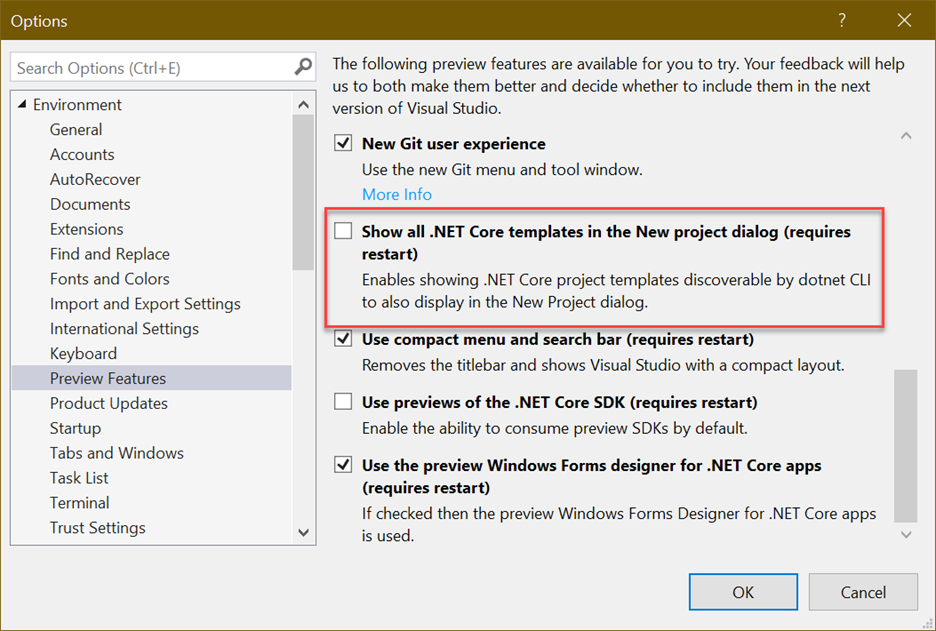
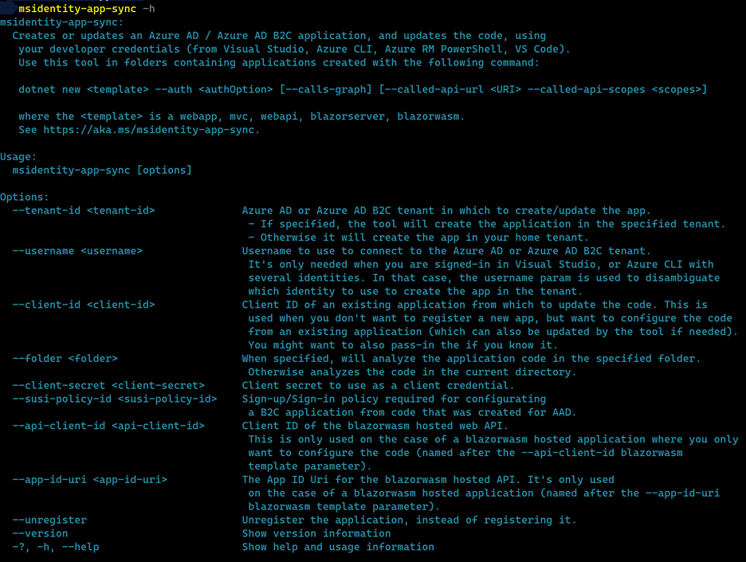
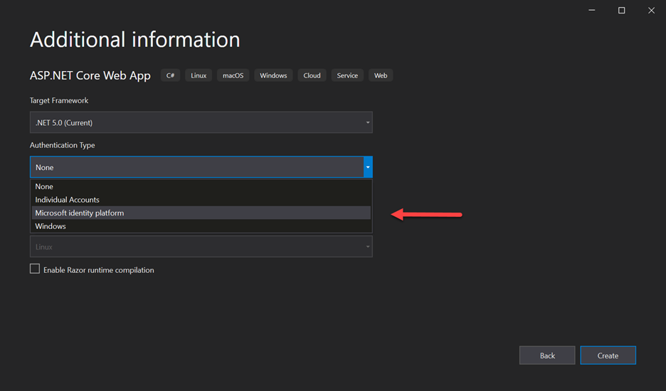
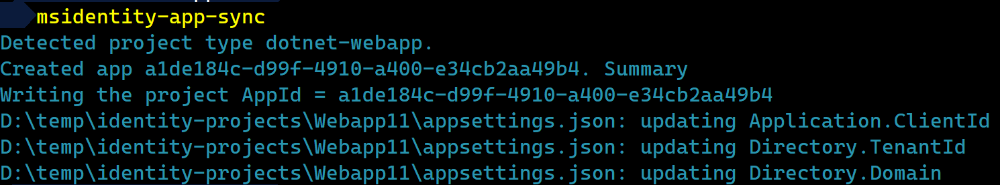

# Creating ASP.NET Core projects with Microsoft identity platform(Azure AD and Azure AD B2C).

In the 16.9 release of [Visual Studio](https://visualstudio.microsoft.com/downloads/), we updated the ASP.NET Core templates for .NET 5.0, to allow you to use the Microsoft identity platform for authentication. We are still working to provide an experience where you can specify the auth options in Visual Studio 2019 and have it registered with the Microsoft identity platform and configure the generated project. With the new auth option, Microsoft identity platform, in the 16.9 release, you can create projects that are setup for authentication, but there will be some additional work that you'll need to perform to complete the process. This document walks you through the available options . In a later update to Visual Studio we will streamline this experience so that all steps can be performed in Visual Studio itself.

The options are:

- Option 1: Go back to the previous experience that took care of all the steps (but with legacy limitations)
- Option 2: Use a dotnet command line tool provided by Microsoft identity platform in 16.9 to register an app, and configure the code for you, or configure the code from an existing app. This tool also works if you created your project with the `dotnet new` command
- Option 3: Do it all by yourself using the Microsoft identity platform documentation and samples.

Before we explore how to use the Microsoft identity platform option, if you would prefer to go back to the previous experience where Visual Studio took care of all the steps you can do that. Let's see how to do that first.

## Option 1: Go back to the previous experience that took care of all the steps

Prior to the 16.9 release, Visual Studio 2019 had support for users to specify the auth options, and it would take care of provisioning the needed Azure AD App Registration and configuring the project with the right settings. To go back to the previous experience, in 16.9 you can uncheck the preview flag, _Show all .NET Core templates in the New Project dialog_, shown below. You can find this option by going to _Tools > Options > Environment > Preview Features_.



After unchecking this checkbox, and restarting Visual Studio, when you create a new ASP.NET Core project, you will have the same options that were available previously, but you won't see the new .NET 5.0 templates.

Now let's move on to discuss how you can easily add Microsoft identity web to new ASP.NET Core projects created with these options selected.

## Option 2: Use the msidentity-app-sync tool

When using Visual Studio 16.9, if you create a new ASP.NET Core project and select the _Microsoft identity platform_ option, the project will be created so that it will use Azure AD or B2C for authentication. This will not automatically provision the App Registrations. The automatic app Registration will be coming in an upcoming release soon. To complete the authentication configuration and make the project runnable, you need to perform the following two steps.

1. Provision necessary Azure AD or B2C App Registrations
2. Configure the project to use the newly provisioned App Registration settings

There is a command line tool that you can use to perform these actions for you. First you'll need to install the tool with the command below.

```
dotnet tool install -g msidentity-app-sync
```

After completing this step, the `msidentity-app-sync` tool should be installed and ready for use. You can verify that the tool was installed successfully by running the command `dotnet tool list -g`. You should see the msidentity-app-sync listed in the results shown in the console.


You can also install it as an external tool in Visual Studio. For details see https://github.com/AzureAD/microsoft-identity-web/tree/master/tools/app-provisioning-tool#install-in-visual-studio

Next, you need to sign into your Azure subscription. You can sign in with any of the following tools.

- [Visual Studio 2019](https://learn.microsoft.com/visualstudio/ide/signing-in-to-visual-studio?view=vs-2019#how-to-sign-in-to-visual-studio)
- [Azure CLI](https://learn.microsoft.com/cli/azure/authenticate-azure-cli)
- [Azure PowerShell](https://learn.microsoft.com/powershell/azure/authenticate-azureps?view=azps-5.5.0)

Once you sign in with any of these tools, you can start using the identity sync tool. Let's look at how to use the tool to provision a new App Registration and configure the project. To get a list of the available built-in options run: `msidentity-app-sync –help` (or `msidentity-app-sync -h`). The current help output is shown in the image below.



From the help output, you can see that all the options are optional. You'll typically want to execute this command from the same directory that contains the project file (or solution in the case of Blazor WebAssembly hosted code) that you are trying to update. If you execute this command without any parameters, the following will occur (_assuming you are signed into a single Azure account_).

- The tool will detect what type of asp.net core app the project represents, the supported project types include; web (webapp and mvc templates), web API, Blazor Server and Blazor WebAssembly (hosted or not).
- The tool will detect which type of auth the project is configured for (Azure AD, Azure AD B2C)
- A new Azure AD App registration will be created in the [home tenant](https://learn.microsoft.com/azure/active-directory/develop/single-and-multi-tenant-apps#who-can-sign-in-to-your-app) of the signed in user
- The project will be updated to connect the app with the Azure objects created

If you'd like to use an existing Azure AD (or Azure AD B2C) tenant or existing application, you can use the `–-tenant-id` and `–-client-id` parameters respectively. More on this later. For more info on the tool visit the [microsoft-identity-web](https://github.com/AzureAD/microsoft-identity-web/tree/master/tools/app-provisioning-tool) Github repository. Now that we've gone over the basic usage of the tool, let's go ahead and run it.

We want to use the tool to create a new App Registration and configure the project. For this scenario we can execute the tool without any additional parameters. Open the terminal of your choice, and navigate to the directory where our code resides. Next, run the tool without any parameters, by calling msidentity-app-sync. Let's see that in action.

First let's create a new ASP.NET Core web application, that is configured for authentication using Azure AD with a single organization. After we create the project, we will use the tool to provision the needed objects in Azure and configure the project.

**1: Create the project**

To create the project, you can use Visual Studio 2019 16.10, or dotnet new. When using Visual Studio, select the _Microsoft identity platform_ option for authentication on the Additional Information page of the New Project Dialog.



If you are using `dotnet new` to create the project you should pass the value of `SingleOrg` for the `-–auth` parameter. For example, you can use this command `dotnet new webapp –auth SingleOrg` to create the project. Now that we have created the project, let's use the tool to take care of the auth related.

**2: Update auth**

In many cases you can use the tool without passing any parameters. You will want to cd into the directory where the project file (.csproj file) is located, and then run the tool. Let's try it by running msidentity-app-sync. If you are configuring a Blazor WebAssembly app, run the tool in the directory where the solution (.sln) file is located.



From the output in the console, we can see that the tool detected that we have an ASP.NET Core web application. Following that, we can see that the appSettings.json file was updated to use the azure objects that the tool provisioned. In some cases (when you are signed-in with several identities in Visual Studio for instance), you may need to pass in a username for the action to complete. This username should be a username for a user in your home tenant (or the tenant that is passed in with `-–tenant-id`). Now that we have configured this project, you can run the web app and sign in with users in the tenant. Let's briefly discuss some of the other options that the tool makes available.

By default, the tool will create new App Registrations in your &quot;home tenant&quot;, in order to create new App Registrations in different tenants that you have access to, pass the id of the tenant in the `–-tenant-id` parameter. In particular Visual Studio 2019 16.9 will create an Azure AD application. If you want to register a B2C application you'll need to provide both `-–tenant-id`, and `-–susi-policy-id` (name of your Sign Up Sign In (SUSI) policy). By default the tool uses your identity that you have signed into Visual Studio with. If you are signed into VS with several identities, you also need to use the `-–username` option.

By default, the tool will create a new Azure AD or AzureAD B2C application. To use an existing a client application, pass in the id of that application in the `-–client-id` parameter.

## Option 3: How to configure without the provisioning tool

If you would like to perform all the steps without using the provisioning tool, there are some quick start guides that you can use. The specific steps will be different based on you project type. Use the links below to get started with that.

- Web app [Quickstart: Add sign-in with Microsoft to an ASP.NET Core web app - Microsoft identity platform | Microsoft Docs](https://learn.microsoft.com/azure/active-directory/develop/quickstart-v2-aspnet-core-webapp)
- Web API [Quickstart: Protect an ASP.NET Core web API with the Microsoft identity platform - Microsoft identity platform | Microsoft Docs](https://learn.microsoft.com/azure/active-directory/develop/quickstart-v2-aspnet-core-web-api)
- Blazor [Tutorial - Create a Blazor Server app that uses the Microsoft identity platform for authentication - Microsoft identity platform | Microsoft Docs](https://learn.microsoft.com/azure/active-directory/develop/tutorial-blazor-server)
- Blazor WASM [Tutorial - Sign in users and call a protected API from a Blazor WebAssembly app - Microsoft identity platform | Microsoft Docs](https://learn.microsoft.com/azure/active-directory/develop/tutorial-blazor-webassembly)
